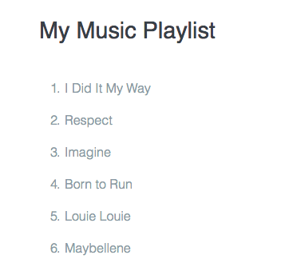

# Using `for` loops with Arrays

```js
var students = ['Sascha', 'Lyn', 'Jenifer', 'Paul'];
for(i = 0; i < students.length; i++){
console.log( students[i]);
}
```
Let's look how it works:
* first an `array` is created width four items
* then we have the `for` loop
* first the `i` variable is created and value of `0` is stored in it
* the `condition` is then tested: is `i less than students.length`? yes `0` is less than `4` - so we are in to the loop
* the program logs the item at index position `0` in the `students` array
* this is the end of the loop
* now `i` is incteased by `1` and the condition is again tested

### Create a function to turn an array items in an ordered list  (printList function)

We have the following html

**HTML** 
```html
<ol>
<li>I did it my way</li> <!-- each of these list items is one item in an array -->
<li>Respect</li>
<li>Imagine</li>
<li>Born to run</li>
<li>Louie Louie</li>
<li>Maybellene</li>
</ol>
```
Let's write the program that generates `html` by running through the array by one item at a time. 
```js
var playList = [
  'I Did It My Way',
  'Respect',
  'Imagine',
  'Born to Run',
  'Louie Louie',
  'Maybellene'
];

function print(message) {
  document.write(message);
}

function printList(list){ //in orther words we'll create an ordered list in html
}
```

`printList` function takes an array as a parameter that holds some value that passed to the function. We should create a `variable` called `listHTML` and set its value match the opening `<ol>` tag. By adding more string to this `variable` we can buld up a complete `html` and add it to a page.

```js
var playList = [
  'I Did It My Way',
  'Respect',
  'Imagine',
  'Born to Run',
  'Louie Louie',
  'Maybellene'
];

function print(message) {
  document.write(message);
}

function printList(list){ //in orther words we'll create an ordered list in html
    var listHTML = '<ol>';
}
```
The next step will be to add a `loop`. We'll use a `for` loop. 

```js
var playList = [
  'I Did It My Way',
  'Respect',
  'Imagine',
  'Born to Run',
  'Louie Louie',
  'Maybellene'
];

function print(message) {
  document.write(message);
}

function printList(list){
  var listHTML = '<ol>';
  for(i = 0; i < list.length; i+=1){
    
  }
}
```

It's time to create `html` list items. 

```js
var playList = [
  'I Did It My Way',
  'Respect',
  'Imagine',
  'Born to Run',
  'Louie Louie',
  'Maybellene'
];

function print(message) {
  document.write(message);
}

function printList(list){
  var listHTML = '<ol>';
  for(i = 0; i < list.length; i+=1){
    listHTML+= '<li>' + list[i] + '</li>';
  }
}
```
Now we just need to close the `<ol>` tag an print it to the page.

```js
var playList = [
  'I Did It My Way',
  'Respect',
  'Imagine',
  'Born to Run',
  'Louie Louie',
  'Maybellene'
];

function print(message) {
  document.write(message);
}

function printList(list){
  var listHTML = '<ol>';
  for(var i = 0; i < list.length; i+=1){
    listHTML += '<li>' + list[i] + '</li>';
  }
  listHTML += '</ol>';
  print(listHTML);
}
printList(playList); 
```


**Remember** that a `function` actually doesn't do anything untill it's called! So we need to call it and pass our array to it. 


