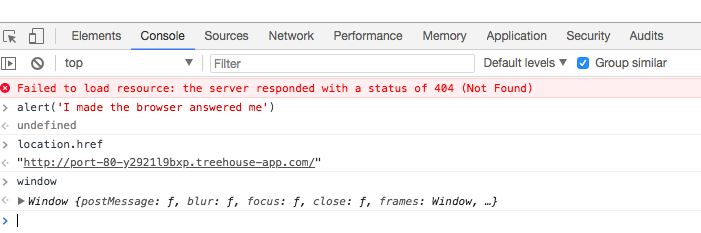
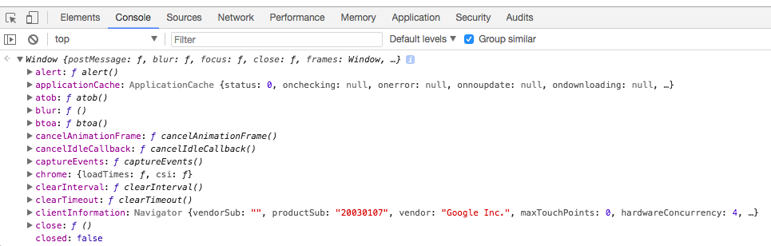
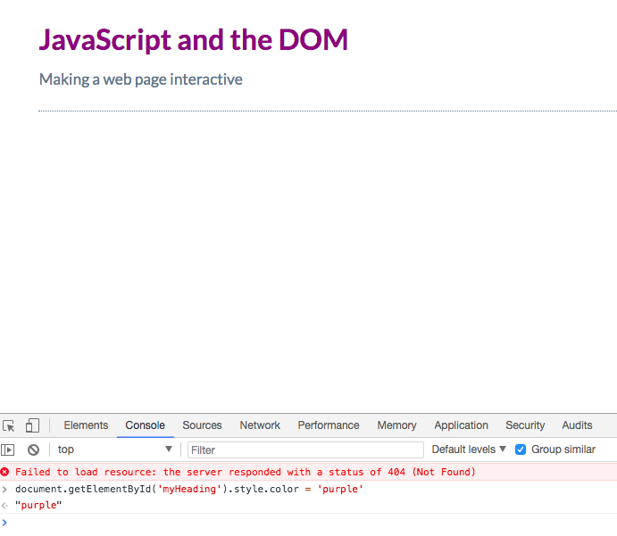
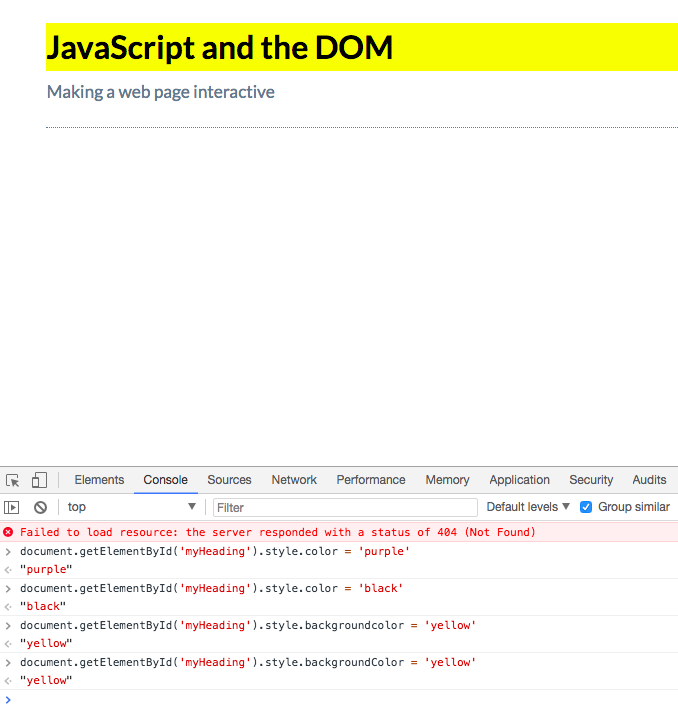

# Thinking Globally

* [MDN page for the window object](https://developer.mozilla.org/en-US/docs/Web/API/Window)

* [MDN page for the document object](https://developer.mozilla.org/en-US/docs/Web/API/Document)

### Global Environment

`global variables` - are actually `properties` of a single global `object`, which in browsers is called `window`.
If we type `window` into console, we'll see all the `properties` it contains. 

These are all the `controls` the browser gives you with JavaScript. 

### The `document` object

We can use it to select and control elements of the currently loaded web page. For example, let's change the color of the heading. 

Let's add a yellow background color to the headline. 

