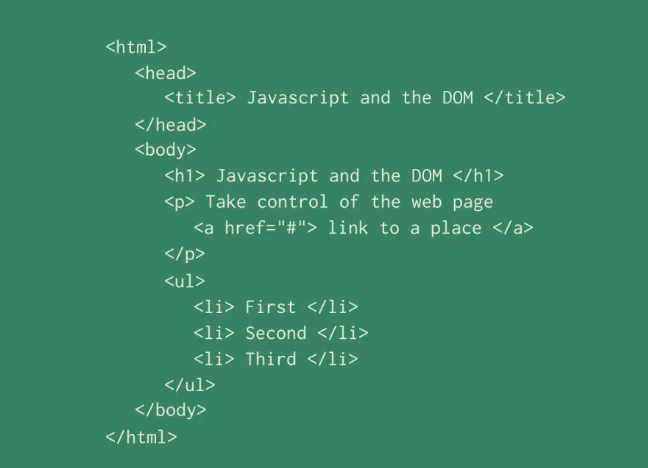
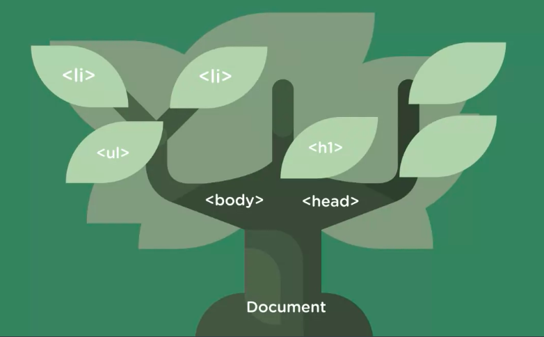
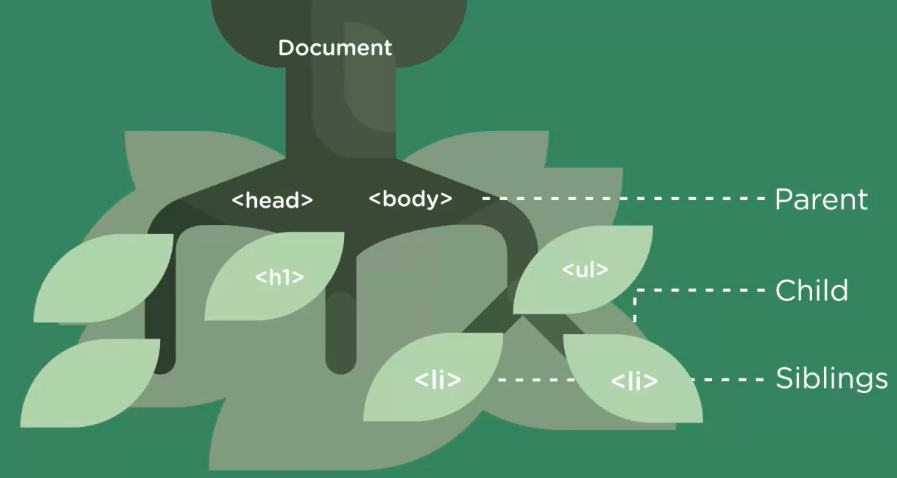

# What is the DOM?

[MDN page for the Document Object Model](https://developer.mozilla.org/en-US/docs/Web/API/Document_Object_Model)

The `document` is a global object representing `html` in content of a web page. In javaScript you can select and change different parts of a web page by interacting with the `document`. 

`DOM` (Document Object Model) - is a representation of a `web page` that JavaScript can use, just like a citymap helps you to get around the town. DOM is a map of a `web page` that JavaScript can use. 

The `DOM` represents a `web pag`e like a tree like structure. 

Computer science treats it upside down or like a family tree. 

