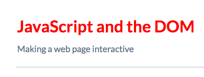

# Tell the Headline to listen to events (namely `click`)

Lets change the `heading` elemnt to `red` by `clicking`.

```js
const myHeading = document.getElementById('myHeading'); //we select the element

myHeading.addEventListener('click', () => {
myHeading.style.color = 'red';            
});
```
`.addEventsListner` - starts the heading for listening the browser events. Inside the `method` first we say what to listen ('click' - the name of the event) and then what to do when the headline is clicked - we do this by passing `function` as a second `argument`. 



### Code line by line

* on the first line we select the element
* next we take our selection and call `.addEventsListner` method, telling the browser to do something, when the hedline is clicked
* and finally we tell the browser to manipulate the `event` by making the text `red` for every click of it. 