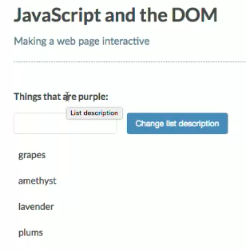
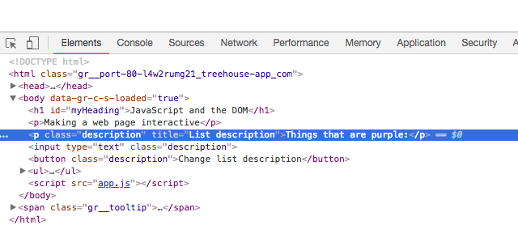

# Changing Element Attributes

Attributes, like the `href` attribute on a `link`, or the `action` attribute on a `form`, exist as `properties` of an `element` object. You get or set them in a similar way we saw with `text`. Now, we'll look at `index.html` and find an attribute to access.

[Here is a list of standard HTML element attributes for reference](https://developer.mozilla.org/en-US/docs/Web/HTML/Attributes).

### Example

**HTML**
```js
<!DOCTYPE html>
<html>
  <head>
    <title>JavaScript and the DOM</title>
    <link rel="stylesheet" href="css/style.css">
  </head>
  <body>
    <h1 id="myHeading">JavaScript and the DOM</h1>
    <p>Making a web page interactive</p>    
    <p class="description">Things that are purple:</p>
    <input type="text" class="description"> 
    <button class="description">Change list description</button>
    <ul>
      <li>grapes</li>
      <li>amethyst</li>
      <li>lavender</li>
      <li>plums</li>
    </ul>
    <script src="app.js"></script>
  </body>
</html>
```
Let's update the `title` attribute of the `description pagagraph`. 

**JS**
```js
const input = document.querySelector('input');
const p = document.querySelector('p.description');
const button = document.querySelector('button');

button.addEventListener( 'click', () => {
 p.innerHTML = input.value + ':';                      
});

p.title = "List description";
```
If we hover on the paragraph we'll see a tooltip appears. 



And in the console we see that the `title` with `List description` text was added to a paragraph



Normally a `title` like this would be better set in the html, and not necesseraly by a line of JavaScript. 
If you want to get or set the element's `class`, the `class` property won't work. Use `element.className` instead. 