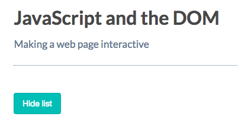
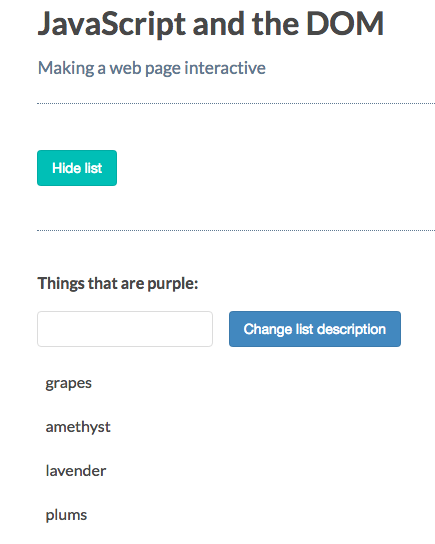
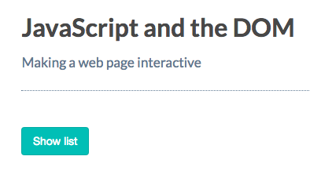

# Styling Elements

[MDN page for style property](https://developer.mozilla.org/en-US/docs/Web/API/HTMLElement/style)

### Example

Let's set of a `button` that will toggle our description paragraph, text field and list in an `attribute`. 
First let's add the `button` below the first `paragraph`

**HTML**
```html
<!DOCTYPE html>
<html>
  <head>
    <title>JavaScript and the DOM</title>
    <link rel="stylesheet" href="css/style.css">
  </head>
  <body>
    <h1 id="myHeading">JavaScript and the DOM</h1>
    <p>Making a web page interactive</p> 
    <button id="toggleList">Hide list</button> <!-- add a button -->
    <p class="description">Things that are purple:</p>
    <input type="text" class="description"> 
    <button class="description">Change list description</button>
    <ul>
      <li>grapes</li>
      <li>amethyst</li>
      <li>lavender</li>
      <li>plums</li>
    </ul>
    <script src="app.js"></script>
  </body>
</html>
```
Since we want to hide `p`, `input`, `button` and `list` let's put them in a `div` with tha `class`

**HTML**
```html
<!DOCTYPE html>
<html>
  <head>
    <title>JavaScript and the DOM</title>
    <link rel="stylesheet" href="css/style.css">
  </head>
  <body>
    <h1 id="myHeading">JavaScript and the DOM</h1>
    <p>Making a web page interactive</p> 
    <button id="toggleList">Hide list</button>
      <div class="list"> <!-- div starts -->
      <p class="description">Things that are purple:</p>
      <input type="text" class="description"> 
      <button class="description">Change list description</button>
      <ul>
        <li>grapes</li>
        <li>amethyst</li>
        <li>lavender</li>
        <li>plums</li>
      </ul>
        </div> <!-- div ends -->
    <script src="app.js"></script>
  </body>
</html>
```
In js let's select a `button` and a `div` we've just created. 
**JS**
```js
const toggleList = document.getElementById('toggleList'); //button
const listDiv = document.querySelector('.list'); //div
const input = document.querySelector('input');
const p = document.querySelector('p.description');
const button = document.querySelector('button');

button.addEventListener( 'click', () => {
 p.innerHTML = input.value + ':';                      
});
```
Ok, now we want to hide elements in a `div` when the `button` is clicked.

```js
const toggleList = document.getElementById('toggleList');
const listDiv = document.querySelector('.list');
const input = document.querySelector('input');
const p = document.querySelector('p.description');
const button = document.querySelector('button');

toggleList.addEventListener('click', () =>{ //listens to an event
listDiv.style.display = 'none';             //hides elements
})
button.addEventListener( 'click', () => {
 p.innerHTML = input.value + ':';                      
});
```


Now we want to show the list if it's hidden and hide the list if it's visible. 

**JS**
```js
const toggleList = document.getElementById('toggleList');
const listDiv = document.querySelector('.list');
const input = document.querySelector('input.description'); //here we should select the exact input !!!
const p = document.querySelector('p.description');
const button = document.querySelector('button.description'); //here we should select the exact button !!!

toggleList.addEventListener('click', () =>{
if(listDiv.style.display == 'none'){
  toggleList.textContent = 'Hide list'; //change the button text
  listDiv.style.display = 'block';
}else{
  toggleList.textContent = 'Show list'; //thanche the button text
listDiv.style.display = 'none';
}
})
button.addEventListener( 'click', () => {
 p.innerHTML = input.value + ':';                      
});
```
### Result




