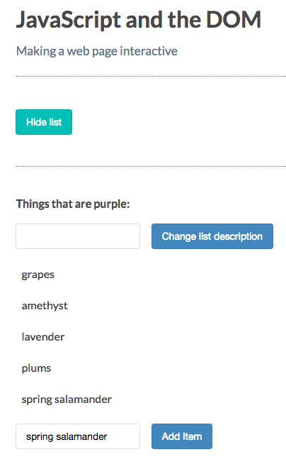

# Appending Nodes

[MDN page for appendChild](https://developer.mozilla.org/en-US/docs/Web/API/Node/appendChild)

Nodes - belong to the DOM, while elements are mainly html.

### Example

Let's add one more list `item`.

**HTML**
```html
<!DOCTYPE html>
<html>
  <head>
    <title>JavaScript and the DOM</title>
    <link rel="stylesheet" href="css/style.css">
  </head>
  <body>
    <h1 id="myHeading">JavaScript and the DOM</h1>
    <p>Making a web page interactive</p> 
    <button id="toggleList">Hide list</button>
      <div class="list">
      <p class="description">Things that are purple:</p>
      <input type="text" class="description"> 
      <button class="description">Change list description</button>
      <ul>
        <li>grapes</li>
        <li>amethyst</li>
        <li>lavender</li>
        <li>plums</li>
      </ul>
        <input type="text" class="addItemInput"> 
      <button class="addItemButton">Add Item</button>
        </div>
    <script src="app.js"></script>
  </body>
</html>
```
The first step is to select the `parent` element. Then append a new careated element to it. 

**JS**
```js
const toggleList = document.getElementById('toggleList');
const listDiv = document.querySelector('.list');
const descriptionInput = document.querySelector('input');
const descriptionP = document.querySelector('p.description');
const descriptionButton = document.querySelector('button');
const addItemInput = document.querySelector('input.addItemInput');
const addItemButton = document.querySelector('button.addItemButton');

toggleList.addEventListener('click', () =>{
if(listDiv.style.display == 'none'){
  toggleList.textContent = 'Hide list';
  listDiv.style.display = 'block';
}else{
  toggleList.textContent = 'Show list';
listDiv.style.display = 'none';
}
})
descriptionButton.addEventListener( 'click', () => {
 descriptionP.innerHTML = descriptionInput.value + ':';   
 descriptionInput.value = ' ';                   
});

addItemButton.addEventListener('click', () =>{
let ul = document.getElementsByTagName('ul')[0];    //select the parent element                            
let li = document.createElement('li'); 
li.textContent = addItemInput.value;
ul.appendChild(li); //append li element to parent ul element
addItemInput.value = ' ';
});
```


