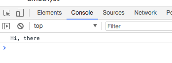
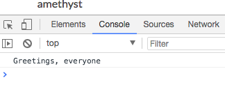

# Functions as Parameters

Just as you can pass a number to a function, you can pass a function to a function. This might sound a bit strange, but once you've tried it a few times, you'll get the hang of it.

To learn more about the distinction between function expressions and function statements, check out the MDN articles linked below.

[Function statements](https://developer.mozilla.org/en-US/docs/Web/JavaScript/Reference/Statements/function)
[Function expressions](https://developer.mozilla.org/en-US/docs/Web/JavaScript/Reference/Operators/function)

### Example

```js
function say (something){
  console.log(something);
}

function exec (func, arg) {
  func(arg);
}

exec(say, 'Hi, there');
```


Let's do it as a function expression

```js
function exec (func, arg) {
  func(arg);
}

exec((something) => {
  console.log(something);
}, 'Greetings, everyone');
```



