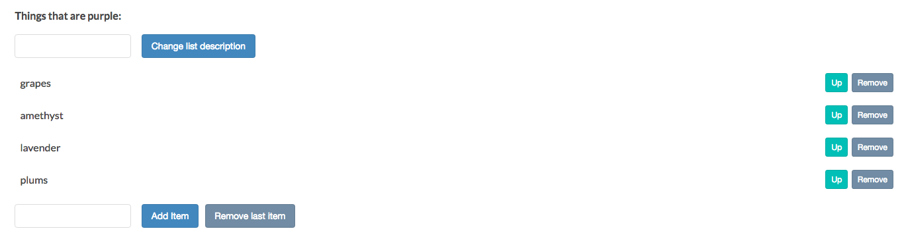
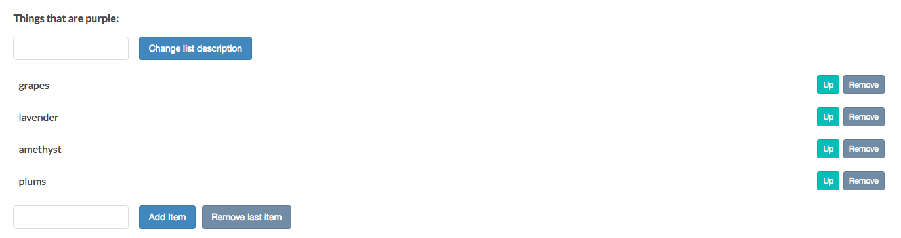

# Using `previousElementSiblig` and `insertBefore`

Here is [MDN page for previousElementSibling](https://developer.mozilla.org/en-US/docs/Web/API/NonDocumentTypeChildNode/previousElementSibling)

Here is [MDN page for insertBefore](https://developer.mozilla.org/en-US/docs/Web/API/Node/insertBefore)

### Example 
Let's implement the `up` button next to each element and clicking on the `up` button we'll move the element up the list. And let's put classes on the each button. 
**HTML**
```html
<!DOCTYPE html>
<html>
  <head>
    <title>JavaScript and the DOM</title>
    <link rel="stylesheet" href="css/style.css">
  </head>
  <body>
    <h1 id="myHeading">JavaScript and the DOM</h1>
    <p>Making a web page interactive</p> 
    <button id="toggleList">Hide list</button>
      <div class="list">
      <p class="description">Things that are purple:</p>
      <input type="text" class="description"> 
      <button class="description">Change list description</button>
      <ul>
        <li>grapes 
           <button class="up">Up</button>  <!--add button and class here-->
          <button class="remove">Remove</button> <!--add class here-->
        </li>
        <li>amethyst
           <button class="up">Up</button> <!--add button and class here-->
          <button class="remove">Remove</button> <!--add class here-->
        </li>
        <li>lavender
           <button class="up">Up</button> <!--add button and class here-->
          <button class="remove">Remove</button> <!--add class here-->
        </li>
        <li>plums
           <button class="up">Up</button> <!--add button and class here-->
          <button class="remove">Remove</button> <!--add class here-->
        </li>
      </ul>
        <input type="text" class="addItemInput"> 
      <button class="addItemButton">Add Item</button>
        <button class="removeItemButton">Remove last item</button>
        </div>
    <script src="app.js"></script>
   
  </body>
</html>
```
Now we need to modify our `click` handler to only remove the element if the `class` name is "remove". And we need the code for the `up` buttons as well. Since we want to move the `target list item` up, we'll need to get its `previous sibling` as a reference, which we can get with `.previousElementSibling`. And then we'll call `.insertBefore` on the `unordered list` element, passing-in the `list` item to move and the revious sibling reference. 

```js
const toggleList = document.getElementById('toggleList');
const listDiv = document.querySelector('.list');
const input = document.querySelector('input');
const p = document.querySelector('p.description');
const button = document.querySelector('button');
const listUl = listDiv.querySelector('ul');
const addItemInput = document.querySelector('input.addItemInput');
const addItemButton = document.querySelector('button.addItemButton');
const removeItemButton = document.querySelector('button.removeItemButton');


listUl.addEventListener('click', (event) =>{
  if(event.target.tagName == 'BUTTON'){
    if(event.target.className == 'remove'){
        let li = event.target.parentNode; 
        let ul = li.parentNode;
        ul.removeChild(li);
    }
    if(event.target.className == 'up'){
        let li = event.target.parentNode; 
        let prevLi = li.previousElementSibling; //use previous sibling here 
        let ul = li.parentNode;
        ul.insertBefore(li, prevLi);  //use insert before
    }
  }
});


toggleList.addEventListener('click', () =>{
if(listDiv.style.display == 'none'){
  toggleList.textContent = 'Hide list';
  listDiv.style.display = 'block';
}else{
  toggleList.textContent = 'Show list';
listDiv.style.display = 'none';
}
});

button.addEventListener( 'click', () => {
 p.innerHTML = input.value + ':';                      
});

addItemButton.addEventListener('click', () =>{
let ul = document.getElementsByTagName('ul')[0];                               
let li = document.createElement('li'); 
li.textContent = addItemInput.value;
ul.appendChild(li);
});

removeItemButton.addEventListener('click', () =>{
let ul = document.getElementsByTagName('ul')[0];                               
let li = document.querySelector('li:last-child'); 
ul.removeChild(li);
});
```



But if we push the first `up` button, the first list item will move to the bottom of the list. This is how `insertBefore` works. We can fix it now with an `if` statement. If an element is already is a first child, the previous element's sibling will be `no`. So we can test this `no` value in an `if` statement. 

```js
const toggleList = document.getElementById('toggleList');
const listDiv = document.querySelector('.list');
const input = document.querySelector('input');
const p = document.querySelector('p.description');
const button = document.querySelector('button');
const listUl = listDiv.querySelector('ul');
const addItemInput = document.querySelector('input.addItemInput');
const addItemButton = document.querySelector('button.addItemButton');
const removeItemButton = document.querySelector('button.removeItemButton');


listUl.addEventListener('click', (event) =>{
  if(event.target.tagName == 'BUTTON'){
    if(event.target.className == 'remove'){
        let li = event.target.parentNode;
        let ul = li.parentNode;
        ul.removeChild(li);
    }
    if(event.target.className == 'up'){
        let li = event.target.parentNode;
        let prevLi = li.previousElementSibling;
        let ul = li.parentNode;
       if(prevLi){       //if first item is already a first child
        ul.insertBefore(li, prevLi); 
       }
    }
  }
});


toggleList.addEventListener('click', () =>{
if(listDiv.style.display == 'none'){
  toggleList.textContent = 'Hide list';
  listDiv.style.display = 'block';
}else{
  toggleList.textContent = 'Show list';
listDiv.style.display = 'none';
}
});

button.addEventListener( 'click', () => {
 p.innerHTML = input.value + ':';                      
});

addItemButton.addEventListener('click', () =>{
let ul = document.getElementsByTagName('ul')[0];                               
let li = document.createElement('li'); 
li.textContent = addItemInput.value;
ul.appendChild(li);
});

removeItemButton.addEventListener('click', () =>{
let ul = document.getElementsByTagName('ul')[0];                               
let li = document.querySelector('li:last-child'); 
ul.removeChild(li);
});
```

