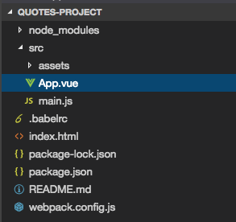

# Setting up the Project

Here is the starting quotes-project folder structure.



Initially we have 

**App.vue**

```html
<template>
    <div class="container">
    
    </div>
</template>

<script>
    export default {
        
    }
</script>

<style>
</style>
```

**index.html**
```html
<!DOCTYPE html>
<html lang="en">
  <head>
    <meta charset="utf-8">
    <title>Vue Components</title>
    <link rel="stylesheet" href="https://maxcdn.bootstrapcdn.com/bootstrap/3.3.7/css/bootstrap.min.css" integrity="sha384-BVYiiSIFeK1dGmJRAkycuHAHRg32OmUcww7on3RYdg4Va+PmSTsz/K68vbdEjh4u" crossorigin="anonymous">
    <link href='https://fonts.googleapis.com/css?family=Arizonia' rel='stylesheet' type='text/css'>
  </head>
  <body>
    <div id="app">
    </div>
    <script src="/dist/build.js"></script>
  </body>
</html>
```

**main.js**

```js
import Vue from 'vue'
import App from './App.vue'

new Vue({
  el: '#app',
  render: h => h(App)
})
```
First we need to understand how many `components` we need and how we could structure, how we could logically break it to pieces with their own business logic. Let's get started working with `grid` and then adding the possibility to add a new quotes before we finished it all, with tracking the state, tracking the number of quotes, and adding the `progress bar` to display the current state. 
