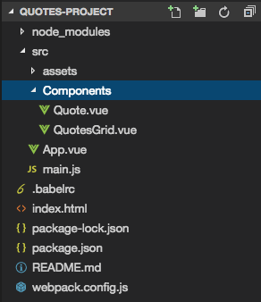

# Initializing the Application

In the `App.vue` file we first create `data function` to return the `data object` we are going to use. In this `data object` we wanna track the maximum number of quotes and also setup the `array of quotes`, which will be the empty `array` at the beginning. 

**App.vue**

```html
<template>
    <div class="container">
    
    </div>
</template>

<script>
    export default {
        data: function(){
            return {
            maxQuotes: 10,      //max number of quotes we want
            quotes: ['Just a quote to see smth']   //an array of quotes we will have, add one qoute just to see smth. 
            }
        }
    }
</script>

<style>
</style>
```

Let's start working on the `grid` of quotes. And for this lets create new `components` in the components folder. `QuotesGrid.vue` which holds the grid, and `Quote.vue` which holds a single file. 



