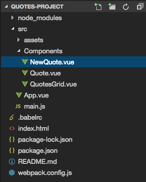
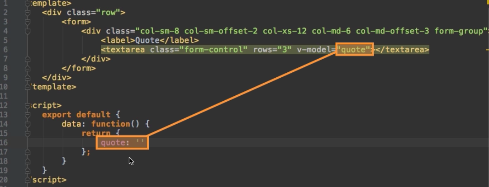

# Allowing Users to create Quotes with a new Quote Component

So, now we are able to display a quote. Now we can implement a `method` to add new quotes. For that we first need to add a new `component` - `NewQuote.vue`. 



Well, what do we need in this new `component`? In the template we need to have the `div` with the class `row`, and in this row we wanna have ` div` with the `class class col-sm-8 col-sm-offset-2 col-xs-12 col-md-6 col-md-offset-3` - this is just a bootstrap styles to make the grid look nice on different device sizes. Inside this `div` we will have our `label` - qote - and the `textarea`. Now for that to work we need to wrap everything here in a `form`. The `textarea` gets the `class` of form-control (bootstrap styling). And on the `form div` we have a `class form-group` - also bootstrap styling. On our `textarea` we will set three rows (as a normal html attribute). And hen we bind it with `two-way binding` to quote. So, logically in our `object` we need to setup our `quote property`, which is an empty `string`, to which we are binding the `textarea`. This will get set whenever we enter something in the tex area. 

**NewQuote**
```html
<template>
<div class="row">

<form>
<div class col-sm-8 col-sm-offset-2 col-xs-12 col-md-6 col-md-offset-3 form-group>

<label>Quote</label>
<textarea class="form-control" rows="3" v-model="quote"></textarea>

</div>
</form>

</div>
</template>

<script>
 
 export default{
        data: function(){
            return{
                quote: ''
            }
        }
    }
</script>

<style></style>
```


Then, inside the `form` we need to have a `div` with a `button`, with `classes - btn btn-primary` to add a quote. For the `button` we add a `click listener` with the code we wanna execute. And we'll add a `revent` modifier to prevent the default behavior, cos we don't wanna submit the form, we don't wanna send the request to the server - this would reload the page and we don't want that. Instead we prevent the default and execute a `createNew()` method. Surely we add the `method` in our `object`. And with the `method` we wanna to `emit` this new quote. 

**NewQuote**
```html
<template>
<div class="row">
<form>

<div class col-sm-8 col-sm-offset-2 col-xs-12 col-md-6 col-md-offset-3 form-group>
<label>Quote</label>
<textarea class="form-control" rows="3" v-model="quote"></textarea>
</div>

<div class col-sm-8 col-sm-offset-2 col-xs-12 col-md-6 col-md-offset-3 form-group>
<button class="btn btn-primary" @click.prevent="createNew">Add quote</button> 
</div>

</form>

</div>
</template>

<script>
 
 export default{
        data: function(){
            return{
                quote: ''
            }
        },
        methods: {
            createNew(){

            }
        }
    }
</script>

<style></style>
```

Follow the next class ==> 006_Adding Quotes with Custom Events