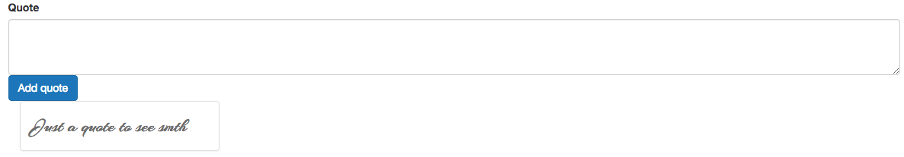

# Adding Quotes with Custom Events

Now we wanna send the new quote to the `parent component`, which will hold it and holds all out quotes. In the child `NewQuote` we will call `$emit()` to emit the `quoteAdded` event and add quote from the `data object`. Remenber the quote will be updated all the time cos we bind it with `two-way` binding. Therefore we also reset this quote after sending it, so that the `form` gets cleared. 

**NewQuote**
```html
<template>
<div class="row">
<form>

<div class col-sm-8 col-sm-offset-2 col-xs-12 col-md-6 col-md-offset-3 form-group>
<label>Quote</label>
<textarea class="form-control" rows="3" v-model="quote"></textarea>
</div>

<div class col-sm-8 col-sm-offset-2 col-xs-12 col-md-6 col-md-offset-3 form-group>
<button class="btn btn-primary" @click.prevent="createNew">Add quote</button> 
</div>

</form>

</div>
</template>

<script>
 
 export default{
        data: function(){
            return{
                quote: ''
            }
        },
        methods: {
            createNew(){
            this.$emit('quoteAdded', this.quote);
            this.quote = '';
            }
        }
    }
</script>

<style></style>
```

Now in our `root component - App.vue` we need to implement this `NewQuote` component. To do so we first import it to the `root component` and register it, and finally add the `selector` to the template. 

**App.vue**

```html
<template>
    <div class="container">
    <app-new-quote></app-new-quote>
    <app-quotes-grid :quotes="quotes"></app-quotes-grid>

    </div>
</template>

<script>
import QuotesGrid from './components/QuotesGrid.vue';
import NewQuote from './components/NewQuote.vue';

    export default {
         data: function(){
            return {
            maxQuotes: 10,     
            quotes: ['Just a quote to see smth']   
            }
        },
        components:{
            appQuotesGrid: QuotesGrid,
            appNewQuote: NewQuote
        }
    }
</script>

<style>
</style>
```



Now it would be nice to listen to our `event` and display a new quote when we type it in the  text field. To do so we could add a click listener in the `root component` on the `<app-new-quote>` selector. And then execute a `method`, which we need to add in the `object`. Inside we will use the `data` we pass from our `child components`, namely `quote`, and use `.push()` method to add quotes. 

**App.vue**

```html
<template>
    <div class="container">
    <app-new-quote @quoteAdded="newQuote"></app-new-quote>  <!--listen to event-->
    <app-quotes-grid :quotes="quotes"></app-quotes-grid>

    </div>
</template>

<script>
import QuotesGrid from './components/QuotesGrid.vue';
import NewQuote from './components/NewQuote.vue';

    export default {
         data: function(){
            return {
            maxQuotes: 10,     
            quotes: ['Just a quote to see smth']   
            }
        },
        components:{
            appQuotesGrid: QuotesGrid,
            appNewQuote: NewQuote
        },
        methods:{
            newQuote(quote){
            this.quotes.push(quote);
            }
        }
    }
</script>

<style>
</style>
```

What is missing now is the functionality to delete a quote, infobox at the bottom and the logic to count how many quotes we have and to show a progress bar. 