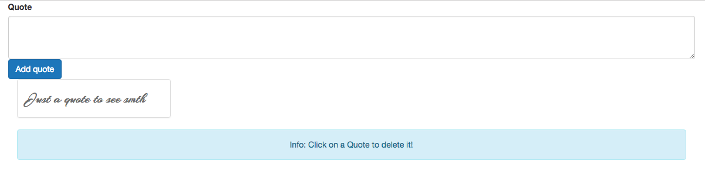

# Adding an Info Box

Let's implement the functionality to delete quotes. For that we first need in our `App.vue` file add a little `info box` telling us that we should click on the quote to delete it. For that we'll use a `div` with a  bootstrap `row` and in that row a column (`div`) which spands the whole width, and in there we also need center our text. And then one more `div` with the `class of alert` - the box with rounded corners, but to not make it red we'll add the `alert-info` class.

**App.vue**

```html
<template>
    <div class="container">
    <app-new-quote @quoteAdded="newQuote"></app-new-quote>  
    <app-quotes-grid :quotes="quotes"></app-quotes-grid>
    <div class="row">
    <div class="col-sm-12 text-center">
    <div class="alert alert-info">Info: Click on a Quote to delete it!</div>
    </div>
    </div>

    </div>
</template>

<script>
import QuotesGrid from './components/QuotesGrid.vue';
import NewQuote from './components/NewQuote.vue';

    export default {
         data: function(){
            return {
            maxQuotes: 10,     
            quotes: ['Just a quote to see smth']   
            }
        },
        components:{
            appQuotesGrid: QuotesGrid,
            appNewQuote: NewQuote
        },
        methods:{
            newQuote(quote){
            this.quotes.push(quote);
            }
        }
    }
</script>

<style>
</style>
```



Now to make Quotes delitable we need to make them clickable. And then when we click them we kin dof need to acces our `array of quotes` and delete it. 