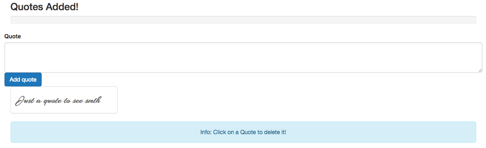

# Controlling Quotes with a Progress Bar

To implement a `progress bar` we'll add a new `component` "Header.vue". We'll use a normal bootstrap `progress bar`. The state of the `progress bar` is controlled by the width of it. 

**Header.vue**

```html
<template>
<div class="row">
<div class="col-sm-12">
<h3>Quotes Added!</h3>
<div class="progress">
	<div class="progress-bar" role="progressbar" aria-valuenow="60" aria-valuemin="0" aria-valuemax="100">
	
	</div>
</div>
</div> 
</div>
</template>	
```

Now we can go to our `App.vue` file where we import `Header`, register it and add a `selector` in the `template`. 

**App.vue**

```html
<template>
    <div class="container">
    <app-header></app-header>
    <app-new-quote @quoteAdded="newQuote"></app-new-quote>  
    <app-quotes-grid :quotes="quotes" @quoteDeleted="deleteQuote"></app-quotes-grid>
    <div class="row">
    <div class="col-sm-12 text-center">
    <div class="alert alert-info">Info: Click on a Quote to delete it!</div>
    </div>
    </div>

    </div>
</template>

<script>
import QuotesGrid from './components/QuotesGrid.vue';
import NewQuote from './components/NewQuote.vue';
import Header from './components/Header.vue';

    export default {
         data: function(){
            return {
            maxQuotes: 10,     
            quotes: ['Just a quote to see smth']   
            }
        },
        components:{
            appQuotesGrid: QuotesGrid,
            appNewQuote: NewQuote,
            appHeader: Header
        },
        methods:{
            newQuote(quote){
            this.quotes.push(quote);
            },
            deleteQuote(index){
            this.quotes.splice(index, 1)
            }
        }
    }
</script>

<style>
</style>
```



Now we need to adjust the width of the `inner div` of the `Header` to control how far this `progrees bar` has moved. To set the progress let's add a `<script>` part to the `Header` file. And setup the `props` - actually two of them: `quoteQount` and `maxQuotes` of quotes. We wanna output some text in the `progress bar` - the number of quotes. Do do so we would simply use string interpolation and output `{{quoteCount}}` and also the max number of quotes. Now let's set the `width`, we would bind to the `style` attribute and in there dynamically set the width.Well, we wanna calculate the `quoteCount` devided by the maximum number of quotes, multilp by 100. And now we should correctly pass both `quoteQount` and `maxQuotes`. 

**Header.vue**

```html
<template>
<div class="row">
<div class="col-sm-12">
<h3>Quotes Added!</h3>
<div class="progress">
	<div class="progress-bar" role="progressbar" aria-valuenow="60" aria-valuemin="0" aria-valuemax="100" :style="{width: (quoteCount / maxQuotes) * 100 + '%'}">
	{{quoteCount}} / {{maxQuotes}}
	</div>
</div>
</div> 
</div>
</template>	

<script>
export default{
    props: ['quoteCount', 'maxQuotes']
}
</script>

```

