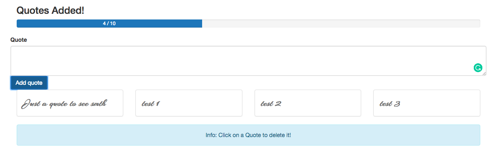
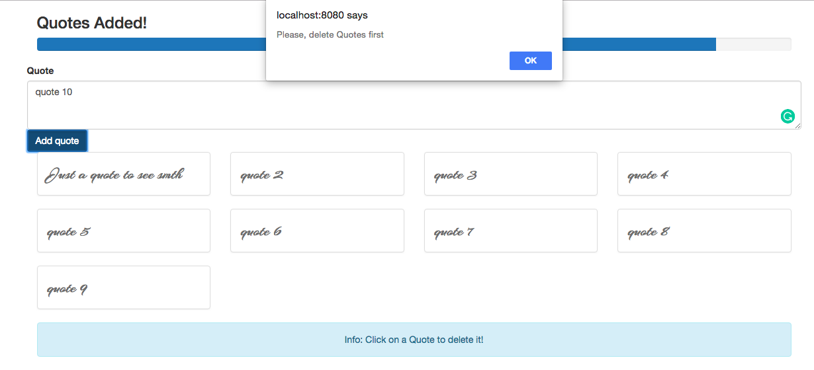

# Finishing Touches and State Management

In our `App.vue` component we can pass  both `quoteQount` and `maxQuotes`. Actually, we already have it in the `object`: `maxQuotes: 10` and `quotes array`. So, we set `quoteQount` equal to the `quotes length`. And `maxQuotes` can simply be `maxQuotes` - ` <app-header :quoteQount="quotes.length" :maxQuotes="maxQuotes"></app-header>`. 

**App.vue**

```html
<template>
    <div class="container">
    <app-header :quoteQount="quotes.length" :maxQuotes="maxQuotes"></app-header>
    <app-new-quote @quoteAdded="newQuote"></app-new-quote>  
    <app-quotes-grid :quotes="quotes" @quoteDeleted="deleteQuote"></app-quotes-grid>
    <div class="row">
    <div class="col-sm-12 text-center">
    <div class="alert alert-info">Info: Click on a Quote to delete it!</div>
    </div>
    </div>

    </div>
</template>

<script>
import QuotesGrid from './components/QuotesGrid.vue';
import NewQuote from './components/NewQuote.vue';
import Header from './components/Header.vue';

    export default {
         data: function(){
            return {
            maxQuotes: 10,     
            quotes: ['Just a quote to see smth']   
            }
        },
        components:{
            appQuotesGrid: QuotesGrid,
            appNewQuote: NewQuote,
            appHeader: Header
        },
        methods:{
            newQuote(quote){
            this.quotes.push(quote);
            },
            deleteQuote(index){
            this.quotes.splice(index, 1)
            }
        }
    }
</script>

<style>
</style>
```



The last thing is - if we have ten quotes we wanna have a warning that we need first delete an item before adding more. 

To get this we go to `App.vue` component and the `newQuote()` method there. And check if `quotes length` is greater or equal the `maximum quote number`. And if that is the case we'll return an `alert`. 

**App.vue**

```html
<template>
    <div class="container">
    <app-header :quoteQount="quotes.length" :maxQuotes="maxQuotes"></app-header>
    <app-new-quote @quoteAdded="newQuote"></app-new-quote>  
    <app-quotes-grid :quotes="quotes" @quoteDeleted="deleteQuote"></app-quotes-grid>
    <div class="row">
    <div class="col-sm-12 text-center">
    <div class="alert alert-info">Info: Click on a Quote to delete it!</div>
    </div>
    </div>

    </div>
</template>

<script>
import QuotesGrid from './components/QuotesGrid.vue';
import NewQuote from './components/NewQuote.vue';
import Header from './components/Header.vue';

    export default {
         data: function(){
            return {
            maxQuotes: 10,     
            quotes: ['Just a quote to see smth']   
            }
        },
        components:{
            appQuotesGrid: QuotesGrid,
            appNewQuote: NewQuote,
            appHeader: Header
        },
        methods:{
            newQuote(quote){
            this.quotes.push(quote);
            if(this.quotes.length >= this.maxQuotes){
                return alert('Please, delete Quotes first');
            }
            },
            deleteQuote(index){
            this.quotes.splice(index, 1)
            }
        }
    }
</script>

<style>
</style>
```



