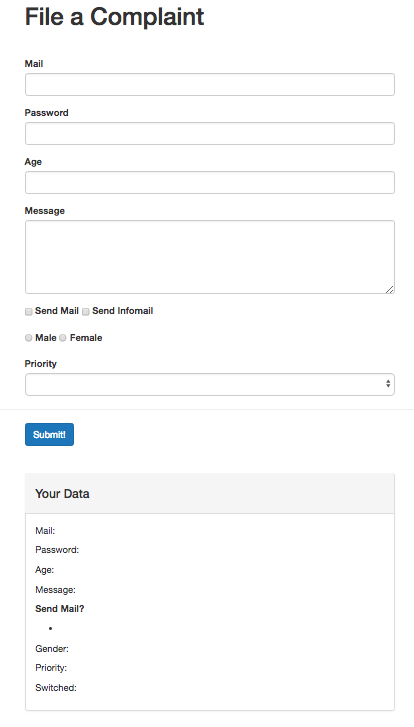
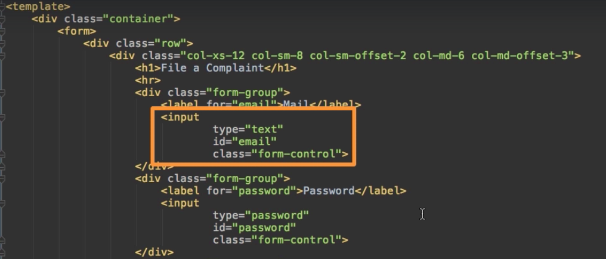
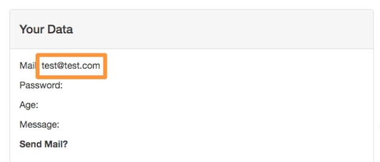

# A basic Input Form binding

We start with a couple of forms. We have a couple of `input fields` and at the bottom the `data` the user entered. At the begginning we output the `data` right away, so that we can always see what we entered. And later we'll change this so the `data` only display when we submit the `button`. 



**main.js**
```js
import Vue from 'vue'
import App from './App.vue'

new Vue({
  el: '#app',
  render: h => h(App)
})
```
**index.html**
```html
<!DOCTYPE html>
<html lang="en">
  <head>
    <meta charset="utf-8">
    <title>Vue Forms</title>
    <link rel="stylesheet" href="https://maxcdn.bootstrapcdn.com/bootstrap/3.3.7/css/bootstrap.min.css" integrity="sha384-BVYiiSIFeK1dGmJRAkycuHAHRg32OmUcww7on3RYdg4Va+PmSTsz/K68vbdEjh4u" crossorigin="anonymous"></head>
  <body>
    <div id="app">
    </div>
    <script src="/dist/build.js"></script>
  </body>
</html>
```

**App.vue**

```html
<template>
    <div class="container">
        <form>
            <div class="row">
                <div class="col-xs-12 col-sm-8 col-sm-offset-2 col-md-6 col-md-offset-3">
                    <h1>File a Complaint</h1>
                    <hr>
                    <div class="form-group">
                        <label for="email">Mail</label>
                        <input
                                type="text"
                                id="email"
                                class="form-control">
                    </div>
                    <div class="form-group">
                        <label for="password">Password</label>
                        <input
                                type="password"
                                id="password"
                                class="form-control">
                    </div>
                    <div class="form-group">
                        <label for="age">Age</label>
                        <input
                                type="number"
                                id="age"
                                class="form-control">
                    </div>

                </div>
            </div>
            <div class="row">
                <div class="col-xs-12 col-sm-8 col-sm-offset-2 col-md-6 col-md-offset-3 form-group">
                    <label for="message">Message</label><br>
                    <!-- Interpolation between <textarea>{{ test }}</textarea> doesn't work!-->
                    <textarea
                            id="message"
                            rows="5"
                            class="form-control"></textarea>
                </div>
            </div>
            <div class="row">
                <div class="col-xs-12 col-sm-8 col-sm-offset-2 col-md-6 col-md-offset-3">
                    <div class="form-group">
                        <label for="sendmail">
                            <input
                                    type="checkbox"
                                    id="sendmail"
                                    value="SendMail"> Send Mail
                        </label>
                        <label for="sendInfomail">
                            <input
                                    type="checkbox"
                                    id="sendInfomail"
                                    value="SendInfoMail"> Send Infomail
                        </label>
                    </div>

                </div>
            </div>
            <div class="row">
                <div class="col-xs-12 col-sm-8 col-sm-offset-2 col-md-6 col-md-offset-3 form-group">
                    <label for="male">
                        <input
                                type="radio"
                                id="male"
                                value="Male"> Male
                    </label>
                    <label for="female">
                        <input
                                type="radio"
                                id="female"
                                value="Female"> Female
                    </label>
                </div>
            </div>
            <div class="row">
                <div class="col-xs-12 col-sm-8 col-sm-offset-2 col-md-6 col-md-offset-3 from-group">
                    <label for="priority">Priority</label>
                    <select
                            id="priority"
                            class="form-control">
                        <option></option>
                    </select>
                </div>
            </div>
            <hr>
            <div class="row">
                <div class="col-xs-12 col-sm-8 col-sm-offset-2 col-md-6 col-md-offset-3">
                    <button
                            class="btn btn-primary">Submit!
                    </button>
                </div>
            </div>
        </form>
        <hr>
        <div class="row">
            <div class="col-xs-12 col-sm-8 col-sm-offset-2 col-md-6 col-md-offset-3">
                <div class="panel panel-default">
                    <div class="panel-heading">
                        <h4>Your Data</h4>
                    </div>
                    <div class="panel-body">
                        <p>Mail:</p>
                        <p>Password:</p>
                        <p>Age:</p>
                        <p>Message: </p>
                        <p><strong>Send Mail?</strong></p>
                        <ul>
                            <li></li>
                        </ul>
                        <p>Gender:</p>
                        <p>Priority:</p>
                        <p>Switched:</p>
                    </div>
                </div>
            </div>
        </div>
    </div>
</template>

<script>
    export default {
    }
</script>

<style>

</style>
```

So lets working on this form step-by-step, and learning about the different options `VueJs forms` offer us. 

Let's start with a normal `text input field`. We wanna hook this up to a `property` in our code, so that we can see what a user entered there and use this in our code to validate or whatever we wanna do with that.

The html representation of the `mail input field` is here. It's a normal `input field` with some bootstrap classes. Now we wanna hook this input to a `property` in our `vue instanse`. Right now our `vue instance` is an empty `object` at the bottom of the code. In the `object` first we need to setup the `data`. In the `data object` we wanna have the `email` property let's say, by default this should be empty. To hook our `input` to the `property` in the object we'll use `v-model`. At our `user data` at the bottom of our form we can simly add {{email}} with a string interpolation. 



**App.vue**

```html
<template>
    <div class="container">
        <form>
            <div class="row">
                <div class="col-xs-12 col-sm-8 col-sm-offset-2 col-md-6 col-md-offset-3">
                    <h1>File a Complaint</h1>
                    <hr>
                    <div class="form-group">
                        <label for="email">Mail</label>
                        <input
                                type="text"
                                id="email"
                                class="form-control"
                                v-model="email">         <!--bind to the property-->
                    </div>
                    <div class="form-group">
                        <label for="password">Password</label>
                        <input
                                type="password"
                                id="password"
                                class="form-control">
                    </div>
                    <div class="form-group">
                        <label for="age">Age</label>
                        <input
                                type="number"
                                id="age"
                                class="form-control">
                    </div>

                </div>
            </div>
            <div class="row">
                <div class="col-xs-12 col-sm-8 col-sm-offset-2 col-md-6 col-md-offset-3 form-group">
                    <label for="message">Message</label><br>
                   
                    <textarea
                            id="message"
                            rows="5"
                            class="form-control"></textarea>
                </div>
            </div>
            <div class="row">
                <div class="col-xs-12 col-sm-8 col-sm-offset-2 col-md-6 col-md-offset-3">
                    <div class="form-group">
                        <label for="sendmail">
                            <input
                                    type="checkbox"
                                    id="sendmail"
                                    value="SendMail"> Send Mail
                        </label>
                        <label for="sendInfomail">
                            <input
                                    type="checkbox"
                                    id="sendInfomail"
                                    value="SendInfoMail"> Send Infomail
                        </label>
                    </div>

                </div>
            </div>
            <div class="row">
                <div class="col-xs-12 col-sm-8 col-sm-offset-2 col-md-6 col-md-offset-3 form-group">
                    <label for="male">
                        <input
                                type="radio"
                                id="male"
                                value="Male"> Male
                    </label>
                    <label for="female">
                        <input
                                type="radio"
                                id="female"
                                value="Female"> Female
                    </label>
                </div>
            </div>
            <div class="row">
                <div class="col-xs-12 col-sm-8 col-sm-offset-2 col-md-6 col-md-offset-3 from-group">
                    <label for="priority">Priority</label>
                    <select
                            id="priority"
                            class="form-control">
                        <option></option>
                    </select>
                </div>
            </div>
            <hr>
            <div class="row">
                <div class="col-xs-12 col-sm-8 col-sm-offset-2 col-md-6 col-md-offset-3">
                    <button
                            class="btn btn-primary">Submit!
                    </button>
                </div>
            </div>
        </form>
        <hr>
        <div class="row">
            <div class="col-xs-12 col-sm-8 col-sm-offset-2 col-md-6 col-md-offset-3">
                <div class="panel panel-default">
                    <div class="panel-heading">
                        <h4>Your Data</h4>
                    </div>
                    <div class="panel-body">
                        <p>Mail: {{email}}</p>  <!--add email here-->
                        <p>Password:</p>
                        <p>Age:</p>
                        <p>Message: </p>
                        <p><strong>Send Mail?</strong></p>
                        <ul>
                            <li></li>
                        </ul>
                        <p>Gender:</p>
                        <p>Priority:</p>
                        <p>Switched:</p>
                    </div>
                </div>
            </div>
        </div>
    </div>
</template>

<script>
    export default {
        data: function (){           //setup the data here 
         return{
          email: ''
         }
        }
    }
</script>

<style>

</style>
```



