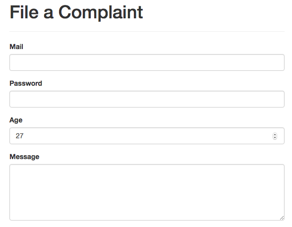
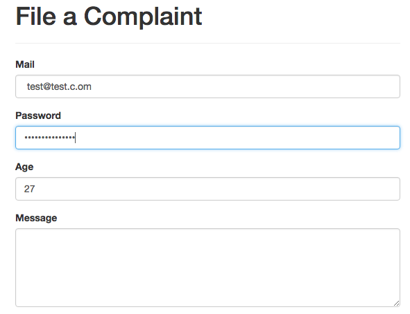
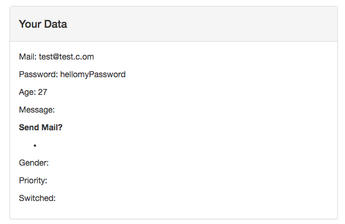

# Grouping Data and Pre-Populating Inputs

Let's group pur three input together: `email`, `password`, `age`. To do this in our `object` let's create `userData` property which is the `object` with our three `properties` inside. With this setup we can bind this with our template: for the email we use `userData.email` - now we bind to a `property` in an `object`. The same approach we use for the `password` and `age`. 

**App.vue**

```html
<template>
    <div class="container">
        <form>
            <div class="row">
                <div class="col-xs-12 col-sm-8 col-sm-offset-2 col-md-6 col-md-offset-3">
                    <h1>File a Complaint</h1>
                    <hr>
                    <div class="form-group">
                        <label for="email">Mail</label>
                        <input
                                type="text"
                                id="email"
                                class="form-control"
                                v-model="userData.email">        <!--bind email--> 
                    </div>
                    <div class="form-group">
                        <label for="password">Password</label>
                        <input
                                type="password"
                                id="password"
                                class="form-control"
                                v-model="userData.password">     <!--bind password--> 
                    </div>
                    <div class="form-group">
                        <label for="age">Age</label>
                        <input
                                type="number"
                                id="age"
                                class="form-control"
                                v-model="userData.age">         <!--bind age--> 
                    </div>

                </div>
            </div>
            <div class="row">
                <div class="col-xs-12 col-sm-8 col-sm-offset-2 col-md-6 col-md-offset-3 form-group">
                    <label for="message">Message</label><br>
                   
                    <textarea
                            id="message"
                            rows="5"
                            class="form-control"></textarea>
                </div>
            </div>
            <div class="row">
                <div class="col-xs-12 col-sm-8 col-sm-offset-2 col-md-6 col-md-offset-3">
                    <div class="form-group">
                        <label for="sendmail">
                            <input
                                    type="checkbox"
                                    id="sendmail"
                                    value="SendMail"> Send Mail
                        </label>
                        <label for="sendInfomail">
                            <input
                                    type="checkbox"
                                    id="sendInfomail"
                                    value="SendInfoMail"> Send Infomail
                        </label>
                    </div>

                </div>
            </div>
            <div class="row">
                <div class="col-xs-12 col-sm-8 col-sm-offset-2 col-md-6 col-md-offset-3 form-group">
                    <label for="male">
                        <input
                                type="radio"
                                id="male"
                                value="Male"> Male
                    </label>
                    <label for="female">
                        <input
                                type="radio"
                                id="female"
                                value="Female"> Female
                    </label>
                </div>
            </div>
            <div class="row">
                <div class="col-xs-12 col-sm-8 col-sm-offset-2 col-md-6 col-md-offset-3 from-group">
                    <label for="priority">Priority</label>
                    <select
                            id="priority"
                            class="form-control">
                        <option></option>
                    </select>
                </div>
            </div>
            <hr>
            <div class="row">
                <div class="col-xs-12 col-sm-8 col-sm-offset-2 col-md-6 col-md-offset-3">
                    <button
                            class="btn btn-primary">Submit!
                    </button>
                </div>
            </div>
        </form>
        <hr>
        <div class="row">
            <div class="col-xs-12 col-sm-8 col-sm-offset-2 col-md-6 col-md-offset-3">
                <div class="panel panel-default">
                    <div class="panel-heading">
                        <h4>Your Data</h4>
                    </div>
                    <div class="panel-body">
                        <p>Mail: {{email}}</p> 
                        <p>Password:</p>
                        <p>Age:</p>
                        <p>Message: </p>
                        <p><strong>Send Mail?</strong></p>
                        <ul>
                            <li></li>
                        </ul>
                        <p>Gender:</p>
                        <p>Priority:</p>
                        <p>Switched:</p>
                    </div>
                </div>
            </div>
        </div>
    </div>
</template>

<script>
    export default {
        data: function(){
            return {
              userData:{          //create an object with three properies 
                email: ' ',
                password: '', 
                age: 27
        }
        }
        }
    }
</script>

<style>

</style>
```

Now `age` is prepolulated already (we setup as a `default value`). We surely can ocerride this by typing another `value` in the form directly. 



Now to display the info in the `Your data` field, we need to use the right string interpolation. 

**App.vue**

```html
<template>
    <div class="container">
        <form>
            <div class="row">
                <div class="col-xs-12 col-sm-8 col-sm-offset-2 col-md-6 col-md-offset-3">
                    <h1>File a Complaint</h1>
                    <hr>
                    <div class="form-group">
                        <label for="email">Mail</label>
                        <input
                                type="text"
                                id="email"
                                class="form-control"
                                v-model="userData.email">       
                    </div>
                    <div class="form-group">
                        <label for="password">Password</label>
                        <input
                                type="password"
                                id="password"
                                class="form-control"
                                v-model="userData.password">     
                    </div>
                    <div class="form-group">
                        <label for="age">Age</label>
                        <input
                                type="number"
                                id="age"
                                class="form-control"
                                v-model="userData.age">        
                    </div>

                </div>
            </div>
            <div class="row">
                <div class="col-xs-12 col-sm-8 col-sm-offset-2 col-md-6 col-md-offset-3 form-group">
                    <label for="message">Message</label><br>
                   
                    <textarea
                            id="message"
                            rows="5"
                            class="form-control"></textarea>
                </div>
            </div>
            <div class="row">
                <div class="col-xs-12 col-sm-8 col-sm-offset-2 col-md-6 col-md-offset-3">
                    <div class="form-group">
                        <label for="sendmail">
                            <input
                                    type="checkbox"
                                    id="sendmail"
                                    value="SendMail"> Send Mail
                        </label>
                        <label for="sendInfomail">
                            <input
                                    type="checkbox"
                                    id="sendInfomail"
                                    value="SendInfoMail"> Send Infomail
                        </label>
                    </div>

                </div>
            </div>
            <div class="row">
                <div class="col-xs-12 col-sm-8 col-sm-offset-2 col-md-6 col-md-offset-3 form-group">
                    <label for="male">
                        <input
                                type="radio"
                                id="male"
                                value="Male"> Male
                    </label>
                    <label for="female">
                        <input
                                type="radio"
                                id="female"
                                value="Female"> Female
                    </label>
                </div>
            </div>
            <div class="row">
                <div class="col-xs-12 col-sm-8 col-sm-offset-2 col-md-6 col-md-offset-3 from-group">
                    <label for="priority">Priority</label>
                    <select
                            id="priority"
                            class="form-control">
                        <option></option>
                    </select>
                </div>
            </div>
            <hr>
            <div class="row">
                <div class="col-xs-12 col-sm-8 col-sm-offset-2 col-md-6 col-md-offset-3">
                    <button
                            class="btn btn-primary">Submit!
                    </button>
                </div>
            </div>
        </form>
        <hr>
        <div class="row">
            <div class="col-xs-12 col-sm-8 col-sm-offset-2 col-md-6 col-md-offset-3">
                <div class="panel panel-default">
                    <div class="panel-heading">
                        <h4>Your Data</h4>
                    </div>
                    <div class="panel-body">
                        <p>Mail: {{userData.email}}</p>  <!--string interpolation here-->
                        <p>Password: {{userData.password}}</p>  <!--string interpolation here-->
                        <p>Age: {{userData.age}}</p>  <!--string interpolation here-->
                        <p>Message: </p>
                        <p><strong>Send Mail?</strong></p>
                        <ul>
                            <li></li>
                        </ul>
                        <p>Gender:</p>
                        <p>Priority:</p>
                        <p>Switched:</p>
                    </div>
                </div>
            </div>
        </div>
    </div>
</template>

<script>
    export default {
        data: function(){
            return {
              userData:{         
                email: ' ',
                password: '', 
                age: 27
        }
        }
        }
    }
</script>

<style>

</style>
```




This is how we can use a more complex `object` to nest our `properties` and how to `pre-populate` a field by simply setting the `property` initially. 
