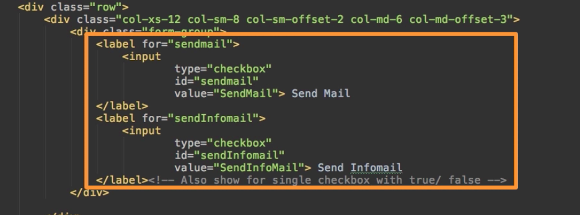
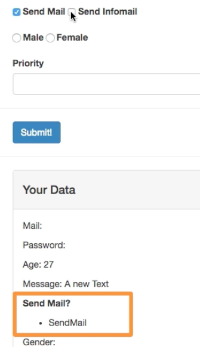

# Using Checkboxes and saving Data in Arrays

Let's work with `checkboxes`. In the html code here is the code responsible for the `checkboxes`. We have two checkboxes that are nested inside of a `label`. We wanna bind the `inputs` to a specific `property`. To be very precise what we want to achieve here is - in the area of selecting which kind of mails we wanna recieve (we can check normal mail or info mails) and then add them both in one array. So, first we need to add an empty `array` in our `object`. Then in our checkboxes we should add `v-model` to the `input`!!! and bind it to `sendMail`. VueJS will automatically merge these `inputs` into a single `array`. To output all the elements in the `array` in our `Your data` field we first loop throug `item in sendMail`. And ouput it with string interpolation. 



**App.vue**

```html
<template>
    <div class="container">
        <form>
            <div class="row">
                <div class="col-xs-12 col-sm-8 col-sm-offset-2 col-md-6 col-md-offset-3">
                    <h1>File a Complaint</h1>
                    <hr>
                    <div class="form-group">
                        <label for="email">Mail</label>
                        <input
                                type="text"
                                id="email"
                                class="form-control"
                                v-model="userData.email">       
                    </div>
                    <div class="form-group">
                        <label for="password">Password</label>
                        <input
                                type="password"
                                id="password"
                                class="form-control"
                                v-model.lazy="userData.password">     
                    </div>
                    <div class="form-group">
                        <label for="age">Age</label>
                        <input
                                type="number"
                                id="age"
                                class="form-control"
                                v-model="userData.age">        
                    </div>

                </div>
            </div>
            <div class="row">
                <div class="col-xs-12 col-sm-8 col-sm-offset-2 col-md-6 col-md-offset-3 form-group">
                    <label for="message">Message</label><br>
                   
                    <textarea
                            id="message"
                            rows="5"
                            class="form-control"
                            v-model="message"></textarea>  
                </div>
            </div>
            <div class="row">
                <div class="col-xs-12 col-sm-8 col-sm-offset-2 col-md-6 col-md-offset-3">
                    <div class="form-group">
                        <label for="sendmail">
                            <input
                                    type="checkbox"       
                                    id="sendmail"
                                    value="SendMail"
                                    v-model="sendMail"> Send Mail <!--bind to sendMail array-->
                        </label>
                        <label for="sendInfomail">
                            <input
                                    type="checkbox"
                                    id="sendInfomail"
                                    value="SendInfoMail"
                                    v-model="sendMail"> Send Infomail   <!--bind to sendMail array-->
                        </label>
                    </div>

                </div>
            </div>
            <div class="row">
                <div class="col-xs-12 col-sm-8 col-sm-offset-2 col-md-6 col-md-offset-3 form-group">
                    <label for="male">
                        <input
                                type="radio"
                                id="male"
                                value="Male"> Male
                    </label>
                    <label for="female">
                        <input
                                type="radio"
                                id="female"
                                value="Female"> Female
                    </label>
                </div>
            </div>
            <div class="row">
                <div class="col-xs-12 col-sm-8 col-sm-offset-2 col-md-6 col-md-offset-3 from-group">
                    <label for="priority">Priority</label>
                    <select
                            id="priority"
                            class="form-control">
                        <option></option>
                    </select>
                </div>
            </div>
            <hr>
            <div class="row">
                <div class="col-xs-12 col-sm-8 col-sm-offset-2 col-md-6 col-md-offset-3">
                    <button
                            class="btn btn-primary">Submit!
                    </button>
                </div>
            </div>
        </form>
        <hr>
        <div class="row">
            <div class="col-xs-12 col-sm-8 col-sm-offset-2 col-md-6 col-md-offset-3">
                <div class="panel panel-default">
                    <div class="panel-heading">
                        <h4>Your Data</h4>
                    </div>
                    <div class="panel-body">
                        <p>Mail: {{userData.email}}</p>  
                        <p>Password: {{userData.password}}</p> 
                        <p>Age: {{userData.age}}</p>  
                        <p style="white-space:pre">Message: {{message}}</p>    
                        <p><strong>Send Mail?</strong></p>
                        <ul>
                            <li v-for="item in sendMail"><{{ item }}/li> <!--loop through the elements in array-->
                        </ul>
                        <p>Gender:</p>
                        <p>Priority:</p>
                        <p>Switched:</p>
                    </div>
                </div>
            </div>
        </div>
    </div>
</template>

<script>
    export default {
        data: function(){
            return {
              userData:{         
                email: ' ',
                password: '', 
                age: 27
        },
              message: 'A new text',
              sendMail: []                 //add the array here 
        }
        }
    }
</script>

<style>

</style>
```
Now if we hit `sendMail` it will be added to the list. The same is with `send Infomail`.



