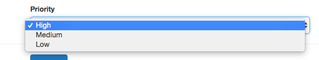
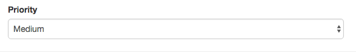
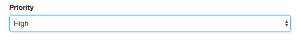

# Handling Dropdowns with `<select>` and `<option>`

Let's work on the last `input` type of our form - a select `input`, a dropdown `input`. First we need to do is to add in our `object` an `array of options` we wanna populate with, let's name it 'priorities'. After that we go to our `<option>` in the template and setup `v-for` loop, so this will create all these options. Also we ouput our priorities in the form with string interpolation. 

**App.vue**

```html
<template>
    <div class="container">
        <form>
            <div class="row">
                <div class="col-xs-12 col-sm-8 col-sm-offset-2 col-md-6 col-md-offset-3">
                    <h1>File a Complaint</h1>
                    <hr>
                    <div class="form-group">
                        <label for="email">Mail</label>
                        <input
                                type="text"
                                id="email"
                                class="form-control"
                                v-model="userData.email">       
                    </div>
                    <div class="form-group">
                        <label for="password">Password</label>
                        <input
                                type="password"
                                id="password"
                                class="form-control"
                                v-model.lazy="userData.password">     
                    </div>
                    <div class="form-group">
                        <label for="age">Age</label>
                        <input
                                type="number"
                                id="age"
                                class="form-control"
                                v-model="userData.age">        
                    </div>

                </div>
            </div>
            <div class="row">
                <div class="col-xs-12 col-sm-8 col-sm-offset-2 col-md-6 col-md-offset-3 form-group">
                    <label for="message">Message</label><br>
                   
                    <textarea
                            id="message"
                            rows="5"
                            class="form-control"
                            v-model="message"></textarea>  
                </div>
            </div>
            <div class="row">
                <div class="col-xs-12 col-sm-8 col-sm-offset-2 col-md-6 col-md-offset-3">
                    <div class="form-group">
                        <label for="sendmail">
                            <input
                                    type="checkbox"       
                                    id="sendmail"
                                    value="SendMail"
                                    v-model="sendMail"> Send Mail 
                        </label>
                        <label for="sendInfomail">
                            <input
                                    type="checkbox"
                                    id="sendInfomail"
                                    value="SendInfoMail"
                                    v-model="sendMail"> Send Infomail   
                        </label>
                    </div>

                </div>
            </div>
            <div class="row">
                <div class="col-xs-12 col-sm-8 col-sm-offset-2 col-md-6 col-md-offset-3 form-group">
                    <label for="male">
                        <input
                                type="radio"
                                id="male"
                                value="Male"
                                v-model="gender"> Male
                    </label>
                    <label for="female">
                        <input
                                type="radio"
                                id="female"
                                value="Female"
                                v-model="gender"> Female
                    </label>
                </div>
            </div>
            <div class="row">
                <div class="col-xs-12 col-sm-8 col-sm-offset-2 col-md-6 col-md-offset-3 from-group">
                    <label for="priority">Priority</label>
                    <select
                            id="priority"
                            class="form-control">
                        <option v-for="priority in priorities">{{priority}}</option>  <!--loop the priorities-->
                    </select>
                </div>
            </div>
            <hr>
            <div class="row">
                <div class="col-xs-12 col-sm-8 col-sm-offset-2 col-md-6 col-md-offset-3">
                    <button
                            class="btn btn-primary">Submit!
                    </button>
                </div>
            </div>
        </form>
        <hr>
        <div class="row">
            <div class="col-xs-12 col-sm-8 col-sm-offset-2 col-md-6 col-md-offset-3">
                <div class="panel panel-default">
                    <div class="panel-heading">
                        <h4>Your Data</h4>
                    </div>
                    <div class="panel-body">
                        <p>Mail: {{userData.email}}</p>  
                        <p>Password: {{userData.password}}</p> 
                        <p>Age: {{userData.age}}</p>  
                        <p style="white-space:pre">Message: {{message}}</p>    
                        <p><strong>Send Mail?</strong></p>
                        <ul>
                            <li v-for="item in sendMail"><{{ item }}/li> 
                        </ul>
                        <p>Gender: {{gender}}</p>
                        <p>Priority:</p>
                        <p>Switched:</p>
                    </div>
                </div>
            </div>
        </div>
    </div>
</template>

<script>
    export default {
        data: function(){
            return {
              userData:{         
                email: ' ',
                password: '', 
                age: 27
        },
              message: 'A new text',
              sendMail: [],
              gender: 'Male',
              priorities: ['High', 'Medium', 'Low']      //set an array of options here          
        }
        }
    }
</script>

<style>

</style>
```



Of course we could select another option as a `defaul`t by binding it to the `:selected` property and for the `value` determining if this ship the selected we could check if `priority` (the `value` of the current `loop` iteration) equals 'Medium'. 

**App.vue**

```html
<template>
    <div class="container">
        <form>
            <div class="row">
                <div class="col-xs-12 col-sm-8 col-sm-offset-2 col-md-6 col-md-offset-3">
                    <h1>File a Complaint</h1>
                    <hr>
                    <div class="form-group">
                        <label for="email">Mail</label>
                        <input
                                type="text"
                                id="email"
                                class="form-control"
                                v-model="userData.email">       
                    </div>
                    <div class="form-group">
                        <label for="password">Password</label>
                        <input
                                type="password"
                                id="password"
                                class="form-control"
                                v-model.lazy="userData.password">     
                    </div>
                    <div class="form-group">
                        <label for="age">Age</label>
                        <input
                                type="number"
                                id="age"
                                class="form-control"
                                v-model="userData.age">        
                    </div>

                </div>
            </div>
            <div class="row">
                <div class="col-xs-12 col-sm-8 col-sm-offset-2 col-md-6 col-md-offset-3 form-group">
                    <label for="message">Message</label><br>
                   
                    <textarea
                            id="message"
                            rows="5"
                            class="form-control"
                            v-model="message"></textarea>  
                </div>
            </div>
            <div class="row">
                <div class="col-xs-12 col-sm-8 col-sm-offset-2 col-md-6 col-md-offset-3">
                    <div class="form-group">
                        <label for="sendmail">
                            <input
                                    type="checkbox"       
                                    id="sendmail"
                                    value="SendMail"
                                    v-model="sendMail"> Send Mail 
                        </label>
                        <label for="sendInfomail">
                            <input
                                    type="checkbox"
                                    id="sendInfomail"
                                    value="SendInfoMail"
                                    v-model="sendMail"> Send Infomail   
                        </label>
                    </div>

                </div>
            </div>
            <div class="row">
                <div class="col-xs-12 col-sm-8 col-sm-offset-2 col-md-6 col-md-offset-3 form-group">
                    <label for="male">
                        <input
                                type="radio"
                                id="male"
                                value="Male"
                                v-model="gender"> Male
                    </label>
                    <label for="female">
                        <input
                                type="radio"
                                id="female"
                                value="Female"
                                v-model="gender"> Female
                    </label>
                </div>
            </div>
            <div class="row">
                <div class="col-xs-12 col-sm-8 col-sm-offset-2 col-md-6 col-md-offset-3 from-group">
                    <label for="priority">Priority</label>
                    <select
                            id="priority"
                            class="form-control">
                        <option v-for="priority in priorities" :selected="priority == 'Medium'">{{priority}}</option>  <!--select the value as a default-->
                    </select>
                </div>
            </div>
            <hr>
            <div class="row">
                <div class="col-xs-12 col-sm-8 col-sm-offset-2 col-md-6 col-md-offset-3">
                    <button
                            class="btn btn-primary">Submit!
                    </button>
                </div>
            </div>
        </form>
        <hr>
        <div class="row">
            <div class="col-xs-12 col-sm-8 col-sm-offset-2 col-md-6 col-md-offset-3">
                <div class="panel panel-default">
                    <div class="panel-heading">
                        <h4>Your Data</h4>
                    </div>
                    <div class="panel-body">
                        <p>Mail: {{userData.email}}</p>  
                        <p>Password: {{userData.password}}</p> 
                        <p>Age: {{userData.age}}</p>  
                        <p style="white-space:pre">Message: {{message}}</p>    
                        <p><strong>Send Mail?</strong></p>
                        <ul>
                            <li v-for="item in sendMail"><{{ item }}/li> 
                        </ul>
                        <p>Gender: {{gender}}</p>
                        <p>Priority:</p>
                        <p>Switched:</p>
                    </div>
                </div>
            </div>
        </div>
    </div>
</template>

<script>
    export default {
        data: function(){
            return {
              userData:{         
                email: ' ',
                password: '', 
                age: 27
        },
              message: 'A new text',
              sendMail: [],
              gender: 'Male',
              priorities: ['High', 'Medium', 'Low']          
        }
        }
    }
</script>

<style>

</style>
```
Now it selects 'Medium' by default.



Now we need to bind our `input`, cos before we just populated the `values`. And again we use `v-model`, IMPORTANT here is that `v-model` is used now not with the individual option, but on the overall control which, in our case, is `select`. First we create the `property` to which we'll bind our input, let's name it 'selectedPriority' and let's set it to 'High' by default. And now we bind it to our `<select>`. 

**App.vue**

```html
<template>
    <div class="container">
        <form>
            <div class="row">
                <div class="col-xs-12 col-sm-8 col-sm-offset-2 col-md-6 col-md-offset-3">
                    <h1>File a Complaint</h1>
                    <hr>
                    <div class="form-group">
                        <label for="email">Mail</label>
                        <input
                                type="text"
                                id="email"
                                class="form-control"
                                v-model="userData.email">       
                    </div>
                    <div class="form-group">
                        <label for="password">Password</label>
                        <input
                                type="password"
                                id="password"
                                class="form-control"
                                v-model.lazy="userData.password">     
                    </div>
                    <div class="form-group">
                        <label for="age">Age</label>
                        <input
                                type="number"
                                id="age"
                                class="form-control"
                                v-model="userData.age">        
                    </div>

                </div>
            </div>
            <div class="row">
                <div class="col-xs-12 col-sm-8 col-sm-offset-2 col-md-6 col-md-offset-3 form-group">
                    <label for="message">Message</label><br>
                   
                    <textarea
                            id="message"
                            rows="5"
                            class="form-control"
                            v-model="message"></textarea>  
                </div>
            </div>
            <div class="row">
                <div class="col-xs-12 col-sm-8 col-sm-offset-2 col-md-6 col-md-offset-3">
                    <div class="form-group">
                        <label for="sendmail">
                            <input
                                    type="checkbox"       
                                    id="sendmail"
                                    value="SendMail"
                                    v-model="sendMail"> Send Mail 
                        </label>
                        <label for="sendInfomail">
                            <input
                                    type="checkbox"
                                    id="sendInfomail"
                                    value="SendInfoMail"
                                    v-model="sendMail"> Send Infomail   
                        </label>
                    </div>

                </div>
            </div>
            <div class="row">
                <div class="col-xs-12 col-sm-8 col-sm-offset-2 col-md-6 col-md-offset-3 form-group">
                    <label for="male">
                        <input
                                type="radio"
                                id="male"
                                value="Male"
                                v-model="gender"> Male
                    </label>
                    <label for="female">
                        <input
                                type="radio"
                                id="female"
                                value="Female"
                                v-model="gender"> Female
                    </label>
                </div>
            </div>
            <div class="row">
                <div class="col-xs-12 col-sm-8 col-sm-offset-2 col-md-6 col-md-offset-3 from-group">
                    <label for="priority">Priority</label>
                    <select
                            id="priority"
                            class="form-control"
                            v-model="selectedPriority">
                        <option v-for="priority in priorities" :selected="priority == 'Medium'">{{priority}}</option>  
                    </select>
                </div>
            </div>
            <hr>
            <div class="row">
                <div class="col-xs-12 col-sm-8 col-sm-offset-2 col-md-6 col-md-offset-3">
                    <button
                            class="btn btn-primary">Submit!
                    </button>
                </div>
            </div>
        </form>
        <hr>
        <div class="row">
            <div class="col-xs-12 col-sm-8 col-sm-offset-2 col-md-6 col-md-offset-3">
                <div class="panel panel-default">
                    <div class="panel-heading">
                        <h4>Your Data</h4>
                    </div>
                    <div class="panel-body">
                        <p>Mail: {{userData.email}}</p>  
                        <p>Password: {{userData.password}}</p> 
                        <p>Age: {{userData.age}}</p>  
                        <p style="white-space:pre">Message: {{message}}</p>    
                        <p><strong>Send Mail?</strong></p>
                        <ul>
                            <li v-for="item in sendMail"><{{ item }}/li> 
                        </ul>
                        <p>Gender: {{gender}}</p>
                        <p>Priority:</p>
                        <p>Switched:</p>
                    </div>
                </div>
            </div>
        </div>
    </div>
</template>

<script>
    export default {
        data: function(){
            return {
              userData:{         
                email: ' ',
                password: '', 
                age: 27
        },
              message: 'A new text',
              sendMail: [],
              gender: 'Male',
              priorities: ['High', 'Medium', 'Low'],
              selectedPriority: 'High' // set the property for the dropdown    
        }
        }
    }
</script>

<style>

</style>
```

This is another way to set the default, now it overrides our `:selected` setup. 



