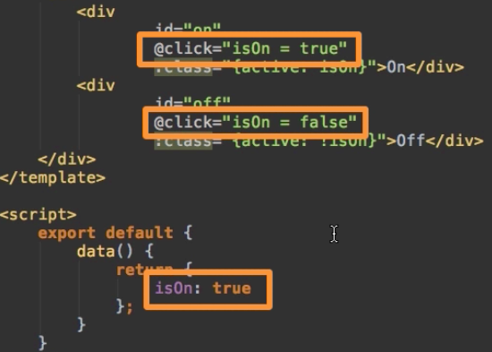
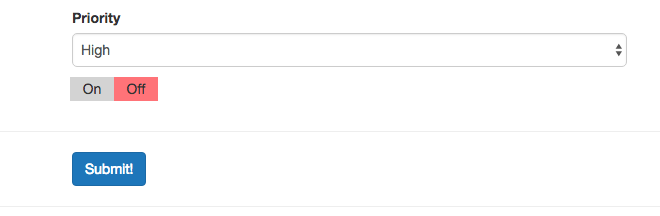
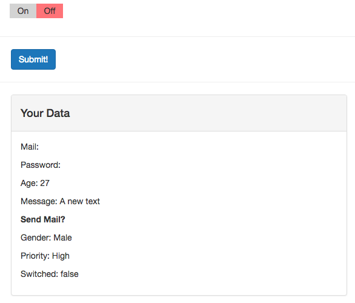

# Creating Custom Control (Input)

Well, in our new `Switch` component we have:
* in the template we have two `divs`, one hase the `id - on` and another has the `id - off`, both have a `click listner`, where we toggle `isOn` to `true`or `false` depending on which switch we click. 



Then we added a class which is the `active class` and thid depends on whether it is `true` or `false`, depending on which switch we are. And we have a couple of styles. 

**Switch.vue**

```html
<template>
    <div>
        <div
                id="on"
                @click="isOn = true"
                :class="{active: isOn}">On</div>
        <div
                id="off"
                @click="isOn = false"
                :class="{active: !isOn}">Off</div>
    </div>
</template>

<script>
    export default {
        data() {
            return {
                isOn: true
            };
        }
    }
</script>

<style scoped>
    #on, #off {
        width: 40px;
        height: 20px;
        background-color: lightgray;
        padding: 2px;
        display: inline-block;
        margin: 10px -2px;
        box-sizing: content-box;
        cursor: pointer;
        text-align: center;
    }

    #on:hover, #on.active {
        background-color: lightgreen;
    }

    #off:hover, #off.active {
        background-color: lightcoral;
    }
</style>
```

Now we go to our `App.vue` file and import our new `Switch.vue` component there, plus registering it as a lockal component in the `components` property. Surely we need to add it in our template as a `selector` `<app-switch>` right below the `select dropdown`. 

**App.vue**

```html
<template>
    <div class="container">
        <form>
            <div class="row">
                <div class="col-xs-12 col-sm-8 col-sm-offset-2 col-md-6 col-md-offset-3">
                    <h1>File a Complaint</h1>
                    <hr>
                    <div class="form-group">
                        <label for="email">Mail</label>
                        <input
                                type="text"
                                id="email"
                                class="form-control"
                                v-model="userData.email">       
                    </div>
                    <div class="form-group">
                        <label for="password">Password</label>
                        <input
                                type="password"
                                id="password"
                                class="form-control"
                                v-model.lazy="userData.password">     
                    </div>
                    <div class="form-group">
                        <label for="age">Age</label>
                        <input
                                type="number"
                                id="age"
                                class="form-control"
                                v-model="userData.age">        
                    </div>

                </div>
            </div>
            <div class="row">
                <div class="col-xs-12 col-sm-8 col-sm-offset-2 col-md-6 col-md-offset-3 form-group">
                    <label for="message">Message</label><br>
                   
                    <textarea
                            id="message"
                            rows="5"
                            class="form-control"
                            v-model="message"></textarea>  
                </div>
            </div>
            <div class="row">
                <div class="col-xs-12 col-sm-8 col-sm-offset-2 col-md-6 col-md-offset-3">
                    <div class="form-group">
                        <label for="sendmail">
                            <input
                                    type="checkbox"       
                                    id="sendmail"
                                    value="SendMail"
                                    v-model="sendMail"> Send Mail 
                        </label>
                        <label for="sendInfomail">
                            <input
                                    type="checkbox"
                                    id="sendInfomail"
                                    value="SendInfoMail"
                                    v-model="sendMail"> Send Infomail   
                        </label>
                    </div>

                </div>
            </div>
            <div class="row">
                <div class="col-xs-12 col-sm-8 col-sm-offset-2 col-md-6 col-md-offset-3 form-group">
                    <label for="male">
                        <input
                                type="radio"
                                id="male"
                                value="Male"
                                v-model="gender"> Male
                    </label>
                    <label for="female">
                        <input
                                type="radio"
                                id="female"
                                value="Female"
                                v-model="gender"> Female
                    </label>
                </div>
            </div>
            <div class="row">
                <div class="col-xs-12 col-sm-8 col-sm-offset-2 col-md-6 col-md-offset-3 from-group">
                    <label for="priority">Priority</label>
                    <select
                            id="priority"
                            class="form-control"
                            v-model="selectedPriority">
                        <option v-for="priority in priorities" :selected="priority == 'Medium'">{{priority}}</option>  
                    </select>
                </div>
            </div>
            <div class="row">
                <div class="col-xs-12 col-sm-8 col-sm-offset-2 col-md-6 col-md-offset-3">
                <app-switch></app-switch>   <!--add switch here-->
                </div>
            </div>
            <hr>
            <div class="row">
                <div class="col-xs-12 col-sm-8 col-sm-offset-2 col-md-6 col-md-offset-3">
                    <button
                            class="btn btn-primary">Submit!
                    </button>
                </div>
            </div>
        </form>
        <hr>
        <div class="row">
            <div class="col-xs-12 col-sm-8 col-sm-offset-2 col-md-6 col-md-offset-3">
                <div class="panel panel-default">
                    <div class="panel-heading">
                        <h4>Your Data</h4>
                    </div>
                    <div class="panel-body">
                        <p>Mail: {{userData.email}}</p>  
                        <p>Password: {{userData.password}}</p> 
                        <p>Age: {{userData.age}}</p>  
                        <p style="white-space:pre">Message: {{message}}</p>    
                        <p><strong>Send Mail?</strong></p>
                        <ul>
                            <li v-for="item in sendMail"><{{ item }}/li> 
                        </ul>
                        <p>Gender: {{gender}}</p>
                        <p>Priority: {{selectedPriority}}</p>  
                        <p>Switched:</p>
                    </div>
                </div>
            </div>
        </div>
    </div>
</template>

<script>
import Switch from './Switch.vue';  //import here 
    export default {
        data: function(){
            return {
              userData:{         
                email: ' ',
                password: '', 
                age: 27
        },
              message: 'A new text',
              sendMail: [],
              gender: 'Male',
              priorities: ['High', 'Medium', 'Low'],
              selectedPriority: 'High'   
        }
        },
        components: {
            appSwitch: Switch    //register here
        }
    }
</script>

<style>

</style>
```



However, now we are sill not able to listen to this switches, to set a `value`. So, let's turn it to real `control` we can use. First in our `App.vue` component's object we create a `property dataSwitch` and set it to `true` by default. Now we want to be able to use this `property` in our custom `component` we created. We will use `v-model` and bind it to `dataSwitch` property. This shall pass `true` or `false` or react to the changes in this `component`. That means we have to setup the `value` prop in our component and emit an `input event`. 

**App.vue**

```html
<template>
    <div class="container">
        <form>
            <div class="row">
                <div class="col-xs-12 col-sm-8 col-sm-offset-2 col-md-6 col-md-offset-3">
                    <h1>File a Complaint</h1>
                    <hr>
                    <div class="form-group">
                        <label for="email">Mail</label>
                        <input
                                type="text"
                                id="email"
                                class="form-control"
                                v-model="userData.email">       
                    </div>
                    <div class="form-group">
                        <label for="password">Password</label>
                        <input
                                type="password"
                                id="password"
                                class="form-control"
                                v-model.lazy="userData.password">     
                    </div>
                    <div class="form-group">
                        <label for="age">Age</label>
                        <input
                                type="number"
                                id="age"
                                class="form-control"
                                v-model="userData.age">        
                    </div>

                </div>
            </div>
            <div class="row">
                <div class="col-xs-12 col-sm-8 col-sm-offset-2 col-md-6 col-md-offset-3 form-group">
                    <label for="message">Message</label><br>
                   
                    <textarea
                            id="message"
                            rows="5"
                            class="form-control"
                            v-model="message"></textarea>  
                </div>
            </div>
            <div class="row">
                <div class="col-xs-12 col-sm-8 col-sm-offset-2 col-md-6 col-md-offset-3">
                    <div class="form-group">
                        <label for="sendmail">
                            <input
                                    type="checkbox"       
                                    id="sendmail"
                                    value="SendMail"
                                    v-model="sendMail"> Send Mail 
                        </label>
                        <label for="sendInfomail">
                            <input
                                    type="checkbox"
                                    id="sendInfomail"
                                    value="SendInfoMail"
                                    v-model="sendMail"> Send Infomail   
                        </label>
                    </div>

                </div>
            </div>
            <div class="row">
                <div class="col-xs-12 col-sm-8 col-sm-offset-2 col-md-6 col-md-offset-3 form-group">
                    <label for="male">
                        <input
                                type="radio"
                                id="male"
                                value="Male"
                                v-model="gender"> Male
                    </label>
                    <label for="female">
                        <input
                                type="radio"
                                id="female"
                                value="Female"
                                v-model="gender"> Female
                    </label>
                </div>
            </div>
            <div class="row">
                <div class="col-xs-12 col-sm-8 col-sm-offset-2 col-md-6 col-md-offset-3 from-group">
                    <label for="priority">Priority</label>
                    <select
                            id="priority"
                            class="form-control"
                            v-model="selectedPriority">
                        <option v-for="priority in priorities" :selected="priority == 'Medium'">{{priority}}</option>  
                    </select>
                </div>
            </div>
            <div class="row">
                <div class="col-xs-12 col-sm-8 col-sm-offset-2 col-md-6 col-md-offset-3">
                <app-switch v-model="dataSwitch"></app-switch>   <!--bind to the property here-->
                </div>
            </div>
            <hr>
            <div class="row">
                <div class="col-xs-12 col-sm-8 col-sm-offset-2 col-md-6 col-md-offset-3">
                    <button
                            class="btn btn-primary">Submit!
                    </button>
                </div>
            </div>
        </form>
        <hr>
        <div class="row">
            <div class="col-xs-12 col-sm-8 col-sm-offset-2 col-md-6 col-md-offset-3">
                <div class="panel panel-default">
                    <div class="panel-heading">
                        <h4>Your Data</h4>
                    </div>
                    <div class="panel-body">
                        <p>Mail: {{userData.email}}</p>  
                        <p>Password: {{userData.password}}</p> 
                        <p>Age: {{userData.age}}</p>  
                        <p style="white-space:pre">Message: {{message}}</p>    
                        <p><strong>Send Mail?</strong></p>
                        <ul>
                            <li v-for="item in sendMail"><{{ item }}/li> 
                        </ul>
                        <p>Gender: {{gender}}</p>
                        <p>Priority: {{selectedPriority}}</p>  
                        <p>Switched:</p>
                    </div>
                </div>
            </div>
        </div>
    </div>
</template>

<script>
import Switch from './Switch.vue';  
    export default {
        data: function(){
            return {
              userData:{         
                email: ' ',
                password: '', 
                age: 27
        },
              message: 'A new text',
              sendMail: [],
              gender: 'Male',
              priorities: ['High', 'Medium', 'Low'],
              selectedPriority: 'High',
              dataSwitch: true // create the property here  
        }
        },
        components: {
            appSwitch: Switch    
        }
    }
</script>

<style>

</style>
```

We should setup the `value prop` and the `input event` in our `Switch` component. To do so we go to our `object` and add `props`, this will be an `array` and we know we should be able to handle a `value` because this is what `v-model` give us in the end. This `value` shall be `true` or `false`. And now we wanna use this `value`. Well, we can remove our `data` object with `isOn` and instead we will use `value` in our `divs` in the template.  So, we are able to use `value prop` and change it. Now, of course, we need to submit an `event`. We'll use `methods` object to add  `switched()` method let's say.  In the template we also change `"value = true"` to the method we want to execute after clicking (`switched()`), and pass `true` or `false`. Inside our `method` in the `object` we'll `$emit` the `event` and the `event` has to have the name `input` because that is what `v-model` is waiting for. And as a second argument we can output the `value` we are passing in the `method`, we name it `isOn`. 

**Switch.vue**

```html
<template>
    <div>
        <div
                id="on"
                @click="switched(true)"       
                :class="{active: value}">On</div>   <!--change to value-->  <!--change to switched()-->
        <div
                id="off"
                @click="switched(false)"
                :class="{active: !value}">Off</div>   <!--change to value--> <!--change to switched()-->
    </div>
</template>

<script>
    export default {
        props: ['value'],  //set props here 
        methods:{
          switched(isOn){
           this.$emit('input', isOn)
          }
        } 
    }
</script>

<style scoped>
    #on, #off {
        width: 40px;
        height: 20px;
        background-color: lightgray;
        padding: 2px;
        display: inline-block;
        margin: 10px -2px;
        box-sizing: content-box;
        cursor: pointer;
        text-align: center;
    }

    #on:hover, #on.active {
        background-color: lightgreen;
    }

    #off:hover, #off.active {
        background-color: lightcoral;
    }
</style>
```
Now, lets go to our `App.vue` file back to our own `component` where we use our own switch, and let's add in `Your data` field a new `paragraph` where we say: 'switched', to output the `dataSwitch`. 

**App.vue**

```html
<template>
    <div class="container">
        <form>
            <div class="row">
                <div class="col-xs-12 col-sm-8 col-sm-offset-2 col-md-6 col-md-offset-3">
                    <h1>File a Complaint</h1>
                    <hr>
                    <div class="form-group">
                        <label for="email">Mail</label>
                        <input
                                type="text"
                                id="email"
                                class="form-control"
                                v-model="userData.email">       
                    </div>
                    <div class="form-group">
                        <label for="password">Password</label>
                        <input
                                type="password"
                                id="password"
                                class="form-control"
                                v-model.lazy="userData.password">     
                    </div>
                    <div class="form-group">
                        <label for="age">Age</label>
                        <input
                                type="number"
                                id="age"
                                class="form-control"
                                v-model="userData.age">        
                    </div>

                </div>
            </div>
            <div class="row">
                <div class="col-xs-12 col-sm-8 col-sm-offset-2 col-md-6 col-md-offset-3 form-group">
                    <label for="message">Message</label><br>
                   
                    <textarea
                            id="message"
                            rows="5"
                            class="form-control"
                            v-model="message"></textarea>  
                </div>
            </div>
            <div class="row">
                <div class="col-xs-12 col-sm-8 col-sm-offset-2 col-md-6 col-md-offset-3">
                    <div class="form-group">
                        <label for="sendmail">
                            <input
                                    type="checkbox"       
                                    id="sendmail"
                                    value="SendMail"
                                    v-model="sendMail"> Send Mail 
                        </label>
                        <label for="sendInfomail">
                            <input
                                    type="checkbox"
                                    id="sendInfomail"
                                    value="SendInfoMail"
                                    v-model="sendMail"> Send Infomail   
                        </label>
                    </div>

                </div>
            </div>
            <div class="row">
                <div class="col-xs-12 col-sm-8 col-sm-offset-2 col-md-6 col-md-offset-3 form-group">
                    <label for="male">
                        <input
                                type="radio"
                                id="male"
                                value="Male"
                                v-model="gender"> Male
                    </label>
                    <label for="female">
                        <input
                                type="radio"
                                id="female"
                                value="Female"
                                v-model="gender"> Female
                    </label>
                </div>
            </div>
            <div class="row">
                <div class="col-xs-12 col-sm-8 col-sm-offset-2 col-md-6 col-md-offset-3 from-group">
                    <label for="priority">Priority</label>
                    <select
                            id="priority"
                            class="form-control"
                            v-model="selectedPriority">
                        <option v-for="priority in priorities" :selected="priority == 'Medium'">{{priority}}</option>  
                    </select>
                </div>
            </div>
            <div class="row">
                <div class="col-xs-12 col-sm-8 col-sm-offset-2 col-md-6 col-md-offset-3">
                <app-switch v-model="dataSwitch"></app-switch>   <!-- -->
                </div>
            </div>
            <hr>
            <div class="row">
                <div class="col-xs-12 col-sm-8 col-sm-offset-2 col-md-6 col-md-offset-3">
                    <button
                            class="btn btn-primary">Submit!
                    </button>
                </div>
            </div>
        </form>
        <hr>
        <div class="row">
            <div class="col-xs-12 col-sm-8 col-sm-offset-2 col-md-6 col-md-offset-3">
                <div class="panel panel-default">
                    <div class="panel-heading">
                        <h4>Your Data</h4>
                    </div>
                    <div class="panel-body">
                        <p>Mail: {{userData.email}}</p>  
                        <p>Password: {{userData.password}}</p> 
                        <p>Age: {{userData.age}}</p>  
                        <p style="white-space:pre">Message: {{message}}</p>    
                        <p><strong>Send Mail?</strong></p>
                        <ul>
                            <li v-for="item in sendMail"><{{ item }}/li> 
                        </ul>
                        <p>Gender: {{gender}}</p>
                        <p>Priority: {{selectedPriority}}</p>  
                        <p>Switched:{{dataSwitch}} </p>  <!--output dataSwitch-->
                    </div>
                </div>
            </div>
        </div>
    </div>
</template>

<script>
import Switch from './Switch.vue';  
    export default {
        data: function(){
            return {
              userData:{         
                email: ' ',
                password: '', 
                age: 27
        },
              message: 'A new text',
              sendMail: [],
              gender: 'Male',
              priorities: ['High', 'Medium', 'Low'],
              selectedPriority: 'High',
              dataSwitch: true 
        }
        },
        components: {
            appSwitch: Switch    
        }
    }
</script>

<style>

</style>
```



The key thing here - we get the `value` and output the `input event`. With that we can use our own `compunent` as `controls` in our `forms`. 