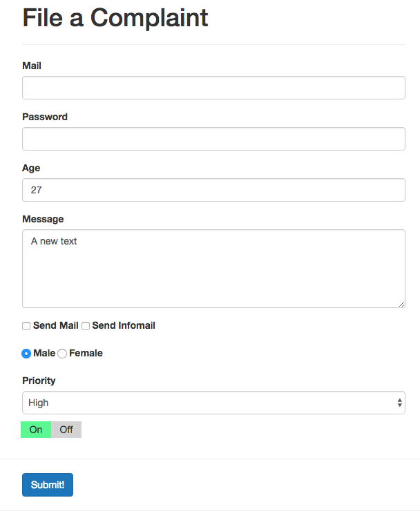

# Submitting a Form

Finally, let's work on a `submit button`. We can add a `click listner` to the `submit button` and on this `click listner` we will add `prevent` to prevent the `form submition`, because the `submit button` is the only button in our `form`. If we got a `button` in a form element it will by default, once we hit it, submit the `form` to the server. Now we don't want to do this cos the server is not the place we want to handle it, we want to handle ti with VueJS. Well, after the click listner we'll add a method we wanna execute. And then we need to add a `method` to our `methods property` in the object, where we say `this.isSubmitted = true`. Surely, we need to create `isSubmitted` property in our `data object`, this new `property` set to `false` initially. 

Now we wanna use this `property` to conditionally show or not show the `data panel` (`Your data`). To this panel we'll add `v-if` to simply check `isSubmitted`, that will be a bolean `true` or `false`. If it is `false` like it is initially we shouldn't see our `data field`, if it's `true` we'll se it. 

**App.vue**

```html
<template>
    <div class="container">
        <form>
            <div class="row">
                <div class="col-xs-12 col-sm-8 col-sm-offset-2 col-md-6 col-md-offset-3">
                    <h1>File a Complaint</h1>
                    <hr>
                    <div class="form-group">
                        <label for="email">Mail</label>
                        <input
                                type="text"
                                id="email"
                                class="form-control"
                                v-model="userData.email">       
                    </div>
                    <div class="form-group">
                        <label for="password">Password</label>
                        <input
                                type="password"
                                id="password"
                                class="form-control"
                                v-model.lazy="userData.password">     
                    </div>
                    <div class="form-group">
                        <label for="age">Age</label>
                        <input
                                type="number"
                                id="age"
                                class="form-control"
                                v-model="userData.age">        
                    </div>

                </div>
            </div>
            <div class="row">
                <div class="col-xs-12 col-sm-8 col-sm-offset-2 col-md-6 col-md-offset-3 form-group">
                    <label for="message">Message</label><br>
                   
                    <textarea
                            id="message"
                            rows="5"
                            class="form-control"
                            v-model="message"></textarea>  
                </div>
            </div>
            <div class="row">
                <div class="col-xs-12 col-sm-8 col-sm-offset-2 col-md-6 col-md-offset-3">
                    <div class="form-group">
                        <label for="sendmail">
                            <input
                                    type="checkbox"       
                                    id="sendmail"
                                    value="SendMail"
                                    v-model="sendMail"> Send Mail 
                        </label>
                        <label for="sendInfomail">
                            <input
                                    type="checkbox"
                                    id="sendInfomail"
                                    value="SendInfoMail"
                                    v-model="sendMail"> Send Infomail   
                        </label>
                    </div>

                </div>
            </div>
            <div class="row">
                <div class="col-xs-12 col-sm-8 col-sm-offset-2 col-md-6 col-md-offset-3 form-group">
                    <label for="male">
                        <input
                                type="radio"
                                id="male"
                                value="Male"
                                v-model="gender"> Male
                    </label>
                    <label for="female">
                        <input
                                type="radio"
                                id="female"
                                value="Female"
                                v-model="gender"> Female
                    </label>
                </div>
            </div>
            <div class="row">
                <div class="col-xs-12 col-sm-8 col-sm-offset-2 col-md-6 col-md-offset-3 from-group">
                    <label for="priority">Priority</label>
                    <select
                            id="priority"
                            class="form-control"
                            v-model="selectedPriority">
                        <option v-for="priority in priorities" :selected="priority == 'Medium'">{{priority}}</option>  
                    </select>
                </div>
            </div>
            <div class="row">
                <div class="col-xs-12 col-sm-8 col-sm-offset-2 col-md-6 col-md-offset-3">
                <app-switch v-model="dataSwitch"></app-switch>   
                </div>
            </div>
            <hr>
            <div class="row">
                <div class="col-xs-12 col-sm-8 col-sm-offset-2 col-md-6 col-md-offset-3">
                    <button
                            class="btn btn-primary"
                            @click.prevent="submitted">Submit!     <!--add click listner-->
                    </button>
                </div>
            </div>
        </form>
        <hr>
        <div class="row" v-if="isSubmitted">  <!--use v-if here-->
            <div class="col-xs-12 col-sm-8 col-sm-offset-2 col-md-6 col-md-offset-3">
                <div class="panel panel-default">
                    <div class="panel-heading">
                        <h4>Your Data</h4>
                    </div>
                    <div class="panel-body">
                        <p>Mail: {{userData.email}}</p>  
                        <p>Password: {{userData.password}}</p> 
                        <p>Age: {{userData.age}}</p>  
                        <p style="white-space:pre">Message: {{message}}</p>    
                        <p><strong>Send Mail?</strong></p>
                        <ul>
                            <li v-for="item in sendMail"><{{ item }}/li> 
                        </ul>
                        <p>Gender: {{gender}}</p>
                        <p>Priority: {{selectedPriority}}</p>  
                        <p>Switched:{{dataSwitch}} </p> 
                    </div>
                </div>
            </div>
        </div>
    </div>
</template>

<script>
import Switch from './Switch.vue';  
    export default {
        data: function(){
            return {
              userData:{         
                email: ' ',
                password: '', 
                age: 27
        },
              message: 'A new text',
              sendMail: [],
              gender: 'Male',
              priorities: ['High', 'Medium', 'Low'],
              selectedPriority: 'High',
              dataSwitch: true,
              isSubmitted: false    //create a new property
        }
        },
        components: {
            appSwitch: Switch    
        },
        methods:{
            submitted(){
            this.isSubmitted = true        //set method here
            }
        }
    }
</script>

<style>

</style>
```

Now, we don't see our `data field` and can see it if click the `submit button`. 



