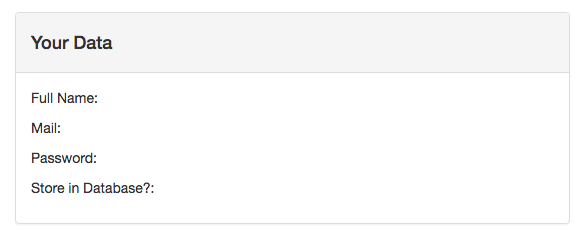
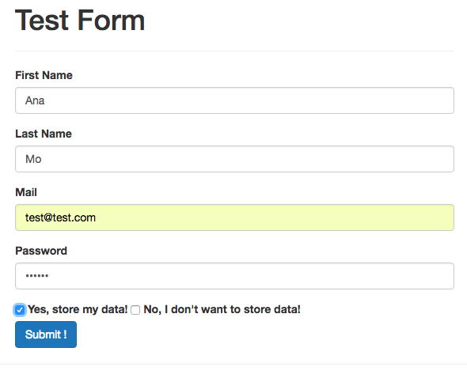

Initally we have only the data field:



And the following files: 

**App.vue**

```html
<template>
    <div class="container">
        <form>
            <div class="row">
                <div class="col-xs-12 col-sm-8 col-sm-offset-2 col-md-6 col-md-offset-3">
                    
                </div>
            </div>
        </form>
        <hr>
        <div class="row">
            <div class="col-xs-12 col-sm-8 col-sm-offset-2 col-md-6 col-md-offset-3">
                <div class="panel panel-default">
                    <div class="panel-heading">
                        <h4>Your Data</h4>
                    </div>
                    <div class="panel-body">
                        <p>Full Name: </p>
                        <p>Mail: </p>
                        <p>Password: </p>
                        <p>Store in Database?: </p>
                    </div>
                </div>
            </div>
        </div>
    </div>
</template>

<script>
    export default {
    }
</script>

<style>
</style>
```

**index.html**

```html
<!DOCTYPE html>
<html lang="en">
  <head>
    <meta charset="utf-8">
    <title>Vue Forms</title>
    <link rel="stylesheet" href="https://maxcdn.bootstrapcdn.com/bootstrap/3.3.7/css/bootstrap.min.css" integrity="sha384-BVYiiSIFeK1dGmJRAkycuHAHRg32OmUcww7on3RYdg4Va+PmSTsz/K68vbdEjh4u" crossorigin="anonymous">
  </head>
  <body>
    <div id="app">
    </div>
    <script src="/dist/build.js"></script>
  </body>
</html>
```

**main.js**

```js
import Vue from 'vue'
import App from './App.vue'

new Vue({
  el: '#app',
  render: h => h(App)
})
```

### Tasks

**Exercise 1**
* Create a `Signup Form` where you retrieve the following Information 
- - Full Name (First Name + Last Name) 
- - Mail 
- - Password 
- - Store Data? Yes/No 

**Exercise 2**
* Only display the `Form` if it has NOT been submitted 
* Display the `Data Summary` ONCE the Form HAS been submitted 

**Exercise 3**
* Edit the `Example` from above and create a custom `"Full Name" Control` , which still holds the `First Name` and `Last Name` Input Field 


### Solution 

**App.vue**

```html
<template>
    <div class="container">
        <form v-if="!submitted">
            <div class="row">
                <div class="col-xs-12 col-sm-8 col-sm-offset-2 col-md-6 col-md-offset-3">
                     <h1>Test Form</h1>
                    <hr>
                        <app-full-name v-model="fullName"></app-full-name>
                        <div class="form-group">
                        <label for="UserInfo_Email">Mail</label>
                        <input type="text" class="form-control" id="email" v-model="email">
                        </div> 
                        <div class="form-group">
                        <label for="UserInfo_Password">Password</label>
                        <input type="password" class="form-control" id="password" v-model.lazy="password">
                        </div> 
   
                        <div class="form-check form-check-inline">
                        
                        <input type="checkbox" class="form-check-input" id="YesCheckBox" value="Yes, store my data!" v-model="storeData">
                        <label for="StoreDataYes" class="form-check-label">Yes, store my data!</label>
                        
                         
                        <input type="checkbox" class="form-check-input" id="NoCheckBox" value="No, I don't want to store data!" v-model="storeData">
                        <label for="StoreDataNo" class="form-check-label">No, I don't want to store data!</label>
                        </div>
                </div>
            </div>
             <div class="row">
                <div class="col-xs-12 col-sm-8 col-sm-offset-2 col-md-6 col-md-offset-3">
                    <button type="submit" class="btn btn-primary" @click.prevent="submitted = true">Submit !     
                    </button>
                </div>
            </div>
        </form>
        <hr>
        <div class="row" v-if="submitted">
            <div class="col-xs-12 col-sm-8 col-sm-offset-2 col-md-6 col-md-offset-3">
                <div class="panel panel-default">
                    <div class="panel-heading">
                        <h4>Your Data</h4>
                    </div>
                    <div class="panel-body">
                        <p>Full Name: {{fullName}} </p>
                        <p>Mail: {{email}} </p>
                        <p>Password: {{password}} </p>
                        <p>Store in Database?: </p>
                        <ul>
                            <li v-for="(item, index) in storeData" :key="index">
                             {{item}}
                            </li>
                        </ul>
                    </div>
                </div>
            </div>
        </div>
    </div>
</template>

<script>
    import FullName from './FullName.vue'
    export default {
        data: function(){
            return{
                fullName: 'Ana Mo',
                email: '',
                password: '',
                storeData: [],
                submitted: false,
                
            }
        },
        components:{
            appFullName: FullName
        }
    }
</script>

<style>
</style>
```

**FullName.vue**

```html
<template>
<div>
<div class="form-group">
<label for="UserInfo_FirstName">First Name</label>
<input type="text" class="form-control" id="name" :value="firstName" @input="nameChanged(true, $event)">
 </div> 

<div class="form-group">
<label for="UserInfo_LastName">Last Name</label>
<input type="text" class="form-control" id="name" :value="lastName" @input="nameChanged(false, $event)">
</div> 
</div>
</template>

<script>
export default{
    props: ['value'],
    methods:{
    nameChanged(isFirst, event){
        let name = ' ';
     if(isFirst){
         name = event.target.value + ' ' + this.lastName;
     } else{
         name = this.firstName + ' ' + event.target.value;
     }
     this.value = name; 
      this.$emit('input', this.value)
    }
    },
    computed:{
        firstName(){
            return this.value.split(' ')[0];
        },
        lastName(){
            return this.value.split(' ')[1];
        }
    }
}
</script>

<style>
</style>
```




And if we change data in the form, it automatically changed in the data field. 


