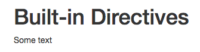
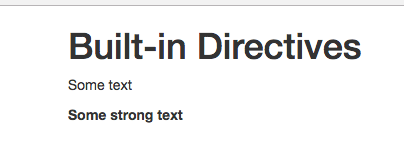

# Understanding Directives

First we'll have a look at `built-in directives`, like `v-if`, `v-for`, `v-bind`. 

Initially we have: 

**index.html**
```html
<!DOCTYPE html>
<html lang="en">
  <head>
    <meta charset="utf-8">
    <title>Vue Directives</title>
    <link rel="stylesheet" href="https://maxcdn.bootstrapcdn.com/bootstrap/3.3.7/css/bootstrap.min.css" integrity="sha384-BVYiiSIFeK1dGmJRAkycuHAHRg32OmUcww7on3RYdg4Va+PmSTsz/K68vbdEjh4u" crossorigin="anonymous"></head>
  <body>
    <div id="app">
    </div>
    <script src="/dist/build.js"></script>
  </body>
</html>
```

**App.vue**

```html
<template>
    <div class="container">
        <div class="row">
            <div class="col-xs-12 col-sm-8 col-sm-offset-2 col-md-6 col-md-offset-3">
                <h1>Built-in Directives</h1>

            </div>
        </div>
    </div>
</template>

<script>
    export default {
    }
</script>

<style>

</style>
```

`Directives` are generally identified like `v-` (v and dash and then the name of the directive). So, the `name` follows after `v-`, e.g `text`, `v-text=""`. `Text` directives takes a `string` as `input` therefore we have single quotation marks between the outer quotation marks, which only mark the JS expression we can enter there.  

**App.vue**

```html
<template>
    <div class="container">
        <div class="row">
            <div class="col-xs-12 col-sm-8 col-sm-offset-2 col-md-6 col-md-offset-3">
                <h1>Built-in Directives</h1>
                <p v-text=" 'Some text' "></p>  <!--text directive-->
            </div>
        </div>
    </div>
</template>

<script>
    export default {
    }
</script>

<style>

</style>
```
Well, now we can see `some text` even we didn't enter anything between the oppening and closing `paragraph tags`.

 

We can output some html code, using `v-html`. 

**App.vue**

```html
<template>
    <div class="container">
        <div class="row">
            <div class="col-xs-12 col-sm-8 col-sm-offset-2 col-md-6 col-md-offset-3">
                <h1>Built-in Directives</h1>
                <p v-text=" 'Some text' "></p>  
                 <p v-html=" '<strong>Some strong text</strong>' "></p>  <!--html directive-->
            </div>
        </div>
    </div>
</template>

<script>
    export default {
    }
</script>

<style>

</style>
```

 

 Be careful when using `v-html` directive. You should standartize your output to make sure you are not getting a victim of cross-site scripting attacs. 

 Now, let's build our own `directives`. Let's say we have a `paragraph` which says: 'Color this', and our goal to give it a `directive` which gives some coloring. How can we do this?

 **App.vue**

```html
<template>
    <div class="container">
        <div class="row">
            <div class="col-xs-12 col-sm-8 col-sm-offset-2 col-md-6 col-md-offset-3">
                <h1>Built-in Directives</h1>
                <p v-text=" 'Some text' "></p>  
                 <p v-html=" '<strong>Some strong text</strong>' "></p>  
            </div>
        </div>
        <hr>
<div class="row">
            <div class="col-xs-12 col-sm-8 col-sm-offset-2 col-md-6 col-md-offset-3">
                <h1>Custom Directives</h1>
                <p>Color this</p>  <!--here we will have a colored paragraph-->
            </div>
        </div>
    </div>
</template>

<script>
    export default {
    }
</script>

<style>

</style>
```

Well, we have two options of doing so. The first one is to register it globally. Just like with `components` we have `Vue.directive()`. Let's go to our `main.js` file. In `Vue.directive()` the first `argument` is the name of the `directive`, e.g. `hightlight`, this will create a global `directive`. And the second `argument` is the `object` configuring the `directive`.

**main.js**

```js
import Vue from 'vue'
import App from './App.vue'

Vue.directive('highlight', {     //create a global directive 

})

new Vue({
  el: '#app',
  render: h => h(App)
})
```

How do we configure such a `directive`? Look at ==> 002_How Directives Work. Hook Functions