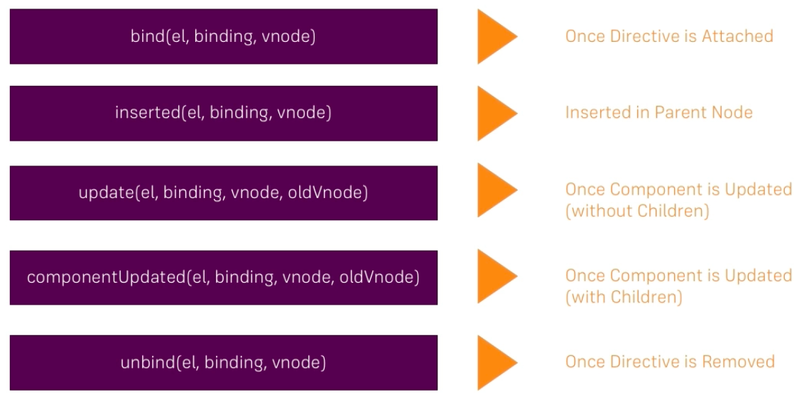

# How Directives Work. Hook Functions

For configuring a `directive` there are 5 important `hooks`, five `methods` we can hook in to perform the `elements` the `directive` sits on. 

* `bind (el, binding, vnode)` - this is fired as soon as the `directive` is bound to the `element`, as soon as we got access to he `element`. We het three `argument` passed to this `method`: `el` argument refers to the element the `directive` sits on, the `binding` argument refers to the way the `directive` is setup, `vnode` refers to the node in the virtual DOM. Important, `binding` and `vnode` should be treated as `read only`!!! Don't change anything here. 

* `inserted (el, binding, vnode)` - this occurs as soon as it is inserted in the DOM, so as soon as the `element` is also a part of the DOM, but **we still can access it in the first circle**. We don't need to be inserted to the DOM to style it for example. Arguments are the same here.

* `update (el, binding, vnode. oldVnode)` - it is called whenever the `component` updates. BUT important here is that the `children` of that `component` haven't been updated yet. Here we got the extra argument `oldVnode` - since the `component` is updated we got the `newVnode` in the virtual DOM and the `oldVnode`. Both should be treated as `read only`. 

* `componentUpdated(el, binding, vnode. oldVnode)` - that is called when the `component` and the `children` have been updated. 

* `unbind(el, binding, vnode)`- that is whenever the `directive` would be removed

