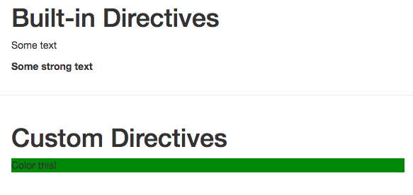

# Creating a Simple Directive

Let's go back to our app and use a `directive` as a second argument in our `Vue.directive()` like a method. Let's use `v-bind` like a `method`. And then what we wanna do here is  - set the style of our `element` (the element here is the `native html element`) and have our `background-color` green. 

**main.js**

```js
import Vue from 'vue'
import App from './App.vue'

Vue.directive('highlight', {    
 bind(el, binding, vnode){             //use bind directive
 el.style.backgroundColor = 'green'
 }
})

new Vue({
  el: '#app',
  render: h => h(App)
})
```

Well, with this setup we can go to our `App.vue` file, and since we have a `global directive`, we can simply add `v-highlight` (the name of the global directive) to the element we need, no `argument` passed no `value` passed, just like this. 

**App.vue**

```html
<template>
    <div class="container">
        <div class="row">
            <div class="col-xs-12 col-sm-8 col-sm-offset-2 col-md-6 col-md-offset-3">
                <h1>Built-in Directives</h1>
                <p v-text=" 'Some text' "></p>  
                 <p v-html=" '<strong>Some strong text</strong>' "></p>  
            </div>
        </div>
        <hr>
<div class="row">
            <div class="col-xs-12 col-sm-8 col-sm-offset-2 col-md-6 col-md-offset-3">
                <h1>Custom Directives</h1>
                <p v-highlight>Color this</p>  <!--add a global directive-->
            </div>
        </div>
    </div>
</template>

<script>
    export default {
    }
</script>

<style>

</style>
```

As a result we have our paragraph colored.



Of course, it would be nice if we could manually control what color this should get, let's work on this next ==>004_Passing Values to Custom Directives

