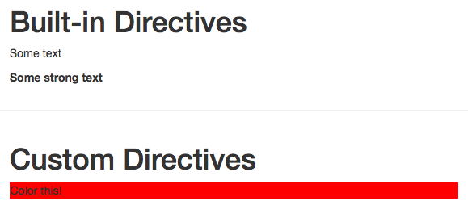

# Passing Values to Custom Directives

Let's determine the background color from outside foe example. Therefore in our `main.js` file we will use `binding.value` - `binding` is the information about our `directive` binding in `App.vue` (in our case - `highlight`) and the `value` is whatever we enter between the quotation marks when passing it with the equal sign (`highlight=" here should be the value "`) 

**main.js**

```js
import Vue from 'vue'
import App from './App.vue'

Vue.directive('highlight', {    
 bind(el, binding, vnode){             
 el.style.backgroundColor = binding.value  //bind the value
 }
})

new Vue({
  el: '#app',
  render: h => h(App)
})
```
So, lets set the value to `red` - it should be a `string`.

**App.vue**

```html
<template>
    <div class="container">
        <div class="row">
            <div class="col-xs-12 col-sm-8 col-sm-offset-2 col-md-6 col-md-offset-3">
                <h1>Built-in Directives</h1>
                <p v-text=" 'Some text' "></p>  
                 <p v-html=" '<strong>Some strong text</strong>' "></p>  
            </div>
        </div>
        <hr>
<div class="row">
            <div class="col-xs-12 col-sm-8 col-sm-offset-2 col-md-6 col-md-offset-3">
                <h1>Custom Directives</h1>
                <p v-highlight=" 'red' ">Color this</p>  <!--set the value-->
            </div>
        </div>
    </div>
</template>

<script>
    export default {
    }
</script>

<style>

</style>
```

Now, we can set the `value` from outside, so we have a more flexible way. 



