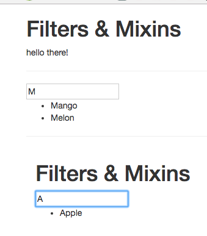

# Creating and Using Mixins

Let's say we wanna have `data` and `computed property` in both of our files `App.vue` and `List.vue`. 

For that we will create a `mixin`. We can outsorce such code in this `mixin`. Let's create a new file in the src, named `fruitMixin.js`. And there we will export the `constant` 'fruitMixin' - this will be the JS `object` which holds all the `data` we cut from our `component`. 

**fruitMixin.js**

```js
export const fruitMixin = {
    data() {
        return {
            fruits: ['Apple', 'Banana', 'Mango', 'Melon'],
            filterText: ''
        }
    },
    computed: {
        filteredFruits() {
            return this.fruits.filter((element) => {
                return element.match(this.filterText);
            });
        }
    }
}
```

Now we can import our `mixin` to our `List.vue`. And now we can simply replace the `data` in the `List.vue` object with the `mixins` property, which is an `array` where we specify all our `mixins` (code snippets) we wanna add to this component's instance. 

**List.vue**

```html
<template>
    <div class="container">
        
                <h1>Filters & Mixins</h1>
                <input v-model="filterText">
                <ul>
                    <li v-for="(fruit,index) in filteredFruits" :key="index">{{ fruit }}</li>
                </ul>
           
    </div>
</template>

<script>
    import { fruitMixin } from './fruitMixin.js'       //import here

    export default {
        mixins: [fruitMixin]
    }
</script>

<style>
</style>
```

In our `App.vue` file we also import our `mixin`. 

**App.vue**

```html
<template>
    <div class="container">
        <div class="row">
            <div class="col-xs-12 col-sm-8 col-sm-offset-2 col-md-6 col-md-offset-3">
                <h1>Filters & Mixins</h1>
                <p>{{text | toUppercase | to-lowercase}}</p> 
                <hr>
                <input v-model="filterText">  
                <ul>
                <li v-for="(fruit, index) in filteredFruits" :key="index">{{fruit}}</li>
                </ul>
                <hr>
                 <app-list></app-list>   
            </div>
        </div>
    </div>
</template>

<script>
import List from './List.vue'   
import { fruitMixin } from './fruitMixin.js' //import mixins

     export default {
        data() {
            return {
                text: 'Hello there!'
            }
        },
        filters: {                     
            toUppercase(value) {
                return value.toUpperCase();
            }
        },
        components: {             
            appList: List
        },
        mixins: [fruitMixin] 
    }
</script>

<style>

</style>
```

Interesting thing here is that in `App.vue` we still have the `data property` - VueJS clever merges our `mixin` and alredy existing data. 

