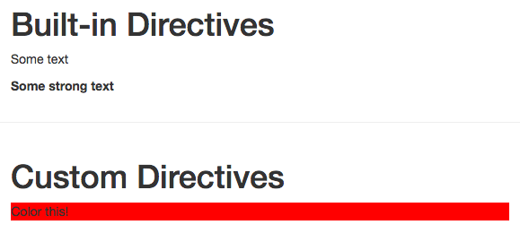
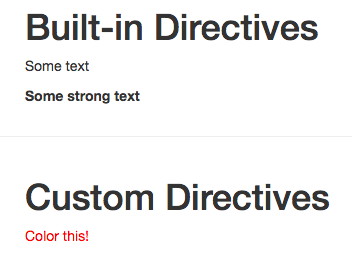

# Passing Arguments to Custom Directives

Let's say we wanna the user do determine if he wanna set the backgroung of the default the text color. So, the user has. To do this we need to pass an `argument`. The `argument` is passed with a colon (`:`) and it could be for example `background` as a normal text. 

**App.vue**

```html
<template>
    <div class="container">
        <div class="row">
            <div class="col-xs-12 col-sm-8 col-sm-offset-2 col-md-6 col-md-offset-3">
                <h1>Built-in Directives</h1>
                <p v-text=" 'Some text' "></p>  
                 <p v-html=" '<strong>Some strong text</strong>' "></p>  
            </div>
        </div>
        <hr>
<div class="row">
            <div class="col-xs-12 col-sm-8 col-sm-offset-2 col-md-6 col-md-offset-3">
                <h1>Custom Directives</h1>
                <p v-highlight:background=" 'red' ">Color this</p>  <!--pass the argument-->
            </div>
        </div>
    </div>
</template>

<script>
    export default {
    }
</script>

<style>

</style>
```
In our `maim.js` file in the `vue.directive` we want to check if our `argument` on the `binding` equals `background`. Then we wanna set the backgroundcolor, and otherwise we wanna set the text color. 

**main.js**

```js
import Vue from 'vue'
import App from './App.vue'

Vue.directive('highlight', {    
 bind(el, binding, vnode){             
 if(binding.arg == 'background'){
 el.style.backgroundColor = binding.value
 }else{
     el.style.color = binding.value
 }
 }
})

new Vue({
  el: '#app',
  render: h => h(App)
})
```
Well, now if we pass the `argument` in our `App.vue` to the element we will have the background color red. 



If we don't pass the `argument`, we'll have the text color red. 

**App.vue**

```html
<template>
    <div class="container">
        <div class="row">
            <div class="col-xs-12 col-sm-8 col-sm-offset-2 col-md-6 col-md-offset-3">
                <h1>Built-in Directives</h1>
                <p v-text=" 'Some text' "></p>  
                 <p v-html=" '<strong>Some strong text</strong>' "></p>  
            </div>
        </div>
        <hr>
<div class="row">
            <div class="col-xs-12 col-sm-8 col-sm-offset-2 col-md-6 col-md-offset-3">
                <h1>Custom Directives</h1>
                <p v-highlight=" 'red' ">Color this</p>  <!--no  argument just the value-->
            </div>
        </div>
    </div>
</template>

<script>
    export default {
    }
</script>

<style>

</style>
```



