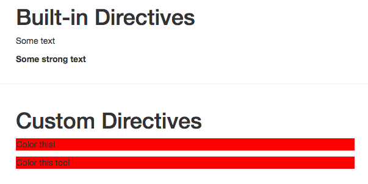

# Registering Directives Locally

To register a `local directive` we should go to our `App.vue` file, in the instance by adding the `directives` property. Inside we set the name of the `directive` and this is again an `object` which contains the major hook we use to setup what a `directive` should do. Inside the hook (method) we need basically setup it as our `global directive` but with more features 

**App.vue**

```html
<template>
    <div class="container">
        <div class="row">
            <div class="col-xs-12 col-sm-8 col-sm-offset-2 col-md-6 col-md-offset-3">
                <h1>Built-in Directives</h1>
                <p v-text=" 'Some text' "></p>  
                 <p v-html=" '<strong>Some strong text</strong>' "></p>  
            </div>
        </div>
        <hr>
<div class="row">
            <div class="col-xs-12 col-sm-8 col-sm-offset-2 col-md-6 col-md-offset-3">
                <h1>Custom Directives</h1>
                <p v-highlight:background.delayed=" 'red' ">Color this</p>  
                <p v-local-highlight:background.delayed=" 'red' ">Color this too</p>  
            </div>
        </div>
    </div>
</template>

<script>
    export default {
        directives: {                   //register directive locally
        'local-highlight':{
        bind(el, binding,vnode){
           var delay = 0;  
 if (binding.modifiers['delayed']) {
     delay = 3000;
 }     
 setTimeout( ()=>{
if(binding.arg == 'background'){
 el.style.backgroundColor = binding.value
 }else{
     el.style.color = binding.value
 }
 },delay);
        }
        }
        }
    }
</script>

<style>

</style>
```



