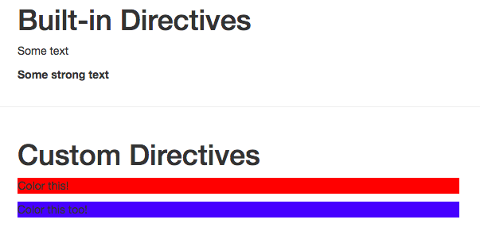

# Using Multiple Modifiers

Let's say we wanna add a `modifyer` which gets not only the possibility to get added `delayed` but also to alternate between two states. We can add `blink` modifyer. In order to be able to use this we need to check this in our `object` - `if (binding.modifiers['blink']) `. If we do have this `modifyer` we wanna set the `timeout` and the `interval` of this `timeout` . Othrewise (`else` statement) we'll use the `timeout` we set before. 

**App.vue**

```html
<template>
    <div class="container">
        <div class="row">
            <div class="col-xs-12 col-sm-8 col-sm-offset-2 col-md-6 col-md-offset-3">
                <h1>Built-in Directives</h1>
                <p v-text=" 'Some text' "></p>  
                 <p v-html=" '<strong>Some strong text</strong>' "></p>  
            </div>
        </div>
        <hr>
<div class="row">
            <div class="col-xs-12 col-sm-8 col-sm-offset-2 col-md-6 col-md-offset-3">
                <h1>Custom Directives</h1>
                <p v-highlight:background.delayed=" 'red' ">Color this</p>  
                <p v-local-highlight:background.delayed.blink=" 'red' ">Color this too</p>  <!--add blink-->
            </div>
        </div>
    </div>
</template>

<script>
    export default {
        directives: {                  
        'local-highlight':{
        bind(el, binding,vnode) {
           var delay = 0;  
 if (binding.modifiers['delayed']) {    
     delay = 3000;
 }     
 if (binding.modifiers['blink']) {   //check blink here 

 }     else {
     setTimeout( ()=>{
if(binding.arg == 'background'){
 el.style.backgroundColor = binding.value
 }else{
     el.style.color = binding.value
 }
 },delay);
 }
 
        }
        }
        }
    }
</script>

<style>

</style>
```

Inside the `blink` case we wanna alternate between two colors. So, we'll create new `variables` and setup `main color` (let it be what the user passes, for example) and `second color` (let it be blue, for example).  Well, we have two colors: the `second color` is hardcoded and the `main color` is set by the user. We also want to have the `current color` and at the beginning it should be our `main color`. 

**App.vue**

```html
<template>
    <div class="container">
        <div class="row">
            <div class="col-xs-12 col-sm-8 col-sm-offset-2 col-md-6 col-md-offset-3">
                <h1>Built-in Directives</h1>
                <p v-text=" 'Some text' "></p>  
                 <p v-html=" '<strong>Some strong text</strong>' "></p>  
            </div>
        </div>
        <hr>
<div class="row">
            <div class="col-xs-12 col-sm-8 col-sm-offset-2 col-md-6 col-md-offset-3">
                <h1>Custom Directives</h1>
                <p v-highlight:background.delayed=" 'red' ">Color this</p>  
                <p v-local-highlight:background.delayed.blink=" 'red' ">Color this too</p>  
            </div>
        </div>
    </div>
</template>

<script>
    export default {
        directives: {                  
        'local-highlight':{
        bind(el, binding,vnode) {
           var delay = 0;  
 if (binding.modifiers['delayed']) {    
     delay = 3000;
 }     
 if (binding.modifiers['blink']) {   
  let mainColor = binding.value;             //create new variables here
  let secondColor = "blue";
  let currentColor = mainColor; 
 }     else {
     setTimeout( ()=>{
if(binding.arg == 'background'){
 el.style.backgroundColor = binding.value
 }else{
     el.style.color = binding.value
 }
 },delay);
 }
 
        }
        }
        }
    }
</script>

<style>

</style>
```

Now inside our `if blink checker` lets set `timeout` function and to make it blink let's set `interval` inside the timeout. Inside the `setInterval()` let's setup the duration it should take (to keep one color before it alternates again), lets set it to one second. Also `setInterval()` method takes a `callback function`, will will execute every one second as we set it, but it only starts after three seconds, because it is nested inside the `setTimeout` function. And inside our `setTimeout` function we will check if the `currentColor` equals the `secondColor`: if that is the case then the `currentColor` is the `mainColor`, otherwise we will do the opposite - `currentColor == secondColor ? currentColor = mainColor : currentColor = secondColor;`.  So, this basically switch our colors. The next line in the `setInterval` then decides whether it should be the `background color` or the `text color`. 

**App.vue**

```html
<template>
    <div class="container">
        <div class="row">
            <div class="col-xs-12 col-sm-8 col-sm-offset-2 col-md-6 col-md-offset-3">
                <h1>Built-in Directives</h1>
                <p v-text=" 'Some text' "></p>  
                 <p v-html=" '<strong>Some strong text</strong>' "></p>  
            </div>
        </div>
        <hr>
<div class="row">
            <div class="col-xs-12 col-sm-8 col-sm-offset-2 col-md-6 col-md-offset-3">
                <h1>Custom Directives</h1>
                <p v-highlight:background.delayed=" 'red' ">Color this</p>  
                <p v-local-highlight:background.delayed.blink=" 'red' ">Color this too</p>  
            </div>
        </div>
    </div>
</template>

<script>
    export default {
        directives: {                  
        'local-highlight':{
        bind(el, binding,vnode) {
           var delay = 0;  
 if (binding.modifiers['delayed']) {    
     delay = 3000;
 }     
 if (binding.modifiers['blink']) {   
  let mainColor = binding.value;             
  let secondColor = "blue";
  let currentColor = mainColor; 
  setTimeout( ()=>{ //set timeout for blink 
          setInterval( ()=>{                //set interval for blink
                currentColor == secondColor ? currentColor = mainColor : currentColor = secondColor;
                if(binding.arg == 'background') {       // decide background or text color
                el.style.backgroundColor = currentColor; 
                 } else {
                 el.style.color = currentColor;
                 }
          }, 1000);                   
  }, delay); //*------------------------------------------------
  //*
 }     else {                       
     setTimeout( ()=>{
if(binding.arg == 'background'){
 el.style.backgroundColor = binding.value
 }else{
     el.style.color = binding.value
 }
 },delay);
 }
 
        }
        }
        }
    }
</script>

<style>

</style>
```



