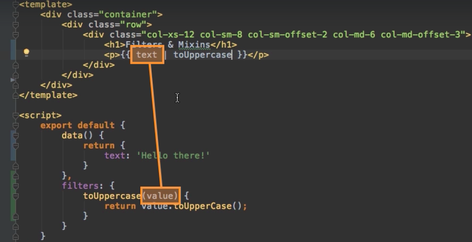
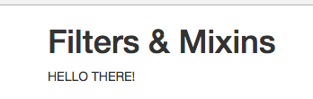

# Creating a Local Filter

A `filter` is basically a little syntax feature we can use in our `template` to transform some `output` in the `temaplate`. A `filter` helps up to transform the output in the `data`. It doesn't transform the `data` itself, it transforms what the user sees. 
VueJS doesn't have `built-in filters`, so it means that all the `filters` we need we have to build on our own. 

Let's build our own `filter`. In our `App.vue` object we ahve some `data`, and we wanna output some text. We can output this text in our `template` with string interpolation. 

**App.vue**

```html
<template>
    <div class="container">
        <div class="row">
            <div class="col-xs-12 col-sm-8 col-sm-offset-2 col-md-6 col-md-offset-3">
                <h1>Filters & Mixins</h1>
                <p>{{text}}</p>  <!--output text hehe-->
            </div>
        </div>
    </div>
</template>

<script>
    export default {
        data () {
            return{
                text: 'Hello there!'      //set some text in the data
            }

        }
    }
</script>

<style>

</style>
```

Now we wanna turn out `text` to be `uppercase`. Important thing is, we don't want to make it uppercase in the `data property` itself, text should stay as it is, we want to give it back in the `uppercase form` in the `template` only.  For that we will create a `filter`, by adding `filters property` to our object. This will register `filter` locally, so we can use it only in the current `template`. In the `local filter` we have the key as the name for the `filter`, and our `filter` is only a `function`. This `function` always gets the `value` as argument and this `value` will be the `data` we wanna transform, at the end in a function we have to return the `transformed value`. Then we can use our `filter` in our `template` by adding a pipe symbol and the `filter name`. 

**App.vue**

```html
<template>
    <div class="container">
        <div class="row">
            <div class="col-xs-12 col-sm-8 col-sm-offset-2 col-md-6 col-md-offset-3">
                <h1>Filters & Mixins</h1>
                <p>{{text | toUppercase}}</p>  <!--output text here-->  <!--use filter-->
            </div>
        </div>
    </div>
</template>

<script>
     export default {
        data() {
            return {
                text: 'Hello there!'   //set some text 
            }
        },
        filters: {                     //create local filter 
            toUppercase(value) {
                return value.toUpperCase();
            }
        }
    }
</script>

<style>

</style>
```




