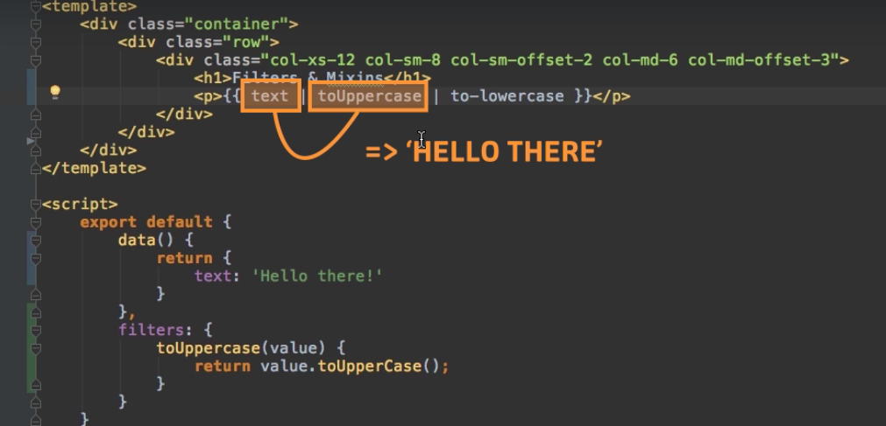
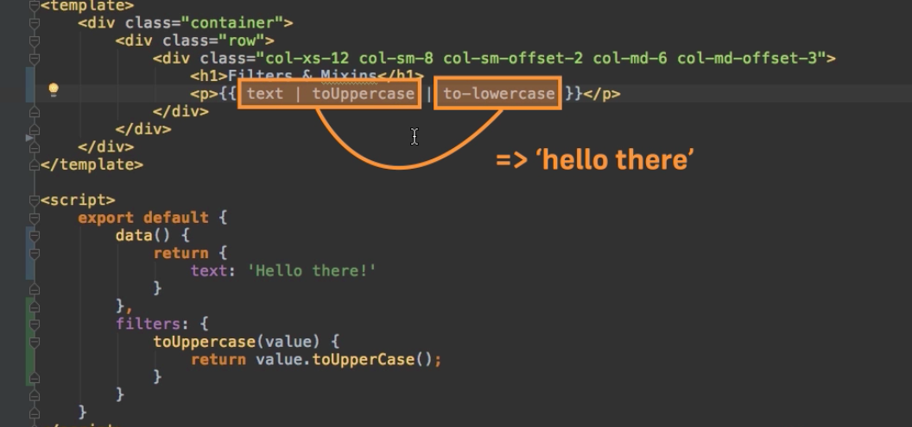
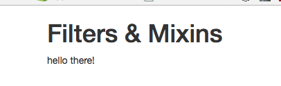

# Global Filters and how ot chain Multiple Filters

We surely can register `filter` globally with `Vue.filter()`. If we register it globally as the first `argument` we have the name of the `filter`, and as a second `argument` a `function` which should get executed, surely as the input of this `function` we get the `value`, and the return the transformend `value`. 

**main.js**
```js
import Vue from 'vue'
import App from './App.vue'

Vue.filter ('to-lowercase', function(value){
          return value.toLowercas();
});

new Vue({
  el: '#app',
  render: h => h(App)
})
```
Now we can use our `global filter` in our `App.vue`, by addign one more pipe symbol. 

**App.vue**

```html
<template>
    <div class="container">
        <div class="row">
            <div class="col-xs-12 col-sm-8 col-sm-offset-2 col-md-6 col-md-offset-3">
                <h1>Filters & Mixins</h1>
                <p>{{text | toUppercase | to-lowercase}}</p>  <!--pass one more filter-->
            </div>
        </div>
    </div>
</template>

<script>
     export default {
        data() {
            return {
                text: 'Hello there!'   
            }
        },
        filters: {                     
            toUppercase(value) {
                return value.toUpperCase();
            }
        }
    }
</script>

<style>

</style>
```

This way first it was transformed to upper case and then `text + transformed value` was again transformed to lower case. 







