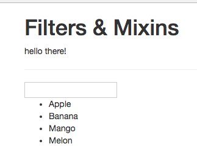
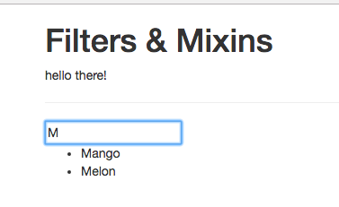

# An (often-times better) Alternative for Filters: Computed Properties

A `computed property` could be a better alternative. Imagine we have an `array` of fruits in our app. It would be convenient to output this `array` as a list and then filter when we type in an input field. Let's add an `input` where we wanna bind with `v-model` to the `filterText property`, which we should also create in our object, wich is initially empty. And with that `filterText` property we wanna filter the unordered list, where we loop with `v-for` through the fruits we have, and output fruit with string interpolation. 

**App.vue**

```html
<template>
    <div class="container">
        <div class="row">
            <div class="col-xs-12 col-sm-8 col-sm-offset-2 col-md-6 col-md-offset-3">
                <h1>Filters & Mixins</h1>
                <p>{{text | toUppercase | to-lowercase}}</p> 
                <hr>
                <input v-model="filterText">  <!--add input-->
                <ul>
                <li v-for="(fruit, index) in fruits" :key="index">{{fruit}}</li>  <!--loop here-->
                </ul>
            </div>
        </div>
    </div>
</template>

<script>
     export default {
        data() {
            return {
                text: 'Hello there!',
                fruits: ['Apple', 'Banana', 'Mango', 'Melon'],  //array of fruits 
                filterText: ''
            }
        },
        filters: {                     
            toUppercase(value) {
                return value.toUpperCase();
            }
        }
    }
</script>

<style>

</style>
```


What would be convenient is to add a `filter` here to say: only output those fruits which match our `filteredText`, so when we type it in the `input`. Well, to add a `filter` to our list in the template is not a good idea. In this cae VueJS is not able to detect when it should rerun the `filter` and when not. Actually it will rerun the `filter` upon each rerendering of the DOM. Well, in this case we can use a `computed property`. The great thing about the `computed properties` is that VueJS knows on what such a property depends, and therefore only recalculates it if something changes in the things where we use this `property`. So, inside our `computed property` we add a new property `filteredFruits` (it is a function as all computed properties) and here we wanna return our `fruits array`, and since it is an `array` we can use the `.filter` method on it. This `filter` method takes a `callback function` which is executed on each `element` on the `array`. The `element` is passed automatically as an `argument` to the `filter method`. In the callback we wanna to return all the `elements` we wanna keep in the `new array` we are generating (the filtered fruits array). And now in the `template` we can loop through our `filteredFruits`. 

**App.vue**

```html
<template>
    <div class="container">
        <div class="row">
            <div class="col-xs-12 col-sm-8 col-sm-offset-2 col-md-6 col-md-offset-3">
                <h1>Filters & Mixins</h1>
                <p>{{text | toUppercase | to-lowercase}}</p> 
                <hr>
                <input v-model="filterText">  
                <ul>
                <li v-for="(fruit, index) in filteredFruits" :key="index">{{fruit}}</li>  <!--loop using computed property-->
                </ul>
            </div>
        </div>
    </div>
</template>

<script>
     export default {
        data() {
            return {
                text: 'Hello there!',
                fruits: ['Apple', 'Banana', 'Mango', 'Melon'],  
                filterText: ''
            }
        },
        filters: {                     
            toUppercase(value) {
                return value.toUpperCase();
            }
        },
        computed:{                     //create computed 
          filteredFruits(){
              return this.fruits.filter( (element)=>{
                  return element.match(this.filterText);   //return a new array 
              });
          }
        }
    }
</script>

<style>

</style>
```


