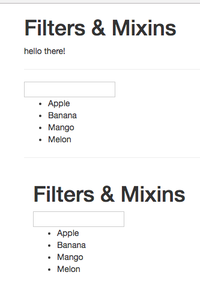

# Understanding Mixins

Let's say we wanna have one more list with fruits, but have it in the separete `component`. Firts we create a new `component` let's name it 'list'. We surely need to import our new `component` to the `App.vue` file. 

**List.vue**

```html
<template>
    <div class="container">
        
                <h1>Filters & Mixins</h1>
                <input v-model="filterText">
                <ul>
                    <li v-for="(fruit,index) in filteredFruits" :key="index">{{ fruit }}</li>
                </ul>
           
    </div>
</template>

<script>
    export default {
        data() {
            return {
                fruits: ['Apple', 'Banana', 'Mango', 'Melon'],
                filterText: ''
            }
        },
        computed: {
            filteredFruits() {
                return this.fruits.filter((element) => {
                    return element.match(this.filterText);
                });
            }
        }
    }
</script>

<style>
</style>
```


**App.vue**

```html
<template>
    <div class="container">
        <div class="row">
            <div class="col-xs-12 col-sm-8 col-sm-offset-2 col-md-6 col-md-offset-3">
                <h1>Filters & Mixins</h1>
                <p>{{text | toUppercase | to-lowercase}}</p> 
                <hr>
                <input v-model="filterText">  
                <ul>
                <li v-for="(fruit, index) in filteredFruits" :key="index">{{fruit}}</li>
                </ul>
                <hr>
                 <app-list></app-list>   <!--attach new list-->
            </div>
        </div>
    </div>
</template>

<script>
import List from './List.vue'    //import

     export default {
        data() {
            return {
                text: 'Hello there!',
                fruits: ['Apple', 'Banana', 'Mango', 'Melon'],  
                filterText: ''
            }
        },
        filters: {                     
            toUppercase(value) {
                return value.toUpperCase();
            }
        },
        computed:{                     
          filteredFruits(){
              return this.fruits.filter( (element)=>{
                  return element.match(this.filterText);   
              });
          }
        },
        components: {             //register locally
            appList: List
        }
    }
</script>

<style>

</style>
```


The problem here is that we have our code duplicated. To solve this we can use `mixins`. 