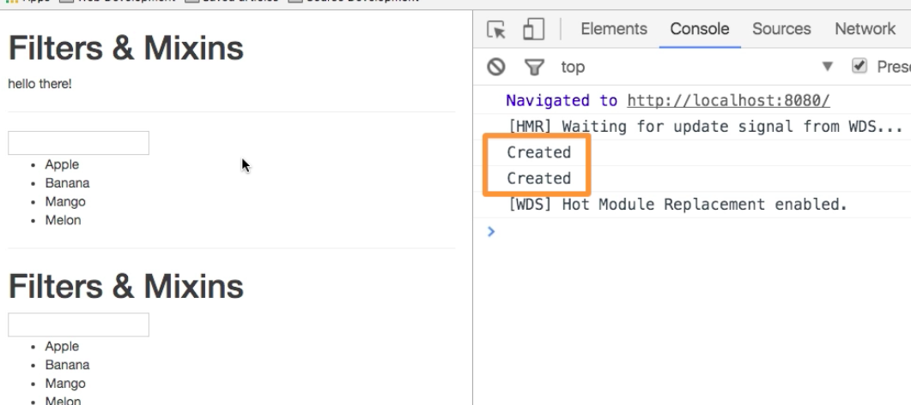
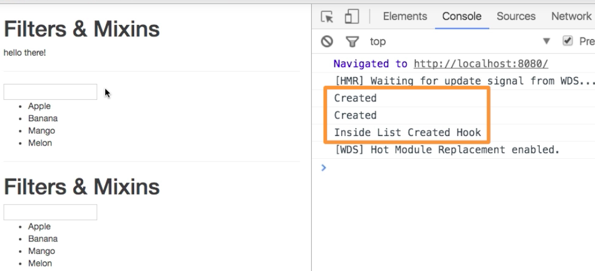

# How Mixins get Merged

VueJs clever merges pur `mixin` into the existing `vue instance`. The merging process generally - it doesn't destroy our `data` in our `vue instance`, so the `vue instanec`, the `vue component` is the part that is always right, but it tries to add new new things by adding the `mixin` to the existing inatnce. 
It also has some lifecycle hooks, the behavior that we are able to provide a lifecycle hook in the `mixin` and our `component` (instance) and both of them get executed even if they have the same name. The order is - `mixin` first thereafter the `component`. 

Let's check this. Let's add a new `method` to our `mixin` and console log "Created". 

**fruitMixin.js**

```js
export const fruitMixin = {
    data() {
        return {
            fruits: ['Apple', 'Banana', 'Mango', 'Melon'],
            filterText: ''
        }
    },
    computed: {
        filteredFruits() {
            return this.fruits.filter((element) => {
                return element.match(this.filterText);
            });
        }
    },
    created(){                       //added a method here 
        console.log("Created");
    }
}
```

Now in the `console` we'll the "Created" twice, cos we used the `mixin` twice: in our `App.vue` component and in our `List.vue` component. 



Let's say our `List.vue` component has its own lifecycle hook. 

**List.vue**

```html
<template>
    <div class="container">
       
                <h1>Filters & Mixins</h1>
                <input v-model="filterText">
                <ul>
                    <li v-for="(fruit,index) in filteredFruits" :key="index">{{ fruit }}</li>
                </ul>
           
    </div>
</template>

<script>
    import { fruitMixin } from './fruitMixin.js'
    export default {
        mixins: [fruitMixin],
        created(){                                    //added a method here 
            console.log("Inside List Created Hook")
        }
    }
</script>

<style>
</style>
```

Now in the `console` we'll see: - "Created", "Created", "Inside List Created Hook" - This is the order we were talking about: `mixin` first and thereafter the `component`. The `component` always has the last word. It is able to override changes introduced by the `mixin`. 

