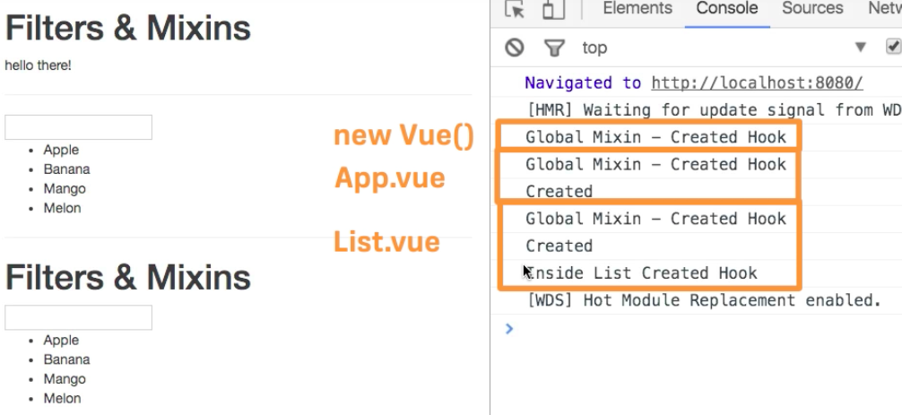

# Creating a Global Mixin (Special Case!)

Let's say we have only one `mixin` we wanna use in every `instance` in our app. A `global mixin` is added in every `instance` and thus in every `component` too, hence we rarely wanna use it.  Most of the time we wanna use this if we create a `third party plugins` for VueJS and not for our `production allication`. Nevertheless let's see how it would work. 
We can register `mixin` globally in `main.js` by using `Vue.mixin()`. 

This will allow us to configure some code which is mixed in every single `instance`. In `Vue.mixin()` we pass the `object` which is our `mixin`. Let's say we use a `created()` hook there. 

**main.js**

```js
import Vue from 'vue'
import App from './App.vue'

Vue.filter ('to-lowercase', function(value){
  return value.toLowerCase();
});

Vue.mixin({                                    //global mixin
  created(){
    console.log("Global Mixin - Created Hook")
  }
});

new Vue({
  el: '#app',
  render: h => h(App)
})
```

Now we see that only `global mixin` is executed three times, when we only have the `App.vue` and the `List.vue`. Well we have it three times, cos we also have the `vue instance` in our `main.js` file. 


We have here the following lifecycle:



* `global mixin` is called first 
* then `mixins`  added with `mixins array` called next
* and then the code directly written into the `instance` 