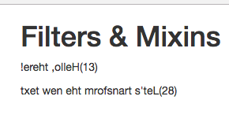

# Challenge.Mixins

### Task 1 / Solution 1

* Build a `local Filter` which reverses the `Text` it is applied on

**App.vue**

```html
<template>
    <div class="container">
        <div class="row">
            <div class="col-xs-12 col-sm-8 col-sm-offset-2 col-md-6 col-md-offset-3">
                <h1>Filters & Mixins</h1>
                <p>{{ text | reverse }}</p>  <!--use filter-->
            </div>
        </div>
    </div>
</template>

<script>
    export default {
        data: function(){
            return {
                text: 'Hello, there!'
            }
        },
        filters:{                          //local filter 
           reverse(value){
           return value.split('').reverse().join('');
           }
        }
            
    }
</script>

<style>
</style>
```


### Task 2 / Solution 2

* Build a `global Filter` which counts the length of a word and it appends it. Like this: "Test" => Gets Filtered to => "Test (4)" 

**main.js**

```js
import Vue from 'vue'
import App from './App.vue'

Vue.filter('countLength', function(value) {         //global filter
    return value + '(' + value.length + ')';
});


new Vue({
  el: '#app',
  render: h => h(App)
})
```

**App.vue**

```html
<template>
    <div class="container">
        <div class="row">
            <div class="col-xs-12 col-sm-8 col-sm-offset-2 col-md-6 col-md-offset-3">
                <h1>Filters & Mixins</h1>
                <p>{{ text | reverse | countLength}}</p>  <!--use filter-->
            </div>
        </div>
    </div>
</template>

<script>
    export default {
        data: function(){
            return {
                text: 'Hello, there!'
            }
        },
        filters:{                         
           reverse(value){
           return value.split('').reverse().join('');
           }
        }
            
    }
</script>

<style>
</style>
```


### Task 3 / Solution 3

* Do the same as in Exercises 1 & 2, now with `Computed Properties` 

*local computed* 

**App.vue**

```html
<template>
    <div class="container">
        <div class="row">
            <div class="col-xs-12 col-sm-8 col-sm-offset-2 col-md-6 col-md-offset-3">
                <h1>Filters & Mixins</h1>
                <p>{{ text | reverse | countLength}}</p>
                <p>{{ reversedTextLength }}</p>
            </div>
        </div>
    </div>
</template>

<script>
    export default {
        data: function(){
            return {
                text: 'Hello, there!',
                newText: 'Let\'s transform the new text'
            }
        },
        filters:{
           reverse(value){
           return value.split('').reverse().join('');
           }
        },
        computed:{
            reversedTextLength(){
                return this.newText.split('').reverse().join('') + '(' + this.newText.length + ')';
            },
            
            
    }
    }
</script>

<style>
</style>
```


4. Share the `Computed Property` rebuilding Exercise 2 via a `Mixin`

**reverseMixin**

```js
export const reverseMixin = {
    filters:{
       reverse(value){
       return value.split('').reverse().join('');
       }
    },
    computed:{
        reversedTextLength(){
            return this.newText.split('').reverse().join('') + '(' + this.newText.length + ')';
        },    
}
}
```

**App.vue**

```html
<template>
    <div class="container">
        <div class="row">
            <div class="col-xs-12 col-sm-8 col-sm-offset-2 col-md-6 col-md-offset-3">
                <h1>Filters & Mixins</h1>
                <p>{{ text | reverse | countLength}}</p>
                <p>{{ reversedTextLength }}</p>
            </div>
        </div>
    </div>
</template>

<script>
 import { reverseMixin } from './reverseMixin.js'  

    export default {
        data: function(){
        return {
            text: 'Hello, there!',
            newText: 'Let\'s transform the new text'
        }
    },
        mixins: [reverseMixin]
    }
</script>

<style>
</style>
```



