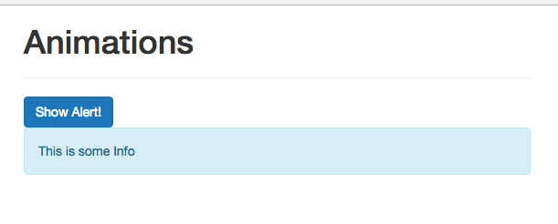
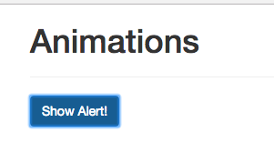
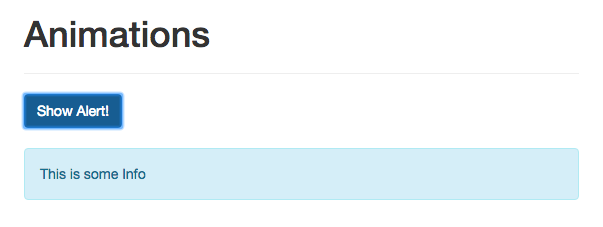

# Preparing code to use Transitions

As the startin point we have the following files:

**App.vue**

```html
<template>
    <div class="container">
        <div class="row">
            <div class="col-xs-12 col-sm-8 col-sm-offset-2 col-md-6 col-md-offset-3">
                <h1>Animations</h1>

            </div>
        </div>
    </div>
</template>

<script>
    export default {
        data() {
            return {

            }
        }
    }
</script>

<style>

</style>
```
**main.js**

```js
import Vue from 'vue'
import App from './App.vue'

new Vue({
  el: '#app',
  render: h => h(App)
})
```
**index.html**

```html
<!DOCTYPE html>
<html lang="en">
  <head>
    <meta charset="utf-8">
    <title>Vue Animations</title>
    <link rel="stylesheet" href="https://maxcdn.bootstrapcdn.com/bootstrap/3.3.7/css/bootstrap.min.css" integrity="sha384-BVYiiSIFeK1dGmJRAkycuHAHRg32OmUcww7on3RYdg4Va+PmSTsz/K68vbdEjh4u" crossorigin="anonymous"></head>
  <body>
    <div id="app">
    </div>
    <script src="/dist/build.js"></script>
  </body>
</html>
```

Let's add an `element` to the DOM and animate it. In our `App.vue` let's add a `button` and an `alert`.  

**App.vue**

```html
<template>
    <div class="container">
        <div class="row">
            <div class="col-xs-12 col-sm-8 col-sm-offset-2 col-md-6 col-md-offset-3">
                <h1>Animations</h1>
                <hr>
                <button class="btn btn-primary">Show Alert!</button>   <!--add a button-->
                <div class="alert alert-info">This is some Info</div>   <!--add an alert-->
            </div>
        </div>
    </div>
</template>

<script>
    export default {
        data() {
            return {

            }
        }
    }
</script>

<style>

</style>
```



Now, we wanna show this `alert` conditionally. In order to show it conditionally In our `App.vue instance` we'll add a new `property` named `show` and set it to `false` initially to not show the `alert`. In our `alert div` in the `template` we'll add `v-if` and will check `show`. On our `button` we'll set a `click listner` where we set `show` to what currently is not, to toggle. 

**App.vue**

```html
<template>
    <div class="container">
        <div class="row">
            <div class="col-xs-12 col-sm-8 col-sm-offset-2 col-md-6 col-md-offset-3">
                <h1>Animations</h1>
                <hr>
                <button class="btn btn-primary" @click="show = !show">Show Alert!</button>  <!--add click listner-->
                <br><br>
                <div class="alert alert-info" v-if="show">This is some Info</div>   <!--add a condition-->
            </div>
        </div>
    </div>
</template>

<script>
    export default {
        data() {
            return {
            show: false          //add show property
            }
        }
    }
</script>

<style>

</style>
```




Now, to animate this we should wrap our `div` in the `<transition>`. Important here!!!!!!!!! You can only animate one `element` wrapped in `<transition>`, well we can have multiple elements inside the `<transition>`, but then the conditions of these `elements` should alternate. We can only show one at a time. We can not animate a `list` - the addition and deletion of the list items. 

**App.vue**

```html
<template>
    <div class="container">
        <div class="row">
            <div class="col-xs-12 col-sm-8 col-sm-offset-2 col-md-6 col-md-offset-3">
                <h1>Animations</h1>
                <hr>
                <button class="btn btn-primary" @click="show = !show">Show Alert!</button>  <!--add click listner-->
                <br><br>
                <transition>        <!--wrap in transition to animate-->
                <div class="alert alert-info" v-if="show">This is some Info</div>   <!--add a condition-->
                </transition>
            </div>
        </div>
    </div>
</template>

<script>
    export default {
        data() {
            return {
            show: false          //add show property
            }
        }
    }
</script>

<style>

</style>
```

To animate the `element` we need to set up the `transition` ==> 003_Setting Up a Transition