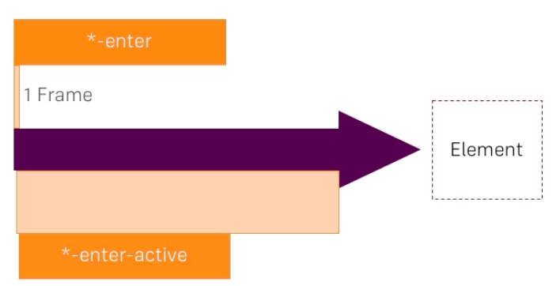

# Setting Up a Transition

One of the typical cases we would use `transitions`, would be to attach `css classes`. VueJS does it for us. We well see how to tell it. What it basically does  -  it will determine (in case we use `v-if`) whether it should attach `element` and that will be attached to `css classes` for animating it in and out. And by styling thsese `classes` we can setup animation. 

Well, how it happens. VueJS detects: "i have `v-if` on the `element`, which is wrapped in a `<transition>` and i should animate it in". Then VueJS first attaches `css class` whith the name we can setup ourselves and then `-enter`. This is important, this is the initial state - the first frame. After the first frame the `*-enter-active`class is appended to our class name, and this will be attached until the animation finishes. The length of the animation will be determined by VueJS automatically by the length of transitions or animations we setup in our `css code`. 

Once the `element` is in, this `class` is also removed, we had a chance to set any transitions at the final state of this `enter-active` class. And if we remove this, it's pretty much the same - we first attach a `name` + `-leave` class and then name + `-leave-active` class. 

The `default`, if we don't enter name is `v-enter`. 