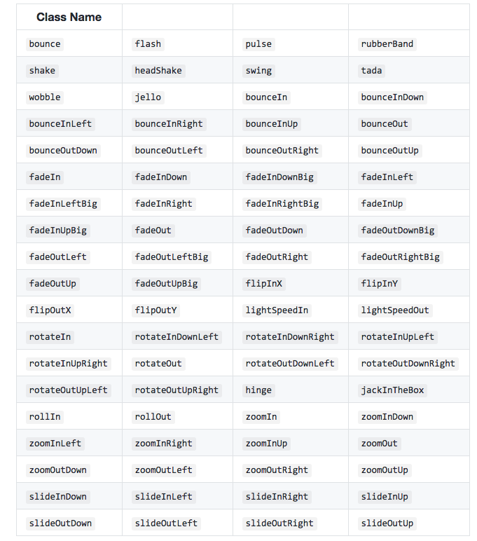

# Using Different CSS Class Names

There is an animation library we can use - [animate.css](https://daneden.github.io/animate.css/). Here we can use animations by simply adding `css classes` to our `elements`. If we visit github page we'll see the detailed explanation of how it works. 
Now we will use CDN version and attach the link in the `head` of our `html file`. 

**index.html**
```html
<!DOCTYPE html>
<html lang="en">
  <head>
    <meta charset="utf-8">
    <title>Vue Animations</title>
    <link rel="stylesheet" href="https://maxcdn.bootstrapcdn.com/bootstrap/3.3.7/css/bootstrap.min.css" integrity="sha384-BVYiiSIFeK1dGmJRAkycuHAHRg32OmUcww7on3RYdg4Va+PmSTsz/K68vbdEjh4u" crossorigin="anonymous">
    <link rel="stylesheet" href="https://cdnjs.cloudflare.com/ajax/libs/animate.css/3.5.2/animate.min.css"> <!--attach animation library-->
  </head>
  <body>
    <div id="app">
    </div>
    <script src="/dist/build.js"></script>
  </body>
</html>
```  

Well, we can attach any animation from this package by adding the `css class` and the `animation name`.



The problem is that VueJS is alseady using default classes. How could we tell VueJS to use different classes? We can do this with setup of some extra `attributes` on the `transition element`. So, we can override the default classes VueJS attaches. In our `App.vue` we can remove the default `name="fade"`, and tell VueJS which class to attach at which point of time. So, we'll set in the `transition element` - `enter-class`, `enter-active` class, and in the `enter-active` class we set animation and the nemae of the class from the library, let's say `bounce`. Of cource, we can the same way override the `leave` class, with let's say `shake` class name. Actually, we can remove `enter-class` and `leave-class`, we added them just to show we have all four classes, in case we wanna use them, they shouldn't be empty. 

One thing to keep in mind here though is - `appear attribute` doesn't work with these classes, it works only with the default ones. 

**App.vue**

```html
<template>
    <div class="container">
        <div class="row">
            <div class="col-xs-12 col-sm-8 col-sm-offset-2 col-md-6 col-md-offset-3">
                <h1>Animations</h1>
                <hr>
                <button class="btn btn-primary" @click="show = !show">Show Alert!</button>
                <br><br>
                <transition name="fade">
                <div class="alert alert-info" v-if="show">This is some Info</div>
                </transition>
                <transition name="slide" type="animation" appear>  
                <div class="alert alert-info" v-if="show">This is some Info</div>
                </transition>
                <transition  
                <!--enter-class=""--> 
                enter-active-class="animated bounce"    <!--override the default class-->  
                <!--leave-class=""-->
                leave-active-class="animated shake"
                >  
                <div class="alert alert-info" v-if="show">This is some Info</div>
                </transition>  
            </div>
        </div>
    </div>
</template>

<script>
    export default {
        data() {
            return {
             show: true    
            }
        }
    }
</script>

<style>
.fade-enter{        
 opacity: 0;
}
.fade-enter-active{
transition: opacity 1s;           
}
.fade-leave{

}
.fade-leave-active{
    transition: opacity 1s;          
    opacity: 0;             
}

.slide-enter{           
opacity: 0;          
}

.slide-eneter-active{
animation: slide-in 1s ease-out forwards;  
transition: opacity .5s;         
}

.slide-leave{

}

.slide-leave-active{
animation: slide-out 1s ease-out forwards;
transition: opacity 3s;   
opacity: 0;
}

@keyframes slide-in{        
 from{
 transform: translateY(20px);
 }
 to{
 transform: translateY(0);
 }
}

@keyframes slide-out{
 from{
 transform: translateY(0);
 }
 to{
 transform: translateY(20px);
 }
}
</style>
```