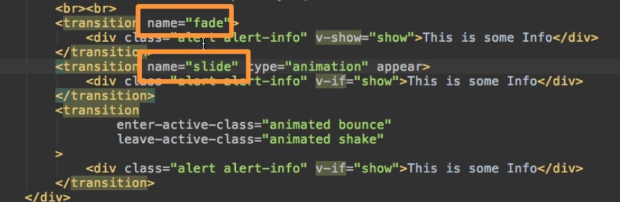

#  Using Dynamic Name and Attributes

Actually the `name` in the `transition element` doesn't have to be static, we don't need to hardcode it here. 



Let's we wanna have an option to swith between the `fade` and `slide` animation so, that we can choose this. In our `App.vue` let's add a `select` control and `options`. We will get this value using `v-model` and bind it to the `alertAnimation property` which we'll create in our `data object`. Let's say `alertAnimation` by default shall be `fade`. For this to work we also need to setup `values` to  our `options`, these will be the `values` the `alertAnimation property` will take in the end. 

Now we can bind `name` in the `transition element` dynamically by exchanging with attribute binding, with a colon (`:`) in front of it. Surely in the `name` we should have the `alertAnimation property` which has the value it will be bind in. 

**App.vue**

```html
<template>
    <div class="container">
        <div class="row">
            <div class="col-xs-12 col-sm-8 col-sm-offset-2 col-md-6 col-md-offset-3">
                <h1>Animations</h1>
                <hr>
                <select v-model="alertAnimation" class="form-control"> <!--bind here -->
                <option value="fade">Fade</option>      <!--add options, set value-->
                <option value="slide">Slide</option>
                </select>
                <br><br>
                <button class="btn btn-primary" @click="show = !show">Show Alert!</button>
                <br><br>
                <transition :name="alertAnimation">  <!--bind name-->
                <div class="alert alert-info" v-if="show">This is some Info</div>
                </transition>
                <transition :name="alertAnimation" type="animation" appear>  <!--bind name-->
                <div class="alert alert-info" v-if="show">This is some Info</div>
                </transition>
                <transition  
                enter-active-class="animated bounce"   
                leave-active-class="animated shake"
                >  
                <div class="alert alert-info" v-if="show">This is some Info</div>
                </transition>  
            </div>
        </div>
    </div>
</template>

<script>
    export default {
        data() {
            return {
             show: true,
             alertAnimation: 'fade'
            }
        }
    }
</script>

<style>
.fade-enter{        
 opacity: 0;
}
.fade-enter-active{
transition: opacity 1s;           
}
.fade-leave{

}
.fade-leave-active{
    transition: opacity 1s;          
    opacity: 0;             
}

.slide-enter{           
opacity: 0;          
}

.slide-eneter-active{
animation: slide-in 1s ease-out forwards;  
transition: opacity .5s;         
}

.slide-leave{

}

.slide-leave-active{
animation: slide-out 1s ease-out forwards;
transition: opacity 3s;   
opacity: 0;
}

@keyframes slide-in{        
 from{
 transform: translateY(20px);
 }
 to{
 transform: translateY(0);
 }
}

@keyframes slide-out{
 from{
 transform: translateY(0);
 }
 to{
 transform: translateY(20px);
 }
}
</style>
``` 