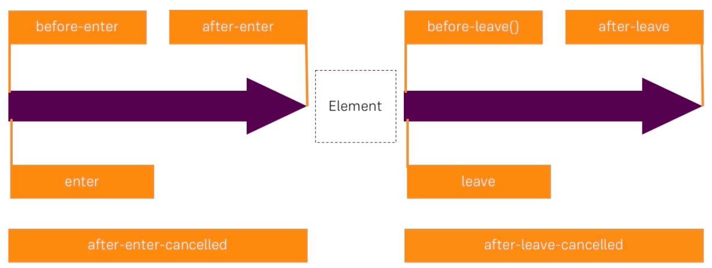

# Listening to Transition Event Hooks

We can also use JS for animation. VueJS allows us to listen to certain `events` the `transition element` emits. So, this `transition` component in which we wrap our elements emits `events` at certain points of time. And we can listen to these `events` to execute our own JS code. We should know here - which `events` are emitted at which points of time. And here we see the similar pattern as with `css classes`: we add our `element` and then we remove it and upon adding we first have the `before-enter` hook, then right after we get the `enter` hook (this is where we typically play our animation), then we have `after-enter` (this is execute after the animation finished), (IMPORTANT - we can combine all these with `css classes`, we can also execute some other code on each of these hooks), and then we have `after-enter-cancelled` hook which is caled whenever we change the `condition` which would add the `element` before the `animation` finished. Well, we surely have hooks for leaving: `before-leave()`, `leave`, `after-leave`, and `after-leave-cancelled`. 

