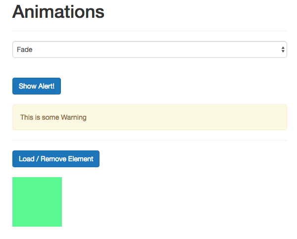

# Understanding JS Animations

To use JS for animation, first let's add a new `button` and load/remove `element` with it. To this button we'll add a `click listner` and toggle a new `property` called "load", and set it to true initially. Now we can add one more `transition element`. In there we wanna have a `div` with some styling. 

**App.vue**

```html
<template>
    <div class="container">
        <div class="row">
            <div class="col-xs-12 col-sm-8 col-sm-offset-2 col-md-6 col-md-offset-3">
                <h1>Animations</h1>
                <hr>
                <select v-model="alertAnimation" class="form-control"> 
                <option value="fade">Fade</option>      
                <option value="slide">Slide</option>
                </select>
                <br><br>
                <button class="btn btn-primary" @click="show = !show">Show Alert!</button>
                <br><br>
                <transition :name="alertAnimation">  
                <div class="alert alert-info" v-if="show">This is some Info</div>
                </transition>
                <transition :name="alertAnimation" type="animation" appear>  
                <div class="alert alert-info" v-if="show">This is some Info</div>
                </transition>
                <transition  
                enter-active-class="animated bounce"   
                leave-active-class="animated shake"
                >  
                <div class="alert alert-info" v-if="show">This is some Info</div>
                </transition> 
                <transition :name="alertAnimation" mode="out-in" > 
                <div class="alert alert-info" v-if="show" key="info">This is some Info</div> 
                <div class="alert alert-warning" v-else key="warning">This is some Warning</div>  
                </transition> 
                <hr>
                <button class="btn btn-primary" @click="load = !load">Load / Remove Element</button> <!--add a button-->
                <br><br>
                <transition> <!--add a transition element-->
                <div style="width: 100px; height: 100px; background-color: lightgreen"></div> 
                </transition>
            </div>
        </div>
    </div>
</template>

<script>
    export default {
        data() {
            return {
             show: false,
             load: true,   //create load property
             alertAnimation: 'fade'
            }
        }
    }
</script>

<style>
.fade-enter{        
 opacity: 0;
}
.fade-enter-active{
transition: opacity 1s;           
}
.fade-leave{

}
.fade-leave-active{
    transition: opacity 1s;          
    opacity: 0;             
}

.slide-enter{           
opacity: 0;          
}

.slide-eneter-active{
animation: slide-in 1s ease-out forwards;  
transition: opacity .5s;         
}

.slide-leave{

}

.slide-leave-active{
animation: slide-out 1s ease-out forwards;
transition: opacity 1s;   
opacity: 0;
}

@keyframes slide-in{        
 from{
 transform: translateY(20px);
 }
 to{
 transform: translateY(0);
 }
}

@keyframes slide-out{
 from{
 transform: translateY(0);
 }
 to{
 transform: translateY(20px);
 }
}
</style>
``` 



To make this work, we need to add `v-if` condition to our `div` and set it to "load". And now let's animate it through JS. We got a couple of `events` to listen to: `@before-enter` and in quotation marks we specify which `function` we wanna execute. We'll execute `beforeEnter` method we need to create in our `data oblect`. 
Yes we already set this previously, but we can use all these hooks on `css animations` of our other `transition elements`, e.g if we add `after-enter` hook on our first `transition element` we will be able to execute some code when the `css animation` finishes.  Now we should add all the `methods` to our `data object`. 
First is `beforeEnter` and in this method we actually recieve an `argument` - this argument is the `element` on which the animation is performed. So, we can use this `element` in the method, now we simply console.log "beforeEnter", so that we can see that we reached this hook. Then we got `enter()` method - where the animation really plays. `enter()` as well gets `element` as an argument, but also get another argument - `done`, which actually is a function we can execute here. Why we would execute `done` here? `done()` is needed to tell VueJS once this animation finishes. When using `css animation` it can determine it from the timing we set in the `transition` or the `animation` property. But when using JS we don't have such timing. We don't need to call `done` if we use `css animations`. Once we are done we got the `afterEnter()` method, which also get `el` as an argument. And then we surely get the `enterCanselled()`. The same we have with `leave` hooks. 

**App.vue**

```html
<template>
    <div class="container">
        <div class="row">
            <div class="col-xs-12 col-sm-8 col-sm-offset-2 col-md-6 col-md-offset-3">
                <h1>Animations</h1>
                <hr>
                <select v-model="alertAnimation" class="form-control"> 
                <option value="fade">Fade</option>      
                <option value="slide">Slide</option>
                </select>
                <br><br>
                <button class="btn btn-primary" @click="show = !show">Show Alert!</button>
                <br><br>
                <transition :name="alertAnimation">  
                <div class="alert alert-info" v-if="show">This is some Info</div>
                </transition>
                <transition :name="alertAnimation" type="animation" appear>  
                <div class="alert alert-info" v-if="show">This is some Info</div>
                </transition>
                <transition  
                enter-active-class="animated bounce"   
                leave-active-class="animated shake"
                >  
                <div class="alert alert-info" v-if="show">This is some Info</div>
                </transition> 
                <transition :name="alertAnimation" mode="out-in" > 
                <div class="alert alert-info" v-if="show" key="info">This is some Info</div> 
                <div class="alert alert-warning" v-else key="warning">This is some Warning</div>  
                </transition> 
                <hr>
                <button class="btn btn-primary" @click="load = !load">Load / Remove Element</button> <!--add a button-->
                <br><br>
                <transition @before-enter="beforeEnter" 
                @enter="enter"
                @after-enter="afterEnter"
                @enter-cancelled="enterCancelled"

                @before-leave="beforeLeave"
                @leave="leave"
                @after-leave="afterLeave"
                @leave-cancelled="leave-cancelled"
                > <!--add a transition element, listen to events-->
                <div style="width: 100px; height: 100px; background-color: lightgreen" v-if="load"></div> <!--add condition-->
                </transition>
            </div>
        </div>
    </div>
</template>

<script>
    export default {
        data() {
            return {
             show: false,
             load: true,   //create load property
             alertAnimation: 'fade'
            }
        },
        methods:{         //create methods here 
            beforeEnter(el){
              console.log('beforeEnter')
            },
            enter(el, done){
              console.log('enter')
              done();
            },
            afterEnter(el){
              console.log('afterEnter')
            },
            enterCancelled(el){
                console.log('enterCancelled')
            },
            beforeLeave(el){
               console.log('beforeLeave')
            },
            leave(el, done){
               console.log('leave');
               done();
            },
            afterLeave(el){
              console.log('afterLeave')
            },
            leaveCancelled(el){
             console.log('leaveCancelled')
            }
        }
    }
</script>

<style>
.fade-enter{        
 opacity: 0;
}
.fade-enter-active{
transition: opacity 1s;           
}
.fade-leave{

}
.fade-leave-active{
    transition: opacity 1s;          
    opacity: 0;             
}

.slide-enter{           
opacity: 0;          
}

.slide-eneter-active{
animation: slide-in 1s ease-out forwards;  
transition: opacity .5s;         
}

.slide-leave{

}

.slide-leave-active{
animation: slide-out 1s ease-out forwards;
transition: opacity 1s;   
opacity: 0;
}

@keyframes slide-in{        
 from{
 transform: translateY(20px);
 }
 to{
 transform: translateY(0);
 }
}

@keyframes slide-out{
 from{
 transform: translateY(0);
 }
 to{
 transform: translateY(20px);
 }
}
</style>
``` 

If we press the `button` and remove our `div element` we'll see `beforeLeave`, `leave` and `afterLeave`, if we press the button to add element, we'll see `beforeEnter`, `enter` and `afterEnter` methods executed. 

