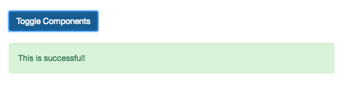
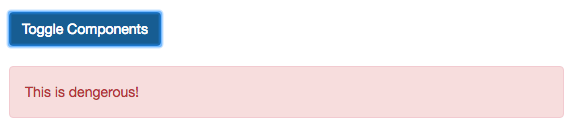

# Animating Dynamic Components

We transition between differnt `html elements` right now. There is one thing we learned in the `components` section which will be perfect to transition between. We are talking about `dynamic components`. 
For this to check, let's first add two new `components`. 

**DangerAlert.vue**

```html
<template>

<div class="alert alert-danger">This is dengerous!</div>

</template>
```

**SuccessAlert.vue**

```html
<template>

<div class="alert alert-success">This is successful!</div>

</template>
```

Now, we got two new components and we wanna switch between them. To use `dynamic components` we first need to register them as components, let's do this locally. After registering both `components` are available. We need to add a new `property` in our `data object`  - let's name it "selectedComponent" and by default it will be "app-success-alert". Now we have the `default selected component`, for our `dynamic component` we set in the template as an element, wchich is with `:is=""` dynamically bound to `selectedComponent`. 

**App.vue**

```html
<template>
    <div class="container">
        <div class="row">
            <div class="col-xs-12 col-sm-8 col-sm-offset-2 col-md-6 col-md-offset-3">
                <h1>Animations</h1>
                <hr>
                <select v-model="alertAnimation" class="form-control"> 
                <option value="fade">Fade</option>      
                <option value="slide">Slide</option>
                </select>
                <br><br>
                <button class="btn btn-primary" @click="show = !show">Show Alert!</button>
                <br><br>
                <transition :name="alertAnimation">  
                <div class="alert alert-info" v-if="show">This is some Info</div>
                </transition>
                <transition :name="alertAnimation" type="animation" appear>  
                <div class="alert alert-info" v-if="show">This is some Info</div>
                </transition>
                <transition  
                enter-active-class="animated bounce"   
                leave-active-class="animated shake"
                >  
                <div class="alert alert-info" v-if="show">This is some Info</div>
                </transition> 
                <transition :name="alertAnimation" mode="out-in" > 
                <div class="alert alert-info" v-if="show" key="info">This is some Info</div> 
                <div class="alert alert-warning" v-else key="warning">This is some Warning</div>  
                </transition> 
                <hr>
                <button class="btn btn-primary" @click="load = !load">Load / Remove Element</button> 
                <br><br>
                <transition @before-enter="beforeEnter" 
                @enter="enter"
                @after-enter="afterEnter"
                @enter-cancelled="enterCancelled"

                @before-leave="beforeLeave"
                @leave="leave"
                @after-leave="afterLeave"
                @leave-cancelled="leave-cancelled"
                :css="false"> 
                <div style="width: 300px; height: 100px; background-color: lightgreen" v-if="load"></div>
                </transition>
                <hr>
                <component :is="selectedComponent"></component>  <!--add component-->
            </div>
        </div>
    </div>
</template>

<script>
 import DangerAlert from './DangerAlert.vue';   //import here 
 import SuccessAlert from './SuccessAlert.vue';

    export default {
        data() {
            return {
             show: false,
             load: true,   
             alertAnimation: 'fade',
             elementWidth: 100,
             selectedComponent: 'app-success-alert'       //selected by default component
            }
        },
        components:{                      //register here 
         appDangerAlert: DangerAlert,
         appSuccessAlert: SuccessAlert
        },
        methods:{         
            beforeEnter(el){
              console.log('beforeEnter');
              this.elementWidth = 100;     
              el.style.width = this.elementWidth + 'px';  
            },
            enter(el, done){
              console.log('enter');
              let round = 1;   
              const interval = setInterval( ()=> {         
               el.style.width  = (this.elementWidth + round * 10) + 'px' 
               round ++     
               if(round > 20){
                clearInterval(interval);
              done();
               }
              }, 20);
            },
            afterEnter(el){
              console.log('afterEnter')
            },
            enterCancelled(el){
                console.log('enterCancelled')
            },
            beforeLeave(el){
               console.log('beforeLeave');
              this.elementWidth = 300;  
              el.style.width = this.elementWidth + 'px'
            },
            leave(el, done){
               console.log('leave');
               let round = 1;   
              const interval = setInterval( ()=> {         
               el.style.width  = (this.elementWidth - round * 10) + 'px' 
               round ++; 
               if(round > 20){
                clearInterval(interval);
                done();
               }
              }, 20);
            },
            afterLeave(el){
              console.log('afterLeave')
            },
            leaveCancelled(el){
             console.log('leaveCancelled')
            }
        }
    }
</script>

<style>
.fade-enter{        
 opacity: 0;
}
.fade-enter-active{
transition: opacity 1s;           
}
.fade-leave{

}
.fade-leave-active{
    transition: opacity 1s;          
    opacity: 0;             
}

.slide-enter{           
opacity: 0;          
}

.slide-eneter-active{
animation: slide-in 1s ease-out forwards;  
transition: opacity .5s;         
}

.slide-leave{

}

.slide-leave-active{
animation: slide-out 1s ease-out forwards;
transition: opacity 1s;   
opacity: 0;
}

@keyframes slide-in{        
 from{
 transform: translateY(20px);
 }
 to{
 transform: translateY(0);
 }
}

@keyframes slide-out{
 from{
 transform: translateY(0);
 }
 to{
 transform: translateY(20px);
 }
}
</style>
```  

Now we also need to add a `button` which allows us to switch between both components. For this button we wanna have a `click listner`, where we check if `selectedComponent` equals `app-success-alert` and if that is the case we wanna set `selectedComponent` to `app-danger-alert`, ortherwise we set `selectedComponent` to `app-sucess-alert`. 

**App.vue**

```html
<template>
    <div class="container">
        <div class="row">
            <div class="col-xs-12 col-sm-8 col-sm-offset-2 col-md-6 col-md-offset-3">
                <h1>Animations</h1>
                <hr>
                <select v-model="alertAnimation" class="form-control"> 
                <option value="fade">Fade</option>      
                <option value="slide">Slide</option>
                </select>
                <br><br>
                <button class="btn btn-primary" @click="show = !show">Show Alert!</button>
                <br><br>
                <transition :name="alertAnimation">  
                <div class="alert alert-info" v-if="show">This is some Info</div>
                </transition>
                <transition :name="alertAnimation" type="animation" appear>  
                <div class="alert alert-info" v-if="show">This is some Info</div>
                </transition>
                <transition  
                enter-active-class="animated bounce"   
                leave-active-class="animated shake"
                >  
                <div class="alert alert-info" v-if="show">This is some Info</div>
                </transition> 
                <transition :name="alertAnimation" mode="out-in" > 
                <div class="alert alert-info" v-if="show" key="info">This is some Info</div> 
                <div class="alert alert-warning" v-else key="warning">This is some Warning</div>  
                </transition> 
                <hr>
                <button class="btn btn-primary" @click="load = !load">Load / Remove Element</button> 
                <br><br>
                <transition @before-enter="beforeEnter" 
                @enter="enter"
                @after-enter="afterEnter"
                @enter-cancelled="enterCancelled"

                @before-leave="beforeLeave"
                @leave="leave"
                @after-leave="afterLeave"
                @leave-cancelled="leave-cancelled"
                :css="false"> 
                <div style="width: 300px; height: 100px; background-color: lightgreen" v-if="load"></div>
                </transition>
                <hr>
                <button class="btn btn-primary" @click="selectedComponent == 'app-success-alert' ? selectedComponent = 'app-danger-alert' : selectedComponent = 'app-success-alert'">Toggle Components</button> <!--add a button and check the condition-->
                <br><br>
                <component :is="selectedComponent"></component> 
            </div>
        </div>
    </div>
</template>

<script>
 import DangerAlert from './DangerAlert.vue';   
 import SuccessAlert from './SuccessAlert.vue';

    export default {
        data() {
            return {
             show: false,
             load: true,   
             alertAnimation: 'fade',
             elementWidth: 100,
             selectedComponent: 'app-success-alert'       
            }
        },
        components:{                     
         appDangerAlert: DangerAlert,
         appSuccessAlert: SuccessAlert
        },
        methods:{         
            beforeEnter(el){
              console.log('beforeEnter');
              this.elementWidth = 100;     
              el.style.width = this.elementWidth + 'px';  
            },
            enter(el, done){
              console.log('enter');
              let round = 1;   
              const interval = setInterval( ()=> {         
               el.style.width  = (this.elementWidth + round * 10) + 'px' 
               round ++     
               if(round > 20){
                clearInterval(interval);
              done();
               }
              }, 20);
            },
            afterEnter(el){
              console.log('afterEnter')
            },
            enterCancelled(el){
                console.log('enterCancelled')
            },
            beforeLeave(el){
               console.log('beforeLeave');
              this.elementWidth = 300;  
              el.style.width = this.elementWidth + 'px'
            },
            leave(el, done){
               console.log('leave');
               let round = 1;   
              const interval = setInterval( ()=> {         
               el.style.width  = (this.elementWidth - round * 10) + 'px' 
               round ++; 
               if(round > 20){
                clearInterval(interval);
                done();
               }
              }, 20);
            },
            afterLeave(el){
              console.log('afterLeave')
            },
            leaveCancelled(el){
             console.log('leaveCancelled')
            }
        }
    }
</script>

<style>
.fade-enter{        
 opacity: 0;
}
.fade-enter-active{
transition: opacity 1s;           
}
.fade-leave{

}
.fade-leave-active{
    transition: opacity 1s;          
    opacity: 0;             
}

.slide-enter{           
opacity: 0;          
}

.slide-eneter-active{
animation: slide-in 1s ease-out forwards;  
transition: opacity .5s;         
}

.slide-leave{

}

.slide-leave-active{
animation: slide-out 1s ease-out forwards;
transition: opacity 1s;   
opacity: 0;
}

@keyframes slide-in{        
 from{
 transform: translateY(20px);
 }
 to{
 transform: translateY(0);
 }
}

@keyframes slide-out{
 from{
 transform: translateY(0);
 }
 to{
 transform: translateY(20px);
 }
}
</style>
```  




Now we wanna animate this. To animate it we wrap our `component` in a `transition element`. And to use transition we can simply use the name of animation, and the `mode` to `out-in`. 

**App.vue**

```html
<template>
    <div class="container">
        <div class="row">
            <div class="col-xs-12 col-sm-8 col-sm-offset-2 col-md-6 col-md-offset-3">
                <h1>Animations</h1>
                <hr>
                <select v-model="alertAnimation" class="form-control"> 
                <option value="fade">Fade</option>      
                <option value="slide">Slide</option>
                </select>
                <br><br>
                <button class="btn btn-primary" @click="show = !show">Show Alert!</button>
                <br><br>
                <transition :name="alertAnimation">  
                <div class="alert alert-info" v-if="show">This is some Info</div>
                </transition>
                <transition :name="alertAnimation" type="animation" appear>  
                <div class="alert alert-info" v-if="show">This is some Info</div>
                </transition>
                <transition  
                enter-active-class="animated bounce"   
                leave-active-class="animated shake"
                >  
                <div class="alert alert-info" v-if="show">This is some Info</div>
                </transition> 
                <transition :name="alertAnimation" mode="out-in" > 
                <div class="alert alert-info" v-if="show" key="info">This is some Info</div> 
                <div class="alert alert-warning" v-else key="warning">This is some Warning</div>  
                </transition> 
                <hr>
                <button class="btn btn-primary" @click="load = !load">Load / Remove Element</button> 
                <br><br>
                <transition @before-enter="beforeEnter" 
                @enter="enter"
                @after-enter="afterEnter"
                @enter-cancelled="enterCancelled"

                @before-leave="beforeLeave"
                @leave="leave"
                @after-leave="afterLeave"
                @leave-cancelled="leave-cancelled"
                :css="false"> 
                <div style="width: 300px; height: 100px; background-color: lightgreen" v-if="load"></div>
                </transition>
                <hr>
                <button class="btn btn-primary" @click="selectedComponent == 'app-success-alert' ? selectedComponent = 'app-danger-alert' : selectedComponent = 'app-success-alert'">Toggle Components</button> 
                <br><br>
                <transition name="fade" mode="out-in">   <!--wrap in a transition--> <!--use the animation name-->
                <component :is="selectedComponent"></component> 
                </transition> 
            </div>
        </div>
    </div>
</template>

<script>
 import DangerAlert from './DangerAlert.vue';   
 import SuccessAlert from './SuccessAlert.vue';

    export default {
        data() {
            return {
             show: false,
             load: true,   
             alertAnimation: 'fade',
             elementWidth: 100,
             selectedComponent: 'app-success-alert'       
            }
        },
        components:{                     
         appDangerAlert: DangerAlert,
         appSuccessAlert: SuccessAlert
        },
        methods:{         
            beforeEnter(el){
              console.log('beforeEnter');
              this.elementWidth = 100;     
              el.style.width = this.elementWidth + 'px';  
            },
            enter(el, done){
              console.log('enter');
              let round = 1;   
              const interval = setInterval( ()=> {         
               el.style.width  = (this.elementWidth + round * 10) + 'px' 
               round ++     
               if(round > 20){
                clearInterval(interval);
              done();
               }
              }, 20);
            },
            afterEnter(el){
              console.log('afterEnter')
            },
            enterCancelled(el){
                console.log('enterCancelled')
            },
            beforeLeave(el){
               console.log('beforeLeave');
              this.elementWidth = 300;  
              el.style.width = this.elementWidth + 'px'
            },
            leave(el, done){
               console.log('leave');
               let round = 1;   
              const interval = setInterval( ()=> {         
               el.style.width  = (this.elementWidth - round * 10) + 'px' 
               round ++; 
               if(round > 20){
                clearInterval(interval);
                done();
               }
              }, 20);
            },
            afterLeave(el){
              console.log('afterLeave')
            },
            leaveCancelled(el){
             console.log('leaveCancelled')
            }
        }
    }
</script>

<style>
.fade-enter{        
 opacity: 0;
}
.fade-enter-active{
transition: opacity 1s;           
}
.fade-leave{

}
.fade-leave-active{
    transition: opacity 1s;          
    opacity: 0;             
}

.slide-enter{           
opacity: 0;          
}

.slide-eneter-active{
animation: slide-in 1s ease-out forwards;  
transition: opacity .5s;         
}

.slide-leave{

}

.slide-leave-active{
animation: slide-out 1s ease-out forwards;
transition: opacity 1s;   
opacity: 0;
}

@keyframes slide-in{        
 from{
 transform: translateY(20px);
 }
 to{
 transform: translateY(0);
 }
}

@keyframes slide-out{
 from{
 transform: translateY(0);
 }
 to{
 transform: translateY(20px);
 }
}
</style>
```  