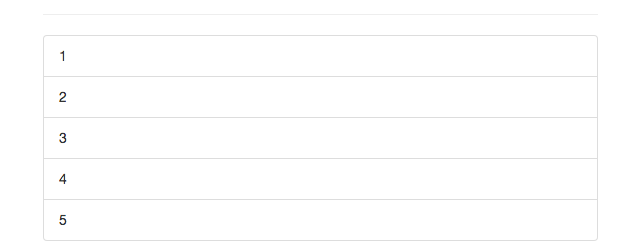

# Animating Lists with `<transition-group>`

Let's say we have a `list` and we wanna animate the removal of the `item` and the addition of the `item`, we can do this with the `<transition-group>` which is another wraper like `<transition>` but for multiple items. 

To use `<transition-group>` we first add to our app an `unordered list`. Well, now we have our list item, and we also need some data. Let's set an `array of numbers` in our `data object`. Now we wanna `loop` through them,of course, with `v-for` and output the `number` with string interpolation in our `list item`.  

**App.vue**

```html
<template>
    <div class="container">
        <div class="row">
            <div class="col-xs-12 col-sm-8 col-sm-offset-2 col-md-6 col-md-offset-3">
                <h1>Animations</h1>
                <hr>
                <select v-model="alertAnimation" class="form-control"> 
                <option value="fade">Fade</option>      
                <option value="slide">Slide</option>
                </select>
                <br><br>
                <button class="btn btn-primary" @click="show = !show">Show Alert!</button>
                <br><br>
                <transition :name="alertAnimation">  
                <div class="alert alert-info" v-if="show">This is some Info</div>
                </transition>
                <transition :name="alertAnimation" type="animation" appear>  
                <div class="alert alert-info" v-if="show">This is some Info</div>
                </transition>
                <transition  
                enter-active-class="animated bounce"   
                leave-active-class="animated shake"
                >  
                <div class="alert alert-info" v-if="show">This is some Info</div>
                </transition> 
                <transition :name="alertAnimation" mode="out-in" > 
                <div class="alert alert-info" v-if="show" key="info">This is some Info</div> 
                <div class="alert alert-warning" v-else key="warning">This is some Warning</div>  
                </transition> 
                <hr>
                <button class="btn btn-primary" @click="load = !load">Load / Remove Element</button> 
                <br><br>
                <transition @before-enter="beforeEnter" 
                @enter="enter"
                @after-enter="afterEnter"
                @enter-cancelled="enterCancelled"

                @before-leave="beforeLeave"
                @leave="leave"
                @after-leave="afterLeave"
                @leave-cancelled="leave-cancelled"
                :css="false"> 
                <div style="width: 300px; height: 100px; background-color: lightgreen" v-if="load"></div>
                </transition>
                <hr>
                <button class="btn btn-primary" @click="selectedComponent == 'app-success-alert' ? selectedComponent = 'app-danger-alert' : selectedComponent = 'app-success-alert'">Toggle Components</button> 
                <br><br>
                <transition name="fade" mode="out-in">   
                <component :is="selectedComponent"></component> 
                </transition> 
                <hr>  <!--add unordered list-->
                <ul class="list-group">
                <li class="list-group-item" v-for="number in numbers">{{ number }}</li>  <!--loop here-->
                </ul>
            </div>
        </div>
    </div>
</template>

<script>
 import DangerAlert from './DangerAlert.vue';   
 import SuccessAlert from './SuccessAlert.vue';

    export default {
        data() {
            return {
             show: false,
             load: true,   
             alertAnimation: 'fade',
             elementWidth: 100,
             selectedComponent: 'app-success-alert' ,
             numbers: [1,2,3,4,5]      //add an array of numbers  
            }
        },
        components:{                     
         appDangerAlert: DangerAlert,
         appSuccessAlert: SuccessAlert
        },
        methods:{         
            beforeEnter(el){
              console.log('beforeEnter');
              this.elementWidth = 100;     
              el.style.width = this.elementWidth + 'px';  
            },
            enter(el, done){
              console.log('enter');
              let round = 1;   
              const interval = setInterval( ()=> {         
               el.style.width  = (this.elementWidth + round * 10) + 'px' 
               round ++     
               if(round > 20){
                clearInterval(interval);
              done();
               }
              }, 20);
            },
            afterEnter(el){
              console.log('afterEnter')
            },
            enterCancelled(el){
                console.log('enterCancelled')
            },
            beforeLeave(el){
               console.log('beforeLeave');
              this.elementWidth = 300;  
              el.style.width = this.elementWidth + 'px'
            },
            leave(el, done){
               console.log('leave');
               let round = 1;   
              const interval = setInterval( ()=> {         
               el.style.width  = (this.elementWidth - round * 10) + 'px' 
               round ++; 
               if(round > 20){
                clearInterval(interval);
                done();
               }
              }, 20);
            },
            afterLeave(el){
              console.log('afterLeave')
            },
            leaveCancelled(el){
             console.log('leaveCancelled')
            }
        }
    }
</script>

<style>
.fade-enter{        
 opacity: 0;
}
.fade-enter-active{
transition: opacity 1s;           
}
.fade-leave{

}
.fade-leave-active{
    transition: opacity 1s;          
    opacity: 0;             
}

.slide-enter{           
opacity: 0;          
}

.slide-eneter-active{
animation: slide-in 1s ease-out forwards;  
transition: opacity .5s;         
}

.slide-leave{

}

.slide-leave-active{
animation: slide-out 1s ease-out forwards;
transition: opacity 1s;   
opacity: 0;
}

@keyframes slide-in{        
 from{
 transform: translateY(20px);
 }
 to{
 transform: translateY(0);
 }
}

@keyframes slide-out{
 from{
 transform: translateY(0);
 }
 to{
 transform: translateY(20px);
 }
}
</style>
```  


Now let's add a way to add and delete `items` first. First we'll add a `button` which adds the `item`, and then upon clicking we wanna execute `addItem` method, we also need to create in our script. Then on an `individual item` we also need to add a `click listner`, so when we click on the `item` we can execute `removeItem()` method. To remove `item` we need to be able to know which `item` to remove, and to be able to know we will pass the `index of the item` to the `removeItem()` method. 

**App.vue**

```html
<template>
    <div class="container">
        <div class="row">
            <div class="col-xs-12 col-sm-8 col-sm-offset-2 col-md-6 col-md-offset-3">
                <h1>Animations</h1>
                <hr>
                <select v-model="alertAnimation" class="form-control"> 
                <option value="fade">Fade</option>      
                <option value="slide">Slide</option>
                </select>
                <br><br>
                <button class="btn btn-primary" @click="show = !show">Show Alert!</button>
                <br><br>
                <transition :name="alertAnimation">  
                <div class="alert alert-info" v-if="show">This is some Info</div>
                </transition>
                <transition :name="alertAnimation" type="animation" appear>  
                <div class="alert alert-info" v-if="show">This is some Info</div>
                </transition>
                <transition  
                enter-active-class="animated bounce"   
                leave-active-class="animated shake"
                >  
                <div class="alert alert-info" v-if="show">This is some Info</div>
                </transition> 
                <transition :name="alertAnimation" mode="out-in" > 
                <div class="alert alert-info" v-if="show" key="info">This is some Info</div> 
                <div class="alert alert-warning" v-else key="warning">This is some Warning</div>  
                </transition> 
                <hr>
                <button class="btn btn-primary" @click="load = !load">Load / Remove Element</button> 
                <br><br>
                <transition @before-enter="beforeEnter" 
                @enter="enter"
                @after-enter="afterEnter"
                @enter-cancelled="enterCancelled"

                @before-leave="beforeLeave"
                @leave="leave"
                @after-leave="afterLeave"
                @leave-cancelled="leave-cancelled"
                :css="false"> 
                <div style="width: 300px; height: 100px; background-color: lightgreen" v-if="load"></div>
                </transition>
                <hr>
                <button class="btn btn-primary" @click="selectedComponent == 'app-success-alert' ? selectedComponent = 'app-danger-alert' : selectedComponent = 'app-success-alert'">Toggle Components</button> 
                <br><br>
                <transition name="fade" mode="out-in">   
                <component :is="selectedComponent"></component> 
                </transition> 
                <hr>  
                <button class="btn btn-primary" @click="addItem">Add Item</button>  <!--add a button, listen to click-->
                <ul class="list-group"> <!--add unordered list-->
                <li class="list-group-item" 
                v-for="(number, index) in numbers" 
                :key="index" 
                @click="removeItem(index)" 
                style="cursor : pointer">
                {{ number }}</li>  <!--loop here, listen to click-->
                </ul>
            </div>
        </div>
    </div>
</template>

<script>
 import DangerAlert from './DangerAlert.vue';   
 import SuccessAlert from './SuccessAlert.vue';

    export default {
        data() {
            return {
             show: false,
             load: true,   
             alertAnimation: 'fade',
             elementWidth: 100,
             selectedComponent: 'app-success-alert' ,
             numbers: [1,2,3,4,5]      //add an array of numbers  
            }
        },
        components:{                     
         appDangerAlert: DangerAlert,
         appSuccessAlert: SuccessAlert
        },
        methods:{         
            beforeEnter(el){
              console.log('beforeEnter');
              this.elementWidth = 100;     
              el.style.width = this.elementWidth + 'px';  
            },
            enter(el, done){
              console.log('enter');
              let round = 1;   
              const interval = setInterval( ()=> {         
               el.style.width  = (this.elementWidth + round * 10) + 'px' 
               round ++     
               if(round > 20){
                clearInterval(interval);
              done();
               }
              }, 20);
            },
            afterEnter(el){
              console.log('afterEnter')
            },
            enterCancelled(el){
                console.log('enterCancelled')
            },
            beforeLeave(el){
               console.log('beforeLeave');
              this.elementWidth = 300;  
              el.style.width = this.elementWidth + 'px'
            },
            leave(el, done){
               console.log('leave');
               let round = 1;   
              const interval = setInterval( ()=> {         
               el.style.width  = (this.elementWidth - round * 10) + 'px' 
               round ++; 
               if(round > 20){
                clearInterval(interval);
                done();
               }
              }, 20);
            },
            afterLeave(el){
              console.log('afterLeave')
            },
            leaveCancelled(el){
             console.log('leaveCancelled')
            },
            addItem(){            //addItem method here
            
            },
            removeItem(index){

            }
        }
    }
</script>

<style>
.fade-enter{        
 opacity: 0;
}
.fade-enter-active{
transition: opacity 1s;           
}
.fade-leave{

}
.fade-leave-active{
    transition: opacity 1s;          
    opacity: 0;             
}

.slide-enter{           
opacity: 0;          
}

.slide-eneter-active{
animation: slide-in 1s ease-out forwards;  
transition: opacity .5s;         
}

.slide-leave{

}

.slide-leave-active{
animation: slide-out 1s ease-out forwards;
transition: opacity 1s;   
opacity: 0;
}

@keyframes slide-in{        
 from{
 transform: translateY(20px);
 }
 to{
 transform: translateY(0);
 }
}

@keyframes slide-out{
 from{
 transform: translateY(0);
 }
 to{
 transform: translateY(20px);
 }
}
</style>
```  

Now, let's setup the `methods`: `addItem()` which doesn't have the argument, and `removeItem(index)` which gets the `index` as an argument. For removing we get our `numbers array` and with `splice` method we can add the `existing array` to remove item, and we wanna remove `item` at the `index` and only `1` item .

And then for adding an `item` we wanna randomise this, we wanna get the `position` which we will determine randomly with `math.floor()` method to get the full integer and then `Math.random()` which gives us the random number between `0` and `.9999`, this then multiplied with the current length of our array - will give us the number between `0` and the `highest index` of the last `item` in the array. And then we can use here the `splice()` method too, we will start splicing at the `position`, don't remove any element (pass `0` as a second `argument`), but then splice also has a third `argument` which allows us to add `item` to our `array` at this `position` (`this.numbers.length + 1`). 

**App.vue**

```html
<template>
    <div class="container">
        <div class="row">
            <div class="col-xs-12 col-sm-8 col-sm-offset-2 col-md-6 col-md-offset-3">
                <h1>Animations</h1>
                <hr>
                <select v-model="alertAnimation" class="form-control"> 
                <option value="fade">Fade</option>      
                <option value="slide">Slide</option>
                </select>
                <br><br>
                <button class="btn btn-primary" @click="show = !show">Show Alert!</button>
                <br><br>
                <transition :name="alertAnimation">  
                <div class="alert alert-info" v-if="show">This is some Info</div>
                </transition>
                <transition :name="alertAnimation" type="animation" appear>  
                <div class="alert alert-info" v-if="show">This is some Info</div>
                </transition>
                <transition  
                enter-active-class="animated bounce"   
                leave-active-class="animated shake"
                >  
                <div class="alert alert-info" v-if="show">This is some Info</div>
                </transition> 
                <transition :name="alertAnimation" mode="out-in" > 
                <div class="alert alert-info" v-if="show" key="info">This is some Info</div> 
                <div class="alert alert-warning" v-else key="warning">This is some Warning</div>  
                </transition> 
                <hr>
                <button class="btn btn-primary" @click="load = !load">Load / Remove Element</button> 
                <br><br>
                <transition @before-enter="beforeEnter" 
                @enter="enter"
                @after-enter="afterEnter"
                @enter-cancelled="enterCancelled"

                @before-leave="beforeLeave"
                @leave="leave"
                @after-leave="afterLeave"
                @leave-cancelled="leave-cancelled"
                :css="false"> 
                <div style="width: 300px; height: 100px; background-color: lightgreen" v-if="load"></div>
                </transition>
                <hr>
                <button class="btn btn-primary" @click="selectedComponent == 'app-success-alert' ? selectedComponent = 'app-danger-alert' : selectedComponent = 'app-success-alert'">Toggle Components</button> 
                <br><br>
                <transition name="fade" mode="out-in">   
                <component :is="selectedComponent"></component> 
                </transition> 
                <hr>  
                <button class="btn btn-primary" @click="addItem">Add Item</button>  
                <br><br> 
                <ul class="list-group"> 
                <li class="list-group-item" 
                v-for="(number, index) in numbers" 
                :key="index" 
                @click="removeItem(index)" 
                style="cursor : pointer">
                {{ number }}</li>  
                </ul>
            </div>
        </div>
    </div>
</template>

<script>
 import DangerAlert from './DangerAlert.vue';   
 import SuccessAlert from './SuccessAlert.vue';

    export default {
        data() {
            return {
             show: false,
             load: true,   
             alertAnimation: 'fade',
             elementWidth: 100,
             selectedComponent: 'app-success-alert' ,
             numbers: [1,2,3,4,5]     
            }
        },
        components:{                     
         appDangerAlert: DangerAlert,
         appSuccessAlert: SuccessAlert
        },
        methods:{         
            beforeEnter(el){
              console.log('beforeEnter');
              this.elementWidth = 100;     
              el.style.width = this.elementWidth + 'px';  
            },
            enter(el, done){
              console.log('enter');
              let round = 1;   
              const interval = setInterval( ()=> {         
               el.style.width  = (this.elementWidth + round * 10) + 'px' 
               round ++     
               if(round > 20){
                clearInterval(interval);
              done();
               }
              }, 20);
            },
            afterEnter(el){
              console.log('afterEnter')
            },
            enterCancelled(el){
                console.log('enterCancelled')
            },
            beforeLeave(el){
               console.log('beforeLeave');
              this.elementWidth = 300;  
              el.style.width = this.elementWidth + 'px'
            },
            leave(el, done){
               console.log('leave');
               let round = 1;   
              const interval = setInterval( ()=> {         
               el.style.width  = (this.elementWidth - round * 10) + 'px' 
               round ++; 
               if(round > 20){
                clearInterval(interval);
                done();
               }
              }, 20);
            },
            afterLeave(el){
              console.log('afterLeave')
            },
            leaveCancelled(el){
             console.log('leaveCancelled')
            },
            addItem(){            //addItem method here
            const pos = Math.floor( Math.random() * this.numbers.length);
            this.numbers.splice(pos,0, this.numbers.length + 1)
            },
            removeItem(index){         //removeItem method here 
             this.numbers.splice(index,1)
            }
        }
    }
</script>

<style>
.fade-enter{        
 opacity: 0;
}
.fade-enter-active{
transition: opacity 1s;           
}
.fade-leave{

}
.fade-leave-active{
    transition: opacity 1s;          
    opacity: 0;             
}

.slide-enter{           
opacity: 0;          
}

.slide-eneter-active{
animation: slide-in 1s ease-out forwards;  
transition: opacity .5s;         
}

.slide-leave{

}

.slide-leave-active{
animation: slide-out 1s ease-out forwards;
transition: opacity 1s;   
opacity: 0;
}

@keyframes slide-in{        
 from{
 transform: translateY(20px);
 }
 to{
 transform: translateY(0);
 }
}

@keyframes slide-out{
 from{
 transform: translateY(0);
 }
 to{
 transform: translateY(20px);
 }
}
</style>
```  

Now we wanna animate both: the addition and the deletion of the item. Look at 019_Using `<transition-group>` to Animate the List. 