#  Creating the App

"The Super Quiz" is the project we are going to build: it uses animation and components

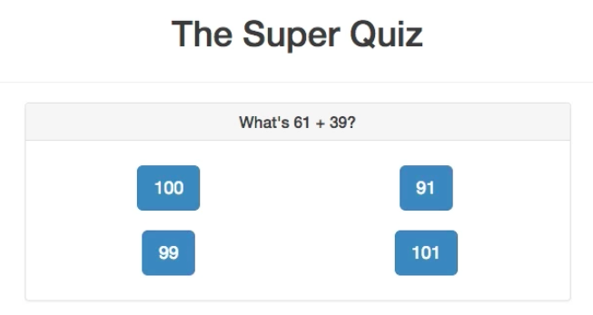


Well, what we want to build where we have `addition` and `substraction` tasks, when we got the right answer we switch this page and show `"That's correct" page`; if we are wrong we get the `alert`. So, we need at least two `components`: the `question` and the `answer`. We need animation, we maybe wanna switch between the `components`.

Initially we have:

**index.html**

```html
<!DOCTYPE html>
<html lang="en">
<head>
    <meta charset="utf-8">
    <title>Vue Animations</title>
    <link rel="stylesheet" href="https://maxcdn.bootstrapcdn.com/bootstrap/3.3.7/css/bootstrap.min.css"
          integrity="sha384-BVYiiSIFeK1dGmJRAkycuHAHRg32OmUcww7on3RYdg4Va+PmSTsz/K68vbdEjh4u" crossorigin="anonymous">
</head>
<body>
<div id="app">
</div>
<script src="/dist/build.js"></script>
</body>
</html>
``` 

**App.vue**

```html
<template>
    <div class="container">
        <div class="row">
            <div class="col-xs-12 col-sm-8 col-sm-offset-2 col-md-6 col-md-offset-3">
                <h1 class="text-center">The Super Quiz</h1>
            </div>
        </div>
        
    </div>
</template>

<script>
    
    export default {
        
    }
</script>
```

After our `heading` let's have another row with a horisontal line in between. and in this row we will have the `question` and the `answer`. To do that we'll use `dynamic components` we should create, import to the app, register and use as the tag in the template. Well, these two new files should switch dynamically. Then in the `data object` we need to setup the `property` which currently holds the loaded `component` because we wanna use the `dynamic components`. The property will be the `mode` which is initially set as "Question", so that we see the question first. Then we bind it dynamically (`:is`) in the `component` tag in the template to `"mode"`. 

**App.vue**

```html
<template>
    <div class="container">
        <div class="row">
            <div class="col-xs-12 col-sm-8 col-sm-offset-2 col-md-6 col-md-offset-3">
                <h1 class="text-center">The Super Quiz</h1>
            </div>
        </div>
        <hr>
        <div class="row">
            <div class="col-xs-12 col-sm-8 col-sm-offset-2 col-md-6 col-md-offset-3"> <!--one more row here-->
                <component :is="mode"></component> <!--add dynamic component, bind to the component place holder-->
            </div>
        </div>
        
    </div>
</template>

<script>
    import Question from './components/Question.vue';
    import Answer from './components/Answer.vue';

    export default {
        data: function(){
         return{
         mode: 'app-question'      //set the loaded component place holder
         }
        },
        components:{
            appQuestion: Question,
            appAnswer: Answer
        }
    }
</script>
```

Let's go through our `Question.vue` file. We got here a title which output some question stored in some property, and then we have several `buttons` which are basically just executing `onAnswer()` method, where we pass the `argument` which should come back and which then show the answer (one of four answeres). 

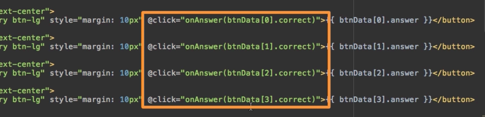
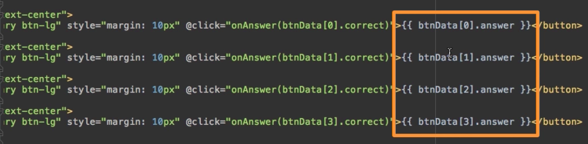

Of course, we need to generate the answers, and we don't want to have the same `button` which holds the `correct answer` at the same position all the time. this is why we pass the second `argument` where we do smth else on our answer which seem to be stored in an `array` - `correct` argument - this determines if the answer is correct or not, so that any `button` may hold the correct or false, and we determine it upon clicking.

Let's look at the `button data array`. 

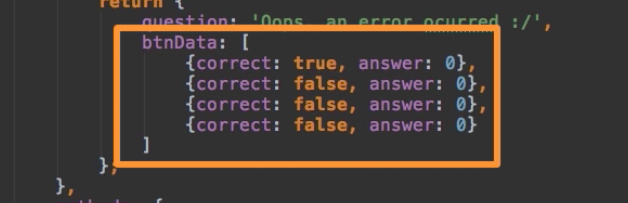

There we have a couple of `objects`, each of them has the answer, set initially to `0`, and whenever it is correct (`true/false`). 

In `methods` property we have `generateQuestion()` method; it is called in the `created()` lifecycle hook, so whenever the `Question.vue component` is loaded. 

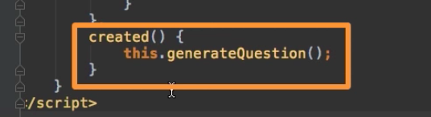

Well, in `generateQuestion()` method we generate `firstNumber` and `secondNumber`.

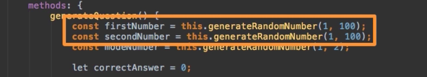

Then we generate which mode we wanna use, that is the random number between `1` and `2`. Surely we have here `randomnumber()` method also. 

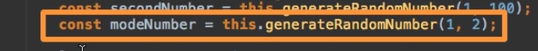
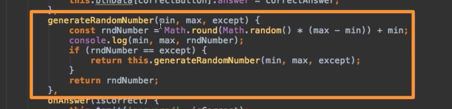

Then we switch between the `mode`. And the `mode addition` is just `1`, where `mode substraction` is just `2` - we use global `variables` for that.  

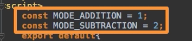

And if `mode number` (a random number between 1 and 2) is `1` then we set the `correct answer` to `firstNumber + secondNumber`, and we set the question using literal here. 

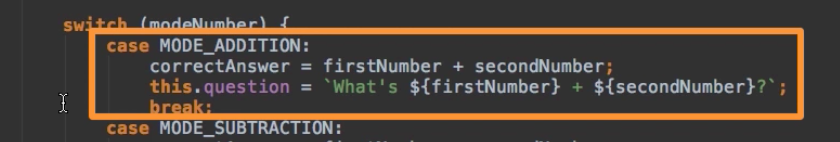

We do the same in `substraction mode`. Well, that was the determinimg of the `correct answer`. And then we need some `fake answers`. So, we make sure that for all our `buttons` we do set some `values`. The `value` on the `first button` is the `correct answer - 10` and `correct answer + 10` (these are min and max borders for the `generateNumber()` function), and then we need to set the `correct answer` itself. 

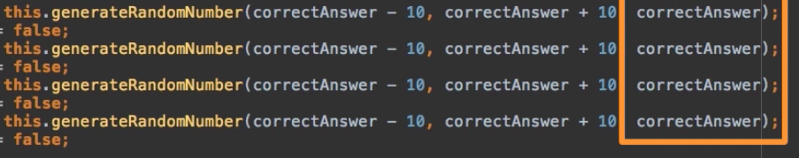

So, we populate all 4 `buttons` with wrong `answeres` - that is why we set the correct `property` to `false` for all 4 `buttons` initially. We need to exclude `correct answer` from the random number generation, cos otherwise we may have two `buttons` with the same `answer`, but one of them gives us the wrong answer. 

Then on the `correct button` we generate the random number between `0` and `3`, cos we have four `elements` in the `button data array` , and then we generate the random number to determine which `button` gets the `correct answer`, then we generate which `button` should hold the `correct data` and then we set the `correct data` on that `button`.

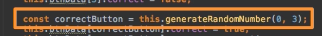
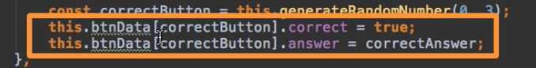

**Question.vue**

```html
<template>
    <div class="panel panel-default">
        <div class="panel-heading">
            <h3 class="panel-title text-center">{{ question }}</h3> <!--title here-->
        </div>
        <div class="panel-body">
            <div class="col-xs-12 col-sm-6 text-center">
                <button class="btn btn-primary btn-lg" style="margin: 10px" @click="onAnswer(btnData[0].correct)">{{ btnData[0].answer }}</button>  <!--abutton-->
            </div>
            <div class="col-xs-12 col-sm-6 text-center">
                <button class="btn btn-primary btn-lg" style="margin: 10px" @click="onAnswer(btnData[1].correct)">{{ btnData[1].answer }}</button>
            </div>
            <div class="col-xs-12 col-sm-6 text-center">
                <button class="btn btn-primary btn-lg" style="margin: 10px" @click="onAnswer(btnData[2].correct)">{{ btnData[2].answer }}</button>
            </div>
            <div class="col-xs-12 col-sm-6 text-center">
                <button class="btn btn-primary btn-lg" style="margin: 10px" @click="onAnswer(btnData[3].correct)">{{ btnData[3].answer }}</button>
            </div>
        </div>
    </div>
</template>
<style>

</style>
<script>
    const MODE_ADDITION = 1; 
    const MODE_SUBTRACTION = 2;
    export default{
        data() {
            return {
                question: 'Oops, an error ocurred :/',
                btnData: [                         //button data array
                    {correct: true, answer: 0},   
                    {correct: false, answer: 0},
                    {correct: false, answer: 0},
                    {correct: false, answer: 0}
                ]
            };
        },
        methods: {
            generateQuestion() {
                const firstNumber = this.generateRandomNumber(1, 100);
                const secondNumber = this.generateRandomNumber(1, 100);
                const modeNumber = this.generateRandomNumber(1, 2);

                let correctAnswer = 0;

                switch (modeNumber) {
                    case MODE_ADDITION:
                        correctAnswer = firstNumber + secondNumber;
                        this.question = `What's ${firstNumber} + ${secondNumber}?`;
                        break;
                    case MODE_SUBTRACTION:
                        correctAnswer = firstNumber - secondNumber;
                        this.question = `What's ${firstNumber} - ${secondNumber}?`;
                        break;
                    default:
                        correctAnswer = 0;
                        this.question = 'Oops, an Error occurred :/';
                }

                this.btnData[0].answer = this.generateRandomNumber(correctAnswer - 10, correctAnswer + 10, correctAnswer);
                this.btnData[0].correct = false;
                this.btnData[1].answer = this.generateRandomNumber(correctAnswer - 10, correctAnswer + 10, correctAnswer);
                this.btnData[1].correct = false;
                this.btnData[2].answer = this.generateRandomNumber(correctAnswer - 10, correctAnswer + 10, correctAnswer);
                this.btnData[2].correct = false;
                this.btnData[3].answer = this.generateRandomNumber(correctAnswer - 10, correctAnswer + 10, correctAnswer);
                this.btnData[3].correct = false;

                const correctButton = this.generateRandomNumber(0, 3);
                this.btnData[correctButton].correct = true;
                this.btnData[correctButton].answer = correctAnswer;
            },
            generateRandomNumber(min, max, except) {
                const rndNumber = Math.round(Math.random() * (max - min)) + min;
                console.log(min, max, rndNumber);
                if (rndNumber == except) {
                    return this.generateRandomNumber(min, max, except);
                }
                return rndNumber;
            },
            onAnswer(isCorrect) {
                this.$emit('answered', isCorrect);
            }
        },
        created() {
            this.generateQuestion();  //call generateQuestion here
        }
    }
</script>
``` 

Now, let's move to our `Answer.vue` file and also populate here. Here we basically say "That's Correct", cos we show this component in case we get the correct answer. And then if we click on `next question` , we emit an `event` called `confirmed`. 

**Answer.vue**

```html
<template>
    <div class="alert alert-success text-center">
        <h1>That's Correct!</h1>
        <hr>
        <button class="btn btn-primary" @click="onNextQuestion">Next Question</button> <!--listen to click-->
    </div>
</template>
<style>

</style>
<script>

    export default{
        methods: {
            onNextQuestion() {
                this.$emit('confirmed');  //emit event here 
            }
        }
    }
</script>
```

Now our job in `App.vue` file is to listen to both `events`: "confirmed" from the `Answer.vue` and "answerred" from the `Question.vue`. To our `dynamic component` we add `click listners` to our `custom events`: first `@answered` - here we execute `answered` and pass on the `event data`, stored in the specific `$event` variable created by VueJS. If the other component is loaded we need listen to event from `Answer` component: we need to listen to `confirmed` and we simply switch the `mode` to `app-question` again. 

The place to switch to `app-answer` is in the `methods` object in the script. 

**App.vue**

```html
<template>
    <div class="container">
        <div class="row">
            <div class="col-xs-12 col-sm-8 col-sm-offset-2 col-md-6 col-md-offset-3">
                <h1 class="text-center">The Super Quiz</h1>
            </div>
        </div>
        <hr>
        <div class="row">
            <div class="col-xs-12 col-sm-8 col-sm-offset-2 col-md-6 col-md-offset-3"> 
                <component :is="mode" @answered="answered($event)" @confirmed="mode = 'app-question' "></component> <!--listen to events-->
            </div>
        </div>
        
    </div>
</template>

<script>
    import Question from './components/Question.vue';
    import Answer from './components/Answer.vue';

    export default {
        data: function(){
         return{
         mode: 'app-question'     
         }
        },
        methods:{
        answered(isCorrect) {
              if (isCorrect) {
                  this.mode = 'app-answer';
              } else {
                  this.mode = 'app-question';
                  alert('Wrong, try again!');
              }
          }
        },
        components:{
            appQuestion: Question,
            appAnswer: Answer
        }
    }
</script>
```

