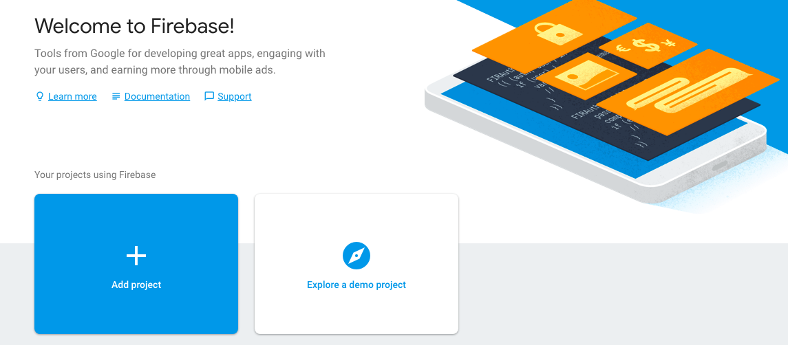
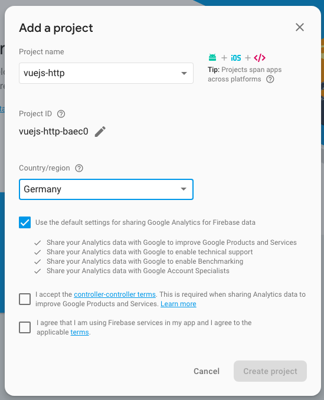

# Creating and Application and Setting up a Server (Firebase)

So, we installed `Vue resourse` though we don't use it yet. In order to be able to use it we also need some `server` where we can send our `data` to. To setup a `server` now we'll use a [`Firebase` service](https://firebase.google.com/?gclid=EAIaIQobChMI5PH1-abz2wIV04KyCh04kARDEAAYASAAEgKaiPD_BwE). 



In the `Firebase console` we are going to create a project. Here we simply name the project and pick the country. 



This will take us to our project dashboard, and on this dashboars we got lot of different things. For now we will only use the `database` cos we only want to store data in the `database` here. The first thing we need to do for testing, important!!! only for testing, is that in the `rules` of the `databese` section  we should say `read` and `write` both to `true`. 


Keep in mind - these are not the settings we need in the production app. 

In order to be able to access `database` we go back to our `App.vue` file, and the first thing we want - we want to be able to store some `data` there. To stote the `data` let's quickly setup a `div` with some `inputs` inside, and then a `button`. 

After that in our `vue instance` we need to setup `data`, where we'll have the `user object` with `username` property empty at the beginning and `email` property also empty at the beginning. Then we bind the data with `v-model` to our `inputs` in the template. 

**App.vue**

```html
<template>
    <div class="container">
        <div class="row">
            <div class="col-xs-12 col-sm-8 col-sm-offset-2 col-md-6 col-md-offset-3">
                <h1>Http</h1>
                <div class="form-group">          <!--set the div-->
                <label>User Name</label> 
                <input class="form-control" type="text" v-model="user.username"> <!--bind here-->
                </div>
                <div class="form-group">          <!--set the div-->
                <label>Mail</label> 
                <input class="form-control" type="text" v-model="user.email"> <!--bind here-->
                </div>
                <button class="btn btn-primary">Submit</button>   <!--set a button-->
            </div>
        </div>
    </div>
</template>

<script>
    export default {
        data: function(){
            return{
                user:{
                    username: '',
                    email: ''
                }
            }
        }
    }
</script>

<style>
</style>
```
Now let's setup `methods` and listen to it on the `button`. 

**App.vue**

```html
<template>
    <div class="container">
        <div class="row">
            <div class="col-xs-12 col-sm-8 col-sm-offset-2 col-md-6 col-md-offset-3">
                <h1>Http</h1>
                <div class="form-group">          
                <label>User Name</label> 
                <input class="form-control" type="text" v-model="user.username"> 
                </div>
                <div class="form-group">          
                <label>Mail</label> 
                <input class="form-control" type="text" v-model="user.email"> 
                </div>
                <button class="btn btn-primary" @click="submit">Submit</button>   <!--listen to click-->
            </div>
        </div>
    </div>
</template>

<script>
    export default {
        data: function(){
            return{
                user:{
                    username: '',
                    email: ''
                }
            }
        },
        methods:{              //setup methods 
            submit(){
                console.log(this.user)
            }
        }
    }
</script>

<style>
</style>
```