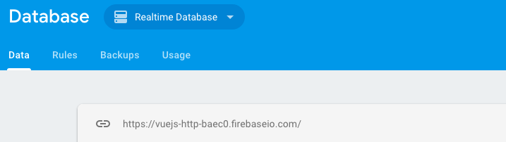
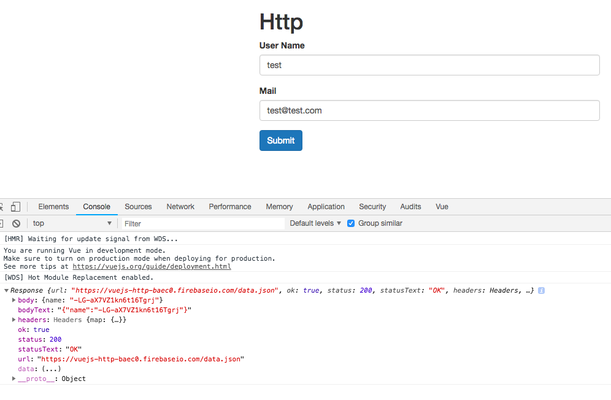
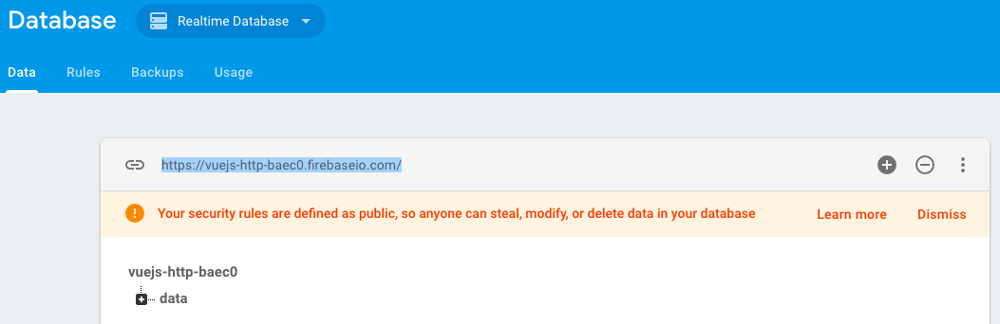
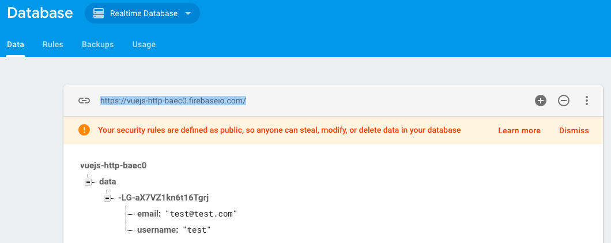

# POSTing Data to a Server (Sending a Post Request)

Well, the next step is to send the request. To send it we'll grab the link from `firebase database` `https://vuejs-http-baec0.firebaseio.com/`  and in our `Ap.vue` on `submit` method - the goal is to send the `data` to firebase. Since we registered our `vue resource` on our `global vue object` every instance we create has access to `http` through `vue resource`. Therefore in our `submit()` method we call `this.$http`. This `$http` was added by `vue resource`, it is not available by default, but now it was added by us due to implementing the plugin with `Vue.use()` function. Well. we get this `http` object and on this object we have a couple of `methods` we can call, basically one `method` for each `http request type`. So, here we can call a `post request` with the `post()` method. We use `post` cos we wanna send some `data` to the `server`. This `method` as a first `argument` expects the URL where we want to send our `data` (we use the one we took from firebase). With `firebase` the special thing is - sending it to this URL we copied from `firebase database` won't do anything , we have to specify a `data package` we want to create. Therefore we need to add `data` for our URL - `https://vuejs-http-baec0.firebaseio.com/data`. This is also not enough, `firebase` only allows `requests` which target `.json` resources, so we need to add this to our URL - `https://vuejs-http-baec0.firebaseio.com/data.json`. 



**App.vue**
```html
<template>
    <div class="container">
        <div class="row">
            <div class="col-xs-12 col-sm-8 col-sm-offset-2 col-md-6 col-md-offset-3">
                <h1>Http</h1>
                <div class="form-group">          
                <label>User Name</label> 
                <input class="form-control" type="text" v-model="user.username"> 
                </div>
                <div class="form-group">          
                <label>Mail</label> 
                <input class="form-control" type="text" v-model="user.email"> 
                </div>
                <button class="btn btn-primary" @click="submit">Submit</button>   
            </div>
        </div>
    </div>
</template>

<script>
    export default {
        data: function(){
            return{
                user:{
                    username: '',
                    email: ''
                }
            }
        },
        methods:{              
            submit(){
                this.$http.post('https://vuejs-http-baec0.firebaseio.com/data.json', ) //set the url
            }
        }
    }
</script>

<style>
</style>
```

So, we also neet to send some `data`. To do this we simply need to supply a second `argument` which allows us to send the `data`. Well, in our example we want to send our `user`, so we'll get `this.user` as the second `argument`. 

**App.vue**
```html
<template>
    <div class="container">
        <div class="row">
            <div class="col-xs-12 col-sm-8 col-sm-offset-2 col-md-6 col-md-offset-3">
                <h1>Http</h1>
                <div class="form-group">          
                <label>User Name</label> 
                <input class="form-control" type="text" v-model="user.username"> 
                </div>
                <div class="form-group">          
                <label>Mail</label> 
                <input class="form-control" type="text" v-model="user.email"> 
                </div>
                <button class="btn btn-primary" @click="submit">Submit</button>   
            </div>
        </div>
    </div>
</template>

<script>
    export default {
        data: function(){
            return{
                user:{
                    username: '',
                    email: ''
                }
            }
        },
        methods:{              
            submit(){
                this.$http.post('https://vuejs-http-baec0.firebaseio.com/data.json', this.user) //send data
                
            }
        }
    }
</script>

<style>
</style>
```

Well, this is how we send the `request`. To get the `request` the second `argument` wouldn't be needed. 
Ok, this will send the `request` but we aslo might want to do smth with the responce. The `vue resource` package uses the `promise approach`, so this will be a `promise` which means it's good for asynchronous action because it promises us to give back some `data` in the future. Therefore we can add `then()` function, we have available on promises, which will allow us to add a `function` to be executed once this operation is done, so once this `request` has been send and once we did get a response back. Inside this `then()` function we can use the response we get back and handle it here; so, for our example let's simply `console.log (response)` to have a look at what we actually getting back. Also important!!! - we can add a second `argument` here, that would be any `error` we get back. 

**App.vue**
```html
<template>
    <div class="container">
        <div class="row">
            <div class="col-xs-12 col-sm-8 col-sm-offset-2 col-md-6 col-md-offset-3">
                <h1>Http</h1>
                <div class="form-group">          
                <label>User Name</label> 
                <input class="form-control" type="text" v-model="user.username"> 
                </div>
                <div class="form-group">          
                <label>Mail</label> 
                <input class="form-control" type="text" v-model="user.email"> 
                </div>
                <button class="btn btn-primary" @click="submit">Submit</button>   
            </div>
        </div>
    </div>
</template>

<script>
    export default {
        data: function(){
            return{
                user:{
                    username: '',
                    email: ''
                }
            }
        },
        methods:{              
            submit(){
                this.$http.post('https://vuejs-http-baec0.firebaseio.com/data.json', this.user) //send data
                .then(response => {        //then function here 
                 console.log(response)
                }, error =>{
                 console.log(error)
                });
            }
        }
    }
</script>

<style>
</style>
```

Well, we get a response which gets some body



Now, if we look at our `firebase` console, we'll see the new `data` node was created.



And if we have a look in this `data node` we'll see the same `cryptic string` and under this string we see `email` and `user name` - the data we submitted in our inputs.  



What is this `cryptic string`? Well, since we posted the `data` it means we can submit the `data` over and over again - and this `cryptic string` actually is a `unique id`, this id in necessary, cos otherwise the `data` would be equal, and since we use `post` we append `new data` to the existing one, we are not overwritting it, we are appending it.  