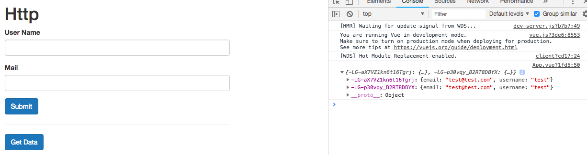
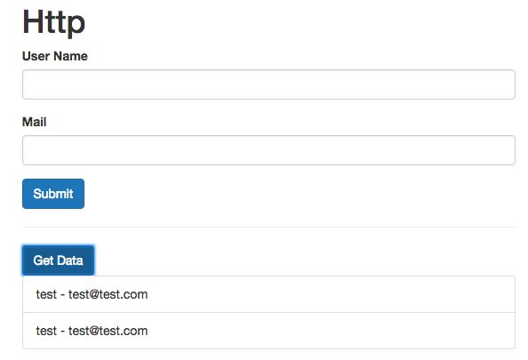

# GETing and Transforming Data (Sending a Get Request)

Let's have a look at `get request` so, we are not only able to store `data` on a `server` but also get it back and use it oi our application. First a bit adjust our app: add a new `button` and execute `fetchData()` method here. Below our `get data` button let's have `unordered list` and in this list we wanna have some `list items` where we output our `user data`. We can do this with `v-for`, and for that we would need a `users array` in our `data object`, users is an empty array initially. And now e can loop through this array, and output it with string interpolation in the template. 

**App.vue**
```html
<template>
    <div class="container">
        <div class="row">
            <div class="col-xs-12 col-sm-8 col-sm-offset-2 col-md-6 col-md-offset-3">
                <h1>Http</h1>
                <div class="form-group">          
                <label>User Name</label> 
                <input class="form-control" type="text" v-model="user.username"> 
                </div>
                <div class="form-group">          
                <label>Mail</label> 
                <input class="form-control" type="text" v-model="user.email"> 
                </div>
                <button class="btn btn-primary" @click="submit">Submit</button>   
                <hr>
                <button class="btn btn-primary" @click="fetchData">Get Data</button>  <!--new button here-->
                <ul class="list-group">
                <li class="list-group-item" v-for="(u, index) in users" :key="index">{{u.username}} - {{u.email}}</li>
                </ul>
            </div>
        </div>
    </div>
</template>

<script>
    export default {
        data: function(){
            return{
                user:{
                    username: '',
                    email: ''
                },
                users: []
            };
        },
        methods:{              
            submit(){
                this.$http.post('https://vuejs-http-baec0.firebaseio.com/data.json', this.user) 
                .then(response => {       
                 console.log(response)
                }, error =>{
                 console.log(error)
                });
            },
            fetchData(){        //create method here
             
            }
        }
    }
</script>

<style>
</style>
```

Now, in our `fetchData()` method we wanna fetch `data` from `firebase` and store it in the `users array`. We still use `$http` now with the `get()` method. In the `get()` method we pass the same URL as in `post`, and we don't need to pass extra `argument` here, but we surely need to handle our `response` with `then()` function. In this `function` we get our `responce`, the cool thing is VueJS gives us some help `methods` on `responses`: one of the useful methods is `json()` method. `json()` method basically extracts the body of the `response` and converts it into a `JS object` which we may use. This means we should store this `object`, let's store it in `const data`. Notice - `response.json()` also gives us back a promise not the extracted `data` right away, cos it's a asynchronous task, it doesn't have the `data` right away. 

**App.vue**
```html
<template>
    <div class="container">
        <div class="row">
            <div class="col-xs-12 col-sm-8 col-sm-offset-2 col-md-6 col-md-offset-3">
                <h1>Http</h1>
                <div class="form-group">          
                <label>User Name</label> 
                <input class="form-control" type="text" v-model="user.username"> 
                </div>
                <div class="form-group">          
                <label>Mail</label> 
                <input class="form-control" type="text" v-model="user.email"> 
                </div>
                <button class="btn btn-primary" @click="submit">Submit</button>   
                <hr>
                <button class="btn btn-primary" @click="fetchData">Get Data</button>  <!--new button here-->
                <ul class="list-group">
                <li class="list-group-item" v-for="(u, index) in users" :key="index">{{u.username}} - {{u.email}}</li>
                </ul>
            </div>
        </div>
    </div>
</template>

<script>
    export default {
        data: function(){
            return{
                user:{
                    username: '',
                    email: ''
                },
                users: []
            };
        },
        methods:{              
            submit(){
                this.$http.post('https://vuejs-http-baec0.firebaseio.com/data.json', this.user) 
                .then(response => {       
                 console.log(response)
                }, error =>{
                 console.log(error)
                });
            },
            fetchData(){       
             this.$http.get('https://vuejs-http-baec0.firebaseio.com/data.json')
             .then(response =>{         //get response
              const data = response.json(); //store in a variable
              console.log(data);
             });
            }
        }
    }
</script>

<style>
</style>
```
To get the `data` we should actually not store this in a `variable` (const), but return `response`. And then chain another `then()` method, to use the extracted `data`. 

**App.vue**
```html
<template>
    <div class="container">
        <div class="row">
            <div class="col-xs-12 col-sm-8 col-sm-offset-2 col-md-6 col-md-offset-3">
                <h1>Http</h1>
                <div class="form-group">          
                <label>User Name</label> 
                <input class="form-control" type="text" v-model="user.username"> 
                </div>
                <div class="form-group">          
                <label>Mail</label> 
                <input class="form-control" type="text" v-model="user.email"> 
                </div>
                <button class="btn btn-primary" @click="submit">Submit</button>   
                <hr>
                <button class="btn btn-primary" @click="fetchData">Get Data</button>  <!--new button here-->
                <ul class="list-group">
                <li class="list-group-item" v-for="(u, index) in users" :key="index">{{u.username}} - {{u.email}}</li>
                </ul>
            </div>
        </div>
    </div>
</template>

<script>
    export default {
        data: function(){
            return{
                user:{
                    username: '',
                    email: ''
                },
                users: []
            };
        },
        methods:{              
            submit(){
                this.$http.post('https://vuejs-http-baec0.firebaseio.com/data.json', this.user) 
                .then(response => {       
                 console.log(response)
                }, error =>{
                 console.log(error)
                });
            },
            fetchData(){       
             this.$http.get('https://vuejs-http-baec0.firebaseio.com/data.json')
             .then(response =>{         
              return response.json(); //return response
             })
             .then(data => console.log(data))  //use data
            }
        }
    }
</script>

<style>
</style>
```

Now, if we hit "get data" button we'll get an `object` with IDs and inside the IDs we do have our `user data`. 



In order to loop through the `data` we should use our `extracted data` and assign it to our `users array`. Well, the thing we are getting back is not an `array` though, it is an `object` with the `value pairs`, but we can easily transform this into the `array`. For that in our second `then()` method we store `array` in a `const resultArray` first, then we'll loop through all the `keys` in `data` (data - is an object, where the keys are cryptic strings), and get the value of the `key` of the current iteration to the `array` with the `push()` method. Now we need to set our `users array` which is empty in the `data object` equal to our `resultArray`. 

**App.vue**
```html
<template>
    <div class="container">
        <div class="row">
            <div class="col-xs-12 col-sm-8 col-sm-offset-2 col-md-6 col-md-offset-3">
                <h1>Http</h1>
                <div class="form-group">          
                <label>User Name</label> 
                <input class="form-control" type="text" v-model="user.username"> 
                </div>
                <div class="form-group">          
                <label>Mail</label> 
                <input class="form-control" type="text" v-model="user.email"> 
                </div>
                <button class="btn btn-primary" @click="submit">Submit</button>   
                <hr>
                <button class="btn btn-primary" @click="fetchData">Get Data</button>  <!--new button here-->
                <ul class="list-group">
                <li class="list-group-item" v-for="(u, index) in users" :key="index">{{u.username}} - {{u.email}}</li>
                </ul>
            </div>
        </div>
    </div>
</template>

<script>
    export default {
        data: function(){
            return{
                user:{
                    username: '',
                    email: ''
                },
                users: []
            };
        },
        methods:{              
            submit(){
                this.$http.post('https://vuejs-http-baec0.firebaseio.com/data.json', this.user) 
                .then(response => {       
                 console.log(response)
                }, error =>{
                 console.log(error)
                });
            },
            fetchData(){       
             this.$http.get('https://vuejs-http-baec0.firebaseio.com/data.json')
             .then(response =>{         
              return response.json(); 
             })
             .then(data =>{
              const resultArray = [];
              for(let key in data){
              resultArray.push(data[key])
              }
              this.users = resultArray;
             });
            }
        }
    }
</script>

<style>
</style>
```

Now, after hitting the `get data` button we'll get the list of user data. VueJS is clever enogh to update the DOM, cos it recognises we set a new `value` to `this.users` and that is the trigger for VueJS to update the DOM. 




